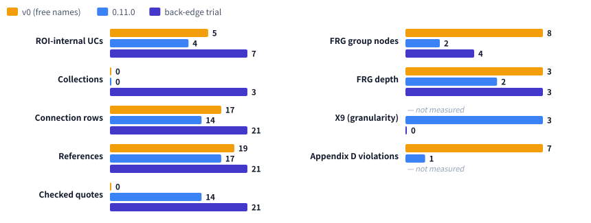

# CoBRAC harness v1.1 → v2: from one-way to round trips

| Item | Details |
| ---- | ------- |
| Document | What changed from CoBRAC harness v1.1 to v2: round trips between HCD and FRG (consistency checks, adjustment turn, back-edge), the research step and literature tools, reference and quote checks, BRA spec compliance, Collections, the Template-v2-2 workbook, Canons, reference materials and the robustness of long jobs |
| Audience | Users, operators, and anyone checking BRA quality or OpenAI costs |
| Versions | v1.1 = app 0.8.0–0.8.1 / v2 = app 0.13.0 and later. The parts of v2 arrived one by one in 0.9.0–0.12.1; the back-edge and the adjustment turn of 0.13.0 ended the one-way flow |
| Related | [05_CoBRAC_Harness_v1_to_v1_1.md](./05_CoBRAC_Harness_v1_to_v1_1.md) (v1 → v1.1) / [04_CoBRAC_Harness_v0_to_v1.md](./04_CoBRAC_Harness_v0_to_v1.md) (v0 → v1) / [06_Research_mode_and_Canon.md](./06_Research_mode_and_Canon.md) (user guide to research mode and Canons) / [01_設計仕様.md](./01_設計仕様.md) / 日本語: [07_CoBRAC_Harness_v1_1_to_v2_ja.md](./07_CoBRAC_Harness_v1_1_to_v2_ja.md) |

---

## 1. In short

In v1.1 the data became JSON and every UC was named after a SABRA unit ([the 05 explainer](./05_CoBRAC_Harness_v1_to_v1_1.md)). The flow, however, was one way. HCD → FRG → CSV → xlsx ran once each, and an accepted phase was never revisited. The FRG was built from "the finished HCD", so when the HCD's UCs were too coarse for a meaningful FRG, the only option was to bend the FRG.

v2 adds a **back-edge from the FRG to the HCD**. After the FRG step the worker checks **how the HCD and the FRG agree (X1–X9)** and, when they disagree, sends one **adjustment turn**. From the evidence, the agent either fixes the FRG or goes back to the HCD to split or add UCs, and records why in the **revisions section** of `decision_log.md`. When a later step changes the HCD, the worker runs every HCD check again.

Alongside, v2 brings a **research step** before generation with the `lit` literature tools, **reference and quote checks**, **BRA spec compliance** (CoBRAC-v1-1), **Collections**, a workbook in the official **Template-v2-2** layout, **Canon** constraints, **reference materials**, and **robustness** for long jobs.

**Why v2.** The repository rules (`AGENTS.md`) say that the workflow skeleton — "HCD → FRG → CSV → xlsx in this order, the worker drives and validates the phases, a JSON output `{status, message, question}` at the end of each turn" — is not changed without consultation. With the user's approval, this skeleton now reads "HCD → FRG → (consistency check, adjustment) → CSV → xlsx". Ending the one-way flow is a larger change than the component swaps of v1 → v1.1, hence the new major label v2. The end-of-turn JSON and the deterministic per-phase validation are unchanged.

---

## 2. Terms

| Term | Meaning |
| ---- | ------- |
| Consistency checks (X1–X9) | Checks that the HCD and the FRG agree (`checkCross`), kept in `cross_check.json` |
| Adjustment turn | One extra turn after the FRG step when X1–X3 or X8 are found; the agent decides from evidence whether to fix the HCD or the FRG |
| Back-edge | Going back from FRG step 3 to HCD step 3 to split or add UCs |
| Revisions section | `## HCD-FRG revisions` in `decision_log.md`: one line per change, tagged `[FRG->HCD]`, `[HCD->FRG]`, `[instruction]` or `[kept]` |
| Re-validation | Running every HCD check again in a later step when the HCD data files changed after the HCD was accepted (detected by the hashes in `phase_baseline.json`) |
| Research step | A literature survey before the HCD (research mode, on by default), written to `research.json` |
| `lit` | The agent's literature MCP server (PubMed and Europe PMC search, abstracts, full-text sentences) |
| Collection | A circuit the HCD splits into finer UCs (Uniform = FALSE), under `collections` in `uc.json` |
| `uniformityNote` | Why a UC spanning several SABRA units is kept as one population when it sends connections |
| sCID / rCID relation | How the UC at each end of a connection relates to the circuit the paper reports (`<`, `=`, `>`) |
| Canon | A set of projects whose circuit definitions are to agree; its definitions constrain generation |

---

## 3. Architecture

### 3.1 Pipeline comparison

")

The v1.1 flow had three weaknesses:

- **① No way back to the HCD.** The FRG spec said "build it from the finished HCD". When the count rules could not be met (a GN of UCs only has exactly two UCs, and so on), the only escape was "decompose the TLF more finely"; the agent was never led to think that the UCs were too coarse. An old sample, with only two ROI-internal UCs, ended with the TLF split directly into those two UCs.
- **② HCD changes made during the FRG were not checked.** The FRG spec said "fix the related files when they disagree", but the FRG and CSV steps discarded the HCD check results. A `uc.json` fixed during the FRG could reach the xlsx without naming, connection or reference checks.
- **③ Nothing checked that the HCD and the FRG agree.** The FRG check looked at structure and IDs only. Nobody verified that a GN interface matches the connections of its UCs, or that the TLF's inputs and outputs match the ROI's.

v2 answers ① with the back-edge and the adjustment turn, ② with re-validation in later steps and ③ with the consistency checks.

### 3.2 Side by side

| Aspect | v1.1 (0.8) | v2 (0.13+) |
| ------ | ---------- | ---------- |
| Flow | HCD → FRG → CSV → xlsx, once each | research (optional) → HCD → FRG → (consistency check, one adjustment) → CSV → xlsx |
| FRG and HCD | The FRG is built from the finished HCD | FRG step 3 can go back to the HCD to split or add UCs |
| Consistency | Not checked (structure and IDs only) | X1–X9 recorded; X1–X3 and X8 trigger the adjustment turn |
| HCD changed later | Not checked | Detected by hash; every HCD check runs again |
| Record of round trips | None (the decision log is free text) | Revisions section of `decision_log.md` (tagged, counted in `cross_check.json`) |
| Finding literature | Memory and web search | Research step (on by default) and the `lit` tools (PubMed, Europe PMC, full text) |
| Reference check | The ID exists in `references.json` | DOI / PMID looked up in Crossref / PubMed; first author, year and title must match |
| Quotes (Pointers on literature) | Free text (2–6-word summaries in the v0 example) | Verbatim quotes, compared with the full text or abstract |
| BRA values | Source of ID and Reference ID joined lists, relation always `=` | Enumerations, one reference per row, relations and the paper's names, ROI row, Review End Lines (CoBRAC-v1-1) |
| Granularity | UCs only (Uniform) | Collections; a sender spanning several units needs a reason (205) |
| xlsx | One CoBRAC workbook | CoBRAC-v1-1 and Template-v2-2 |
| Inputs | ROI, TLF, instructions | + reference materials (files, URLs), Canon definitions |
| Long jobs | Failed on rate limits and oversized conversations | Wait and resume, automatic compaction, continue on a new thread |

---

## 4. Changes

How the weaknesses of 3.1, and others found after v1.1, map to the changes:

| v1.1 weakness | Change in v2 | Details |
| ------------- | ------------ | ------- |
| ① No way back to the HCD | Back-edge from FRG step 3 and one adjustment turn | [4.2](#42-the-adjustment-turn-and-the-back-edge-to-the-hcd) |
| ② HCD changes during the FRG unchecked | Re-validation of the HCD in later steps | [4.4](#44-re-validating-the-hcd-in-later-steps) |
| ③ HCD–FRG agreement unchecked | Consistency checks X1–X9 and a record of round trips | [4.1](#41-hcdfrg-consistency-checks-x1x9), [4.3](#43-recording-round-trips-the-revisions-section) |
| References written from memory, never verified | Research step, `lit` tools, reference checks | [4.5](#45-research-step-and-the-lit-tools), [4.6](#46-reference-and-quote-checks) |
| Quotes were summaries, not the source's words | Verbatim quotes only, checked against full text or abstract | [4.6](#46-reference-and-quote-checks) |
| Values that fail the BRA Review Tool | BRA value rules (CoBRAC-v1-1) | [4.7](#47-bra-spec-compliance-cobrac-v1-1) |
| Coarse regions stayed uniform senders | Collections and the check of multi-unit senders | [4.8](#48-collections-and-uniform-205-uniformitynote) |
| No output in the official template layout | Template-v2-2 workbook | [4.9](#49-template-v2-2-workbook) |
| Circuit definitions differ from project to project | Canon definitions as generation constraints | [4.10](#410-canon-definitions-as-generation-constraints) |
| No way to hand over one's own material | Reference materials | [4.11](#411-reference-materials) |
| Long jobs fail on rate limits or conversation size | Wait and resume, compaction, new thread | [4.12](#412-robustness-of-long-jobs) |

### 4.1 HCD–FRG consistency checks (X1–X9)

At every FRG and CSV check, the worker runs `checkCross` (`packages/shared/src/cross.ts`) and writes `{P}/cross_check.json` (since 0.12.0; 0.13.0 added X9 and the adjustment turn). The chat shows the counts.

| Code | What it checks | Direction | Handling |
| ---- | -------------- | --------- | -------- |
| X1 | A GN interface does not leave out a flow that the HCD connections of its UCs have (inputs from / outputs to circuits outside the GN) | FRG ⇄ HCD | triggers adjustment |
| X2 | The ROI inputs / outputs derived from the connections match the `noROI(input)` / `noROI(output)` tags | both | triggers adjustment |
| X3 | A GN interface does not claim an input or output that no connection of its UCs provides | FRG → HCD (missing connection) | triggers adjustment |
| X4 | The two UCs of a GN are connected through ROI-internal connections | HCD → FRG | record only |
| X5 | Every ROI-internal UC is mentioned in the function text of a GN that contains it | HCD → FRG | record only |
| X6 | A GN's `requirementRealization` mentions every UC of its interface | within the FRG | record only |
| X8 | The FRG is not collapsed (the TLF has only UCs, a single GN, or fewer than 3 ROI-internal UCs) | FRG → HCD (UCs too coarse) | triggers adjustment |
| X9 | A ROI-internal UC is a whole gyrus without facets (`BNAG:`) or spans several SABRA units (`&`) | FRG → HCD (granularity) | record only (whether it should trigger is open) |

- X1–X3 ask whether the information flow claimed by the FRG is realized by HCD connections. X4 and X5 ask whether every circuit of the ROI serves some function.
- X2 works on paths, so an external UC that reaches the ROI through another external UC (retina → LGN → V1) passes.
- X7 (a UC's requirement referring to its parent GN's) is not included, because the current HCD spec does not ask for it.
- `scripts/cross-check-artifacts.mjs` runs the same checks on finished projects copied from S3 (read-only).

### 4.2 The adjustment turn and the back-edge to the HCD

- **Back-edge** (`prompts/phases/FRG.md`, step 3). When the count rules cannot be met, or a GN needs a flow or distinction the HCD does not have, the agent chooses from the evidence:
  - decompose the TLF more finely, or
  - **go back to the HCD and split or add UCs** (HCD step 3). The coarse unit becomes a Collection; new UCs and connections need references (verbatim quotes, interface, Output Semantics, function items).
  - Without evidence, it fixes the FRG side.
- **Adjustment turn.** When the FRG step ends (accepted or with warnings left) and `cross_check.json` has X1, X2, X3 or X8, one adjustment turn is sent per run. It carries the findings, what each check means, and the instruction "decide from the evidence which side to change, keep all files consistent, and record it in the revisions section". The adjustment has its own fix rounds (up to 3), counted separately from the phase's.
- If the revisions section is missing after the adjustment, the FRG check asks for it.
- `cross_check.json` keeps `adjustment` (the trigger counts and findings, and the number of revision lines before the adjustment).
- X4–X6 and X9 are only recorded for now. Whether they should trigger the adjustment will be decided after looking at their counts and false positives in real jobs ([section 7](#7-open-questions-and-known-gaps)).

### 4.3 Recording round trips (the revisions section)

The agent writes one line per change, with its reason and evidence, under `## HCD-FRG revisions` in `decision_log.md` (`prompts/AGENTS.md`).

| Tag | Used for |
| --- | -------- |
| `[FRG->HCD]` | A change the HCD needed, found while building the FRG (split or add UCs, add connections) |
| `[HCD->FRG]` | A change the FRG needed, found from the HCD's evidence (split or merge GNs) |
| `[instruction]` | A change made because the user asked for it (follow-up) |
| `[kept]` | A difference left as it is, and why |

- `revisions` in `cross_check.json` counts the lines per tag, so how often and in which direction round trips happen can be measured.
- `[instruction]` was added in 0.13.0. In the trial ([section 5](#5-example-the-language-area-nonword-reading)), changes the user had asked for were tagged `[FRG->HCD]`, which mixed the effect of the round trip with the effect of the instruction.

### 4.4 Re-validating the HCD in later steps

- Each check stores a SHA-256 of its step's data files, and the problems left at that point, in `{P}/phase_baseline.json`. The HCD covers `meta.json`, `references.json`, `uc.json` and `connections.json`; the FRG covers `frg.json`. The report and the decision log change in every step and are left out.
- When the hash changed, the FRG and CSV steps run the earlier step's checks again in full (schema and rules, RCS, references, quotes). Only new problems go back, in the same fix round, prefixed `HCD (changed after the HCD phase was checked): …`. Problems already left as warnings when the step was accepted are not sent again.
- The CSV step treats FRG changes the same way.
- This keeps HCD edits made through the back-edge inside the checks, which is what makes round trips safe (since 0.12.0).

### 4.5 Research step and the `lit` tools

- **Research step** (0.11.0; research mode is chosen at creation and on by default). Before the HCD, following `prompts/phases/RESEARCH.md`, the agent searches PubMed, Europe PMC and the web for tract-tracing, primate and rodent, and layer / cell-type evidence for each candidate projection (inputs, outputs and internal projections of the ROI, up to 40), and writes queries, evidence and gaps to `{P}/research.json`. It writes no HCD files.
- **Coverage check** (`checkResearch`): at least two queries per candidate (one of them in PubMed or Europe PMC), every listed query must be in the search log (`research_queries.jsonl`), and the coverage values must agree with the evidence. Gaps go back up to twice but never stop the run. The step has 60 minutes and runs at reasoning effort `high` or above.
- **Later steps.** `prompts/research_mode.md` is appended to the HCD, FRG and follow-up specs: build connections from the survey (tract tracing first, weak evidence flagged), look for computational models in the FRG, research what a follow-up adds. The validators are the same with or without research mode.
- **`lit` tools** (available in every run): `search_pubmed`, `search_europepmc`, `get_abstract` and `find_sentences` (sentences of the full text, else the abstract, that contain given terms), so that PMIDs and verbatim quotes come from the source.
- **Outage handling** (0.12.0). Requests time out after 15 s and are retried up to 3 times after 1, 2 and 4 s (429, 5xx, timeouts); a host that fails 3 times in a row is skipped for 5 minutes, and parallel calls are spaced per provider (Europe PMC 200 ms, NCBI 350 ms). When Europe PMC does not answer, the record and abstract come from PubMed and the full text from PMC (NCBI BioC), and the result's `note` names the failed service. This answers the 0.11.0 production run (2026-09-29), where Europe PMC returned 502 / 503 and all 13 `find_sentences` calls failed.
- **Logging.** Every `lit` call and web search goes to `{P}/research_queries.jsonl` (failed calls with their error text), and each job counts its searches per tool.

### 4.6 Reference and quote checks

- **Reference lookups** (0.9.0, `ReferenceVerifier`). DOIs are looked up in Crossref (else doi.org) and PMIDs in PubMed; the record must have the first author, the year (±1) and, when given, a similar title. An identifier that does not exist or belongs to another paper goes back as a problem like any other. Results are kept in `{P}/reference_check.json`.
- **Citation consistency** (`checkCitations`): every `[Author, Year]` in the data files and the report is in `references.json`, no reference goes uncited, no two references share a DOI or PMID.
- **Quote checks** (0.11.0, `QuoteVerifier`). Each connection's Pointers on literature is compared with the paper's full text (Europe PMC, else PMC through BioC) or, without one, its abstract (Europe PMC, PubMed, Crossref, Semantic Scholar). Spacing, punctuation, hyphenation, ligatures, typographic quotes and citation markers are ignored and small OCR-like slips tolerated, but paraphrases do not pass (similarity ≥ 0.9).
- Only quotes missing from a full text that was read (`not_found`) go back, with the closest passage and a link to the paper. Papers without an open-access full text cannot be read and are never reported as problems (`unverified`). Results are kept in `{P}/quote_check.json`.
- Neither check stops on a service outage: what could not be looked up is `unverified`, and the phase continues.

### 4.7 BRA spec compliance (CoBRAC-v1-1)

Since 0.10.0 the HCD check enforces the values the BRA Data Preparation Manual and Template-v2-2.bra prescribe (`packages/shared/src/bra.ts`), so that the output does not produce BRA Review Tool errors (Appendix D codes 1, 10/11, 108, 252, 271/277, 430 and others) by construction.

| Item | v1.1 | v2 |
| ---- | ---- | -- |
| Source of ID (108) | A list of supporting papers | One value: `DHBA` for a whole DHBA term, `BNA` for a Brainnetome area, the one defining paper or `makeshift` for a finer UC |
| Reference ID (252) | Several papers per connection | One per row; the same sender → receiver repeats per paper, each with its taxon, method and quote |
| sCID / rCID relation | Always `=`, notation copied from the Circuit ID | The UC's relation to the paper's circuit (`<`, `=`, `>`) and the paper's own name |
| Pointers (271/277) | Pages, sections, short summaries | Literature: a verbatim quote (at least 10 words for now); figure: a figure number (`Fig. 3B`); one of the two required |
| Enumerations | Free text | Taxon, Measurement method, Transmitter, Modulation Type and Literature type from the template lists |
| References | DOI | Literature type; without DOI an Alternative URL or PMID |
| Output Semantics (430) | Free | One item `[<own Circuit ID>] content;` per UC; GNs get their UCs' outward items |
| Names | Free | Names start with the SABRA official name; function texts refer to tissue as `[U.<Circuit ID>]` |
| ROI row, Review End Line | None | `ROI_<Project ID>` first in Circuits; the last row of each sheet in Project |

- The BRA version in the xlsx is `CoBRAC-v1-1`. Columns were only appended; existing column positions are unchanged.
- `BNA` as Source of ID is a CoBRAC extension; adding it upstream has been requested.

### 4.8 Collections and Uniform (205, uniformityNote)

- **Collections** (0.11.0). A circuit that the HCD splits into finer UCs (for example a cortical area split into layer and cell-type UCs) goes under `collections` in `uc.json`. Its Circuits row has Uniform = FALSE, its members as Sub-Circuits and Source of ID `collection`. Uniformity is decided per HCD, so the same area can be a UC in a coarse project and a Collection in a fine one.
- **Checks.** Members are circuits of the project, no cycles, not all `makeshift` (128). A Collection is neither sender nor receiver of a connection (stricter than 205) and not an FRG leaf. A gyrus and an area inside it cannot both be UCs: the coarser one moves to `collections` (127).
- **Looser conditions** (0.13.0). In the 0.11.0 language-area run the agent created no Collection, judging that the literature had no layer or cell-type evidence, and left whole gyri as uniform senders. Since 0.13.0, a region that is anatomically or functionally heterogeneous at the chosen granularity (a gyrus containing several areas, a region whose parts project differently) becomes a Collection without layer or cell-type evidence. The parts are named, and why they are separated goes into `comments` (required).
- **205 (new).** A sender whose descriptor spans several SABRA units (a `BNAG:` gyrus without facets, or several anchors joined with `&`) is an error without `uniformityNote`. The message offers two fixes:
  - split it into its parts (areas) as UCs, grouped in a Collection if useful; papers that report only the whole gyrus are cited with relation `<`, or
  - if this HCD really treats it as one population, say why in `uniformityNote` (written to the Circuits comments as `Uniform in this project: …`).
- Single areas, left–right pairs, faceted UCs and UCs that only receive are exempt from 205.
- The HCD graph draws Collections as dashed boxes around their UCs, which can be shown or hidden.

### 4.9 Template-v2-2 workbook

- Every job writes, next to the CoBRAC xlsx, the same data into the official template of the BRA Data Preparation Manual (`prompts/templates/Template-v2-2.bra.xlsx`) as `{name}_{ID}.template-v2-2.bra.xlsx` (0.11.0).
- The template's 11 sheets, headers, formulas, AdminOnly lists, validation and WholeBIF rows are kept; only contributor cells are written. Rows beyond the input area are inserted above the WholeBIF rows.
- References get a BibTeX entry built from the DOI / PMID record, and Reference IDs take the template's `Author, Year` form. Circuits anchored on a DHBA term get its DHBA graph_order, name and Lv.2–14.
- For projects finished earlier, the workbook is built on the first download.

### 4.10 Canon definitions as generation constraints

- A Canon (provisional name) is a set of projects whose circuit definitions are to agree: the same UC Descriptor has the same Uniform / Collection status and decomposition. 0.12.0 brought the container, publishing and cloning, pull requests from projects (diff, conflict check, approval), Canon-to-Canon pull requests, and the choice on the create screen.
- What matters for the harness is the **constraint during generation**. A member project follows one Canon revision, and every job gets it in a read-only `canon/` folder. The HCD spec gets "use the Canon's Circuit IDs, names and properties; Collections of the Canon stay Collections; ask instead of splitting a Uniform circuit; copy Canon connections and references as they are".
- After the HCD checks, the Canon conflict rules (Uniform / Collection differs, a different decomposition, a connection ending on a Collection, a different official name, the same Reference ID with another DOI, …) go back as problems. References and quotes the Canon already checked are not looked up again.
- With the back-edge: a circuit the Canon fixes as Uniform is not split in an adjustment turn either; the agent fixes the FRG instead or asks (whether to open a pull request to the Canon).

### 4.11 Reference materials

- The create screen accepts files (PDF, images, text, CSV / JSON, Word / Excel / PowerPoint; up to 10, 20 MB each, 50 MB in total) and up to 20 URLs (0.12.0).
- The worker extracts the text of PDFs and Office files, fetches each URL once on the first run, and lists everything in `materials/INDEX.md`; images are shown to the agent with the first prompt.
- The agent is told to consult them, but that they do not replace verified literature: references still need published sources checked against Crossref / PubMed, and quotes must be verbatim from those sources.

### 4.12 Robustness of long jobs

The research step and the round trips make conversations longer, so the causes of long jobs failing midway were removed one by one.

| Symptom | Cause | What v2 does | Version |
| ------- | ----- | ------------ | ------- |
| A brief rate limit (TPM) fails the job | Codex's own "Reconnecting…" retries were treated as a failed turn | The retries are shown as status lines; a turn that still fails is resumed on the same thread after a pause (up to 3 times) | 0.12.0 |
| A long project fails every time with "Codex Exec exited with code 1" | At about 200k tokens, a single request exceeds the organization's TPM limit (200k for gpt-6-luna), which no amount of waiting fixes | Codex compacts the conversation below the limit (150k tokens by default) | 0.12.1 |
| Same, when compaction is not enough | Same | A turn refused as too large is not retried on the same thread; it continues once on a new thread (with the project header, a note that the files hold the work so far, and the HCD / FRG specs) | 0.12.1 |
| The cause of a failure is unclear | Only the exit code 1 of `codex exec` after a failed turn was reported | The turn's own error is reported | 0.12.1 |

---

## 5. Example: the language area (nonword reading)

### 5.1 Three runs

Three runs with the same input (TLF `nonword reading`, ROI `Angular gyrus, fosiform gyrus, VWFA, Broca, Wernicke`, spelled as given):

| | v0 | 0.11.0 | Back-edge trial (0.12.0) |
| - | -- | ------ | ------------------------ |
| Project | `Aphasia-nonword-reading` (desktop version) | `ufwwj0jg-1` | `ufwwj0jg-5` (a clone of `ufwwj0jg-1`) |
| How | v0 instructions | Defaults (gpt-6-luna, research mode on) | The 0.11.0 result plus a follow-up: "make the ROI-internal UCs finer, rebuild the FRG, record it in the revisions section" |
| ROI-internal UCs | 5 (free names) | 4 (`FuG@L`, `IPL@L`, `IFG@L` as whole gyri, `A22c@L`) | **7** (`A37lv@L`, `A20rv@L`, `IPL@L(AnG)`, `IPL@L(SMG)`, `A22c@L`, `IFG@L(opercular)`, `IFG@L(triangular)`) |
| Collections | 0 | 0 | **3** (the former gyri `FuG@L`, `IPL@L`, `IFG@L`) |
| Connection rows / references | 17 / 19 | 14 / 17 | 21 / 21 |
| Checked quotes | 0 (no quotes) | 14 (7 full text, 7 abstract) | 21 (9 full text, 12 abstract) |
| FRG | 8 GNs, depth 3 (UCs shared by several GNs) | 2 GNs, depth 2 | **4 GNs, depth 3** |
| X1–X8 | cannot be measured | all 0 | all 0 |
| X9 | cannot be measured | 3 | **0** |
| Appendix D codes violated (automatic check) | 7 | 1 (the `@` in Circuit IDs, requested upstream) | not measured |

- From v0 to 0.11.0, the Appendix D violations fell from 7 codes to 1. All 14 quotes became verbatim sentences from the papers, checked against full text or abstract. Source of ID became one value and Reference ID one per row ([4.6](#46-reference-and-quote-checks), [4.7](#47-bra-spec-compliance-cobrac-v1-1)).
- But 0.11.0 was coarser than v0. The fusiform gyrus (pFG and VWFA in v0), the inferior parietal lobule (angular and supramarginal gyrus) and the inferior frontal gyrus (opercular and triangular parts) each became one whole-gyrus UC, and the FRG collapsed to 2 GNs at depth 2. v0's FRG had depth 3, but its UCs were free names and the same UC sat in several GNs.

### 5.2 What the back-edge trial changed

- The agent went back to the HCD and turned the three whole-gyrus UCs into 7 UCs and 3 Collections. Every new connection has a reference and a verbatim quote, and all 21 quotes passed the check.
- The FRG decomposition changed with it. The earlier FRG put "orthographic and parietal" into one GN that bundled the fusiform gyrus and the inferior parietal lobule. The new one splits into ventral orthographic analysis, temporo-parietal phonological analysis and frontal phonological output, with angular and supramarginal gyrus as a lower GN. This is close to the ventral / dorsal route distinction of reading research: **refining the HCD actually changed the FRG decomposition**.
- The revisions section has 9 `[FRG->HCD]`, 4 `[HCD->FRG]` and 2 `[kept]` lines, with the references, the RCS results and the open points (for example that the assignment of `A20rv@L` is provisional).
- In the final checks (`phase_baseline.json`) no problem was left in the HCD or the FRG.

### 5.3 What the example shows

- **With a back-edge instruction, the agent really revises the HCD.** The round trip was not a formality.
- **But X1–X8 cannot detect this coarseness.** They were all 0 before and after. X8 only fires below 3 ROI-internal UCs, so 4 UCs that are all whole gyri go unnoticed. Only X9 told the two versions apart. 0.13.0 therefore records X9, but does not use it as a trigger yet (the adjustment turn fires only on X1–X3 and X8, so in this case it **would not fire automatically**).
- **The trial used a follow-up instruction, not the automatic adjustment turn.** Production ran 0.12.0 at the time, which had no adjustment turn. Whether the adjustment turn produces the same change on its own still has to be measured on 0.13.0.
- **Tags drifted.** Changes the user asked for were tagged `[FRG->HCD]`, hence the new `[instruction]` tag in 0.13.0.
- This is one case. Whether other ROIs and TLFs behave the same is not known.

---

## 6. Instruction size and cost

### 6.1 Instruction tokens (measured)

Counted with the `o200k_base` tokenizer.

| File | v1.1 (0.8.1) | v2 (0.13.0) | Change |
| ---- | -----------: | ----------: | -----: |
| `AGENTS.md` | 1,241 | 2,171 | +930 |
| `phases/HCD.md` | 3,674 | 5,974 | +2,300 |
| `phases/FRG.md` | 1,064 | 1,361 | +297 |
| `phases/RESEARCH.md` (research mode only) | — | 1,450 | new |
| `research_mode.md` (appended to HCD / FRG in research mode) | — | 336 | new |

The instructions present in the context of every request, per step. In research mode, the research spec and the research-mode notes stay in the context in later steps (until the conversation is compacted).

")

- The `HCD.md` increase (+2,300) is the BRA value rules (Source of ID, relations and notations, one reference per row, quotes, enumerations) and Collections, 205 and `uniformityNote`. The `FRG.md` increase (+297) is the back-edge.
- The `AGENTS.md` increase (+930) is the literature tools and the verbatim-quote rule, reference materials, how to write the revisions section, the files the worker writes, and the reply language.
- Not included: the Canon notes (only in runs with `canon/`) and the adjustment prompt (only when X1–X3 or X8 are found).

### 6.2 Per project (estimates)

**Instruction increase (estimate).** With the assumptions of [05, 5.2](./05_CoBRAC_Harness_v1_to_v1_1.md#52-what-this-means-per-project-illustrative) (120 HCD and 60 FRG requests), the increase is 120 × 3,230 + 60 × 3,527 ≈ 0.60M tokens without research mode, plus 180 × 1,786 ≈ 0.32M with it, almost all cached input.

| Model | Cached input price (USD / 1M) | Increase (no research mode) | Increase (research mode) |
| ----- | ----------------------------: | --------------------------: | -----------------------: |
| gpt-6-luna (default) | 0.01 | about $0.01 | about $0.01 |
| gpt-6-sol | 0.20 | about $0.12 | about $0.18 |
| gpt-5.6-sol | 0.40 | about $0.24 | about $0.37 |
| gpt-6-astra | 1.00 | about $0.60 | about $0.92 |

**Measured (language area, gpt-6-luna, 0.11.0).** The research step itself and the tool results in the context weigh more than the instructions.

| | Time | Cost |
| - | ---: | ---: |
| Research step (3 turns, 61 successful `lit` calls) | 41.6 min | $0.31 |
| Whole project (hit a rate limit midway, one retry) | 76.5 min | $0.88 |
| Finishing job of the back-edge trial (`ufwwj0jg-5`) | 7 min | $0.04 |

- The research step took 15.2M input tokens (14.4M cached); the whole project 43M, which is why it hit the TPM limit ([4.12](#412-robustness-of-long-jobs)).
- The cost of an adjustment turn (one turn plus its fix rounds) has not been measured in production yet. The main part of the back-edge trial (37 minutes of rewriting) has no known cost, because the usage of turns that fail midway is not recorded ([section 7](#7-open-questions-and-known-gaps)).
- The create screen shows the estimated extra time and cost of research mode for the selected model (+10–60 minutes, about $0.05–0.19 with gpt-6-luna). Check the real values in each chat's usage line and the OpenAI dashboard.

---

## 7. Open questions and known gaps

| Item | Now | Next decision |
| ---- | --- | ------------- |
| Should X9 trigger the adjustment? | Record only; in the trial the only check that told before and after apart | Collect 5–10 new jobs and look at counts and false positives first; some TLFs are fine at gyrus level |
| Round-trip loop (design stage ③) | One adjustment turn per run, no loop | A proposal of up to 2 rounds and 45 minutes exists; decide after measuring how often the adjustment fires, X counts per round, and minutes and cost per round |
| Function sketch (design stage ④) | Not started; the FRG still comes after the HCD | Decompose the TLF first to steer the research; moves HCD step 6 (UC function items) later, a large prompt change |
| Spot interruptions lose in-turn work | The workspace is saved to S3 only when a phase is accepted, and before a question, completion or failure | The trial lost 15 minutes of work, and detecting the interruption took 27 minutes; in-turn saving and faster detection are needed |
| Cost of failed turns | Without `turn.completed`, usage and cost are not recorded | Failed jobs have an empty `costUsd` |
| Clones and research mode | A cloned project does not inherit the research-mode setting | The trial's finishing job ran without the research-mode notes |
| Upstream requests | `@` in Circuit IDs (104, U11), `BNA` as Source of ID (108, U9), no place for the UC Descriptor in Template-v2-2 (U21) | Waiting for answers; until then the Review Tool may flag these |
| Formula values in Template-v2-2 | The template's formulas are recalculated when Excel opens the file (`fullCalcOnLoad`) | Readers that do not recalculate (scripts, Review Tool import) see `!! Error !!` in Capability and similar cells |
| Reused quotes | In the 0.11.0 language area, 3 pairs / 6 rows, one quote describing several pathways at once | Could be flagged in manual review (274); consider asking for a sentence or figure per connection |
| Success rate of the literature tools in production | Not measured again since the retries and fallbacks of 0.12.0 | Check `find_sentences` and `search_europepmc` in the next research-mode run |

---

## 8. Compatibility

- The BRA version in the xlsx is `CoBRAC-v1-1` (since 0.10.0). Columns were only appended, so the `CoBRAC-v1-0` column positions are unchanged. The graphs read v1-0 and v1-1 CSVs alike.
- Projects created with 0.9 or earlier are checked with the new rules on their next follow-up (a Source of ID list, several references per connection, missing Literature type or relations, locators as quotes, values outside the lists), and the problems come back as fix turns. Since 0.13.0, whole gyri used as senders also come back as 205 (for example `FuG@L`, `IPL@L` and `IFG@L` in the language-area project `ufwwj0jg-1`). The CSVs and xlsx are still produced until they are fixed.
- A workspace without `phase_baseline.json` (checked before 0.12.0) takes its current state as the baseline.
- Projects created before 0.11.0 have no research-mode setting and run without it.
- The Template-v2-2 workbook is built on the first download for projects finished before 0.11.0.
- Workspaces from before v0.8 (markdown tables) are still not read.

---

## 9. Where the code is

| What | Where |
| ---- | ----- |
| Rules shared by all steps (literature, materials, revisions section) | `prompts/AGENTS.md` |
| Phase specs (back-edge, BRA values, Collections, research) | `prompts/phases/HCD.md`, `FRG.md`, `RESEARCH.md`, `prompts/research_mode.md` |
| Consistency checks (X1–X9) and revision counts | `packages/shared/src/cross.ts` |
| Phase loop, adjustment turn, re-validation | `packages/worker/src/pipeline.ts` |
| BRA value rules | `packages/shared/src/bra.ts`, `harness.ts` |
| Research step check | `packages/shared/src/research.ts` |
| `lit` tools and HTTP client | `packages/worker/src/litMcp.ts`, `litsearch.ts`, `http.ts` |
| Reference and quote checks | `packages/worker/src/references.ts`, `quotes.ts`, `packages/shared/src/references.ts`, `quotes.ts` |
| Template-v2-2 workbook | `packages/shared/src/braTemplate.ts`, `xlsxSheet.ts`, `bibtex.ts`, `packages/worker/src/bibliography.ts` |
| Canon constraints | `packages/shared/src/canonConstraints.ts` |
| Reference materials | `packages/shared/src/attachments.ts`, `packages/worker/src/materials.ts` |
| Running Codex (rate limits, compaction, new thread) | `packages/worker/src/codex.ts`, `index.ts` |
| Appendix D checker, consistency measurement | `scripts/bra-appendix-d.mjs`, `scripts/cross-check-artifacts.mjs` |
| Tests | `packages/shared/test/cross.test.ts`, `harness.test.ts`, `packages/worker/test/pipeline.test.ts` and others |
