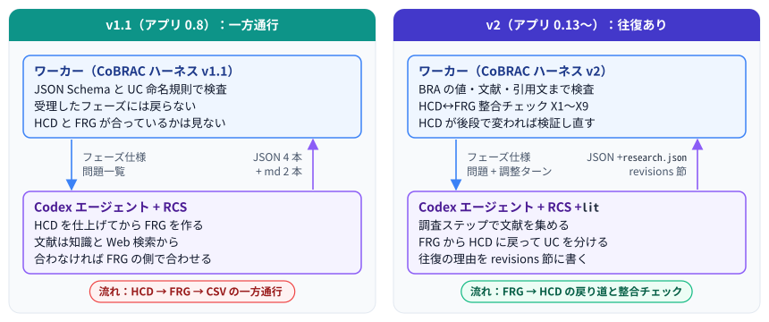
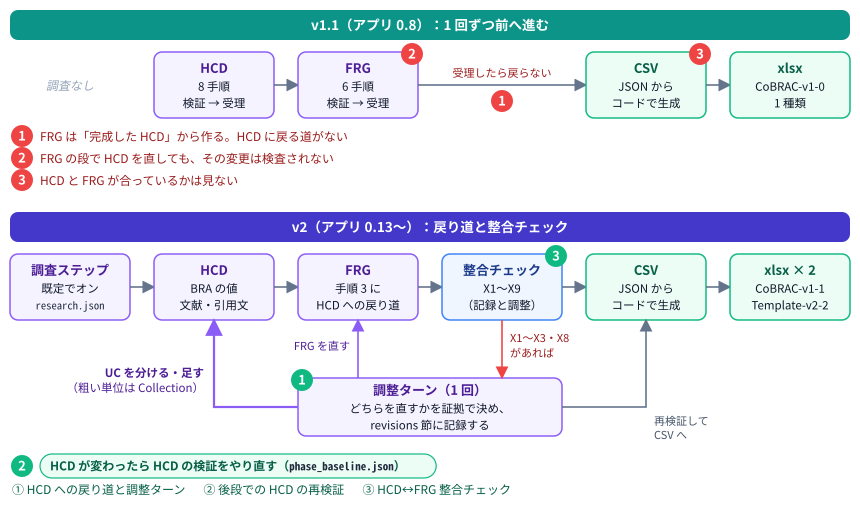
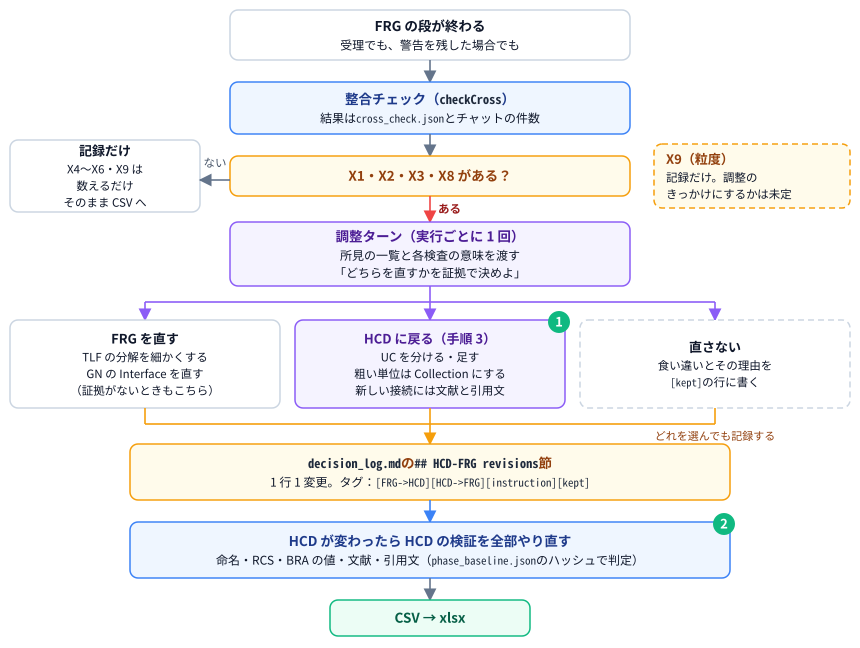
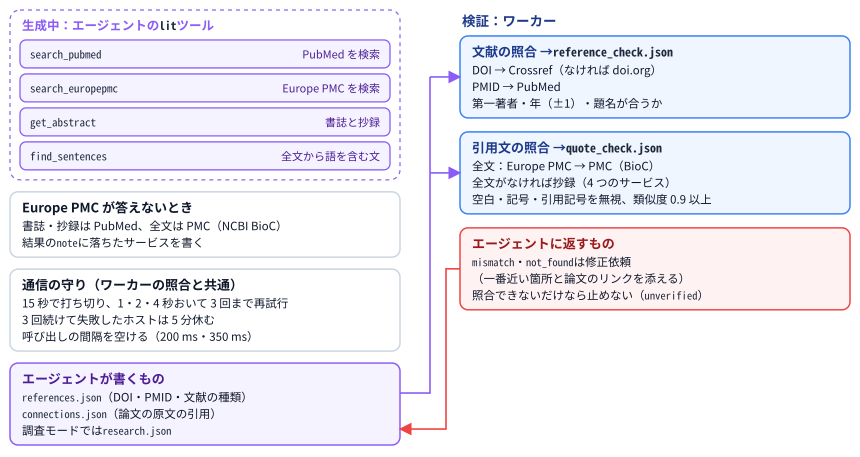
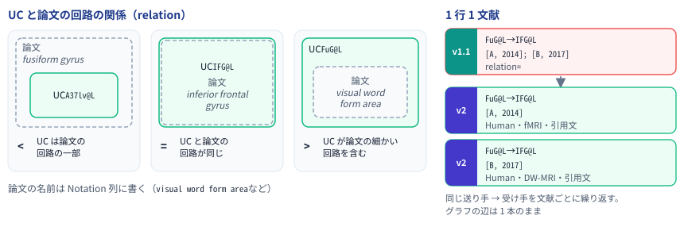
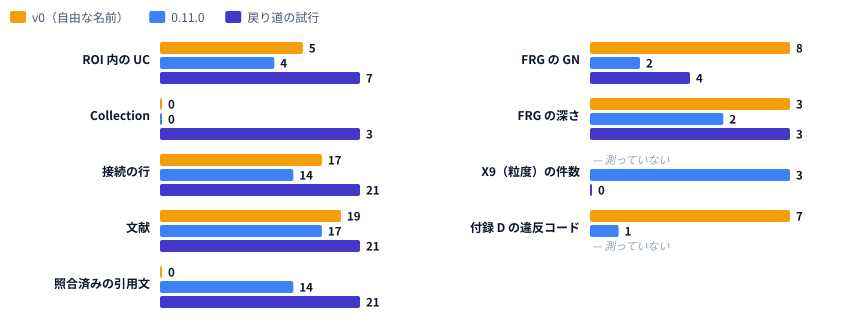
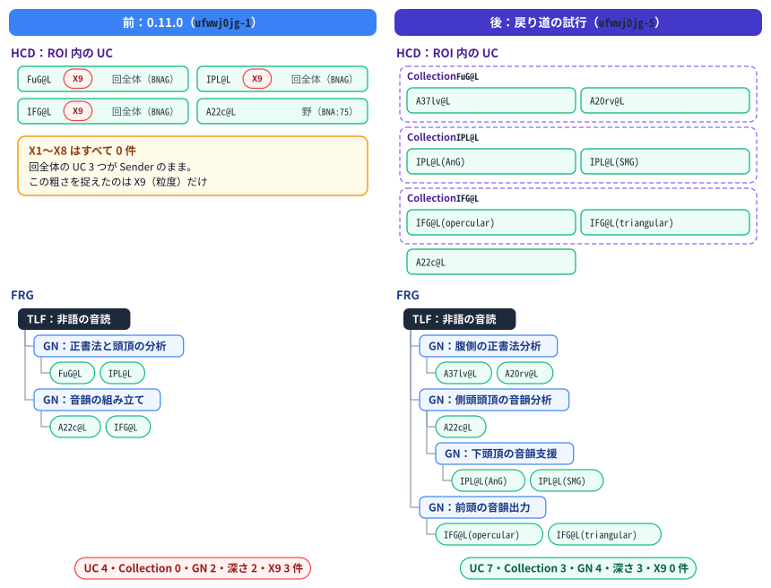
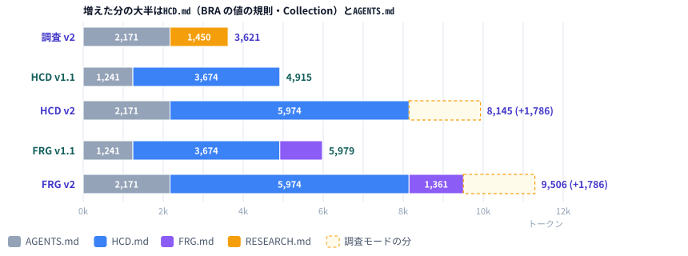

# CoBRAC ハーネス v1.1 → v2 解説：一方通行から往復へ

| 項目 | 内容 |
| ---- | ---- |
| 文書 | CoBRAC ハーネス v1.1 から v2 への変更点の解説。HCD と FRG の往復（整合チェック・調整ターン・戻り道）、調査ステップと文献ツール、文献と引用文の照合、BRA 仕様への準拠、Collection、Template-v2-2 形式の xlsx、Canon、参考資料、長いジョブの堅牢性 |
| 対象読者 | 利用者、運用者、BRA の品質や OpenAI の利用料を確認する人 |
| 対象バージョン | v1.1 = アプリ 0.8.0〜0.8.1 / v2 = アプリ 0.13.0 以降。v2 の部品は 0.9.0〜0.12.1 で順に入り、0.13.0 の戻り道と調整ターンで一方通行でなくなった |
| 関連 | [05_CoBRAC_Harness_v1_to_v1_1_ja.md](./05_CoBRAC_Harness_v1_to_v1_1_ja.md)（v1 → v1.1）/ [04_CoBRAC_Harness_v0_to_v1_ja.md](./04_CoBRAC_Harness_v0_to_v1_ja.md)（v0 → v1）/ [06_Research_mode_and_Canon_ja.md](./06_Research_mode_and_Canon_ja.md)（調査モードと Canon の利用ガイド）/ [01_設計仕様.md](./01_設計仕様.md) / English: [07_CoBRAC_Harness_v1_1_to_v2.md](./07_CoBRAC_Harness_v1_1_to_v2.md) |

---

## 1. ひとことで言うと

v1.1 で、データは JSON になり、UC は SABRA の単位に固定して名付けるようになりました（[05 の解説](./05_CoBRAC_Harness_v1_to_v1_1_ja.md)）。ただし流れは一方通行でした。HCD → FRG → CSV → xlsx を 1 回ずつ進み、受理したフェーズには戻りません。FRG は「完成した HCD」から作るので、HCD の UC が粗すぎて FRG が形にならないときも、FRG の側で無理に合わせるしかありませんでした。

v2 では、**FRG から HCD に戻る道**ができました。ワーカーは FRG の段の後に **HCD と FRG の整合（X1〜X9）** を調べ、食い違いがあれば**調整ターン**を 1 回送ります。エージェントは証拠に基づいて FRG を直すか、HCD に戻って UC を分ける・足すかを選び、その理由を `decision_log.md` の **revisions 節**に残します。HCD が後の段で変われば、ワーカーは HCD の検証をすべてやり直します。

あわせて、生成の前に文献を集める**調査ステップ**と文献ツール `lit`、**文献と引用文の照合**、**BRA 仕様への準拠**（CoBRAC-v1-1）、**Collection**、公式テンプレート **Template-v2-2 形式の xlsx**、**Canon** の制約、**参考資料**の添付、長いジョブの**堅牢性**が入りました。

**なぜ v2 か。** リポジトリの約束（`AGENTS.md`）では、ワークフローの骨格「HCD → FRG → CSV → xlsx の順、ワーカーがフェーズを進めて検証する方式、ターン終了時の JSON 出力」は相談なしに変えないことになっています。今回はこの骨格を、ユーザーの承認を得て「HCD → FRG →（整合チェック・調整）→ CSV → xlsx」に広げました。一方通行でなくなったことが、v1 → v1.1 のような部品の置き換えより大きな変化なので、版を v2 としました。ターン終了時の JSON（`{status, message, question}`）と、フェーズごとの決定的な検証は変わっていません。

---

## 2. 用語

| 用語 | 意味 |
| ---- | ---- |
| 整合チェック（X1〜X9） | HCD と FRG が互いに合っているかの検査（`checkCross`）。結果は `cross_check.json` に残る |
| 調整ターン | FRG の段の後、X1〜X3・X8 があるときに 1 回だけ送るターン。エージェントは HCD と FRG のどちらを直すかを証拠で決める |
| 戻り道 | FRG の手順 3 から HCD の手順 3 に戻り、UC を分ける・足すこと |
| revisions 節 | `decision_log.md` の `## HCD-FRG revisions`。1 行 1 変更で、`[FRG->HCD]`・`[HCD->FRG]`・`[instruction]`・`[kept]` のタグを付ける |
| 再検証 | HCD のデータファイルが HCD の受理の後に変わったとき、後の段で HCD の検証をすべてやり直すこと（`phase_baseline.json` のハッシュで判定） |
| 調査ステップ | HCD の前に文献を調べる段（調査モード、既定でオン）。結果は `research.json` |
| `lit` | エージェントが使う文献ツールの MCP サーバー（PubMed・Europe PMC の検索、抄録、全文の文） |
| Collection | HCD が細かい UC に分けた回路（Uniform = FALSE）。`uc.json` の `collections` に書く |
| `uniformityNote` | 複数の SABRA 単位にまたがる UC を、あえて 1 つの集団として送り手にする理由 |
| sCID / rCID relation | 接続の両端で、UC と論文が報告した回路の関係（`<`・`=`・`>`） |
| Canon | 回路の定義をそろえたいプロジェクトの集まり。生成時にその定義を制約として使う |

---

## 3. アーキテクチャ

### 3.1 パイプラインの比較

v1.1 の流れの弱点は 3 つでした。

- **① HCD に戻る道がなかった。** FRG の仕様は「完成した HCD から作る」でした。数の制約（UC だけの GN はちょうど 2 UC など）が満たせないときの逃げ道は「TLF をもっと細かく分解し直す」だけで、UC が粗すぎるとは考えさせませんでした。旧版のサンプルには、ROI 内の UC が 2 つしかないために、最後は TLF を直接 2 つの UC に分けた例があります。
- **② FRG の段で HCD を直しても検査されなかった。** FRG の仕様は「矛盾したら関係するファイルを直せ」と言いますが、FRG と CSV の段では HCD の検証の結果を捨てていました。エージェントが FRG の途中で `uc.json` を直すと、その変更は命名・接続・文献の検査を受けないまま xlsx に入りえました。
- **③ HCD と FRG が合っているかを見なかった。** FRG の検査は構造と ID だけでした。GN の Interface が子の UC の接続と合っているか、TLF の入出力が ROI の入出力と合っているかは、誰も確かめていませんでした。

v2 では、① に戻り道と調整ターン、② に後段での再検証、③ に整合チェックで応えています。

### 3.2 並べて比べる

| 観点 | v1.1（0.8） | v2（0.13〜） |
| ---- | ----------- | ------------ |
| 流れ | HCD → FRG → CSV → xlsx を 1 回ずつ | 調査（任意）→ HCD → FRG →（整合チェック・調整 1 回）→ CSV → xlsx |
| FRG と HCD の関係 | FRG は完成した HCD から作る | FRG の手順 3 から HCD に戻り、UC を分ける・足せる |
| 整合の検査 | なし（構造と ID だけ） | X1〜X9 を記録。X1〜X3・X8 は調整ターンのきっかけ |
| 後段での HCD の変更 | 検査されない | ハッシュで検出し、HCD の検証をすべてやり直す |
| 往復の記録 | なし（判断ログは自由記述） | `decision_log.md` の revisions 節（タグ付き、`cross_check.json` で数える） |
| 文献の探し方 | 知識と Web 検索 | 調査ステップ（既定でオン）と `lit` ツール（PubMed・Europe PMC・全文） |
| 文献の検査 | ID が `references.json` にあるか | DOI・PMID を Crossref・PubMed で照合し、第一著者・年・題名を確かめる |
| 引用文（Pointers on literature） | 自由記述（v0 の実例では 2〜6 語の要約） | 論文の原文。全文か抄録と照合する |
| BRA の値 | Source of ID と Reference ID は連結、relation はいつも `=` | 列挙値、1 行 1 文献、relation と論文上の名前、ROI 行、Review End Line（CoBRAC-v1-1） |
| 粒度 | UC だけ（Uniform） | Collection。複数の単位にまたがる送り手は理由が要る（205） |
| xlsx | CoBRAC 形式 1 種類 | CoBRAC-v1-1 と Template-v2-2 形式の 2 種類 |
| 入力 | ROI・TLF・指示 | ＋参考資料（ファイル・URL）、Canon の定義 |
| 長いジョブ | レート制限や大きすぎる会話で失敗 | 待って再開、会話の自動圧縮、新しいスレッドで続ける |

---

## 4. 変更点

3.1 の弱点と、v1.1 の後に見つかったほかの弱点、それに対応する変更の関係です。

| v1.1 の弱点 | v2 での変更 | 詳細 |
| ----------- | ----------- | ---- |
| ① HCD に戻る道がない | FRG の手順 3 からの戻り道と、1 回の調整ターン | [4.2](#42-調整ターンと-hcd-への戻り道) |
| ② FRG の段の HCD の変更が未検査 | 後段での HCD の再検証 | [4.4](#44-後段での-hcd-の再検証) |
| ③ HCD と FRG の整合を見ない | 整合チェック X1〜X9 と、往復の記録 | [4.1](#41-hcdfrg-整合チェックx1x9)、[4.3](#43-往復の記録revisions-節) |
| 文献を知識で書き、実在を確かめない | 調査ステップと `lit` ツール、文献の照合 | [4.5](#45-調査ステップと-lit-ツール)、[4.6](#46-文献の照合と引用文の照合) |
| 引用文が要約で、原文か分からない | 原文の引用に限り、全文か抄録と照合する | [4.6](#46-文献の照合と引用文の照合) |
| BRA の Review Tool のエラーになる値 | BRA の値の規則（CoBRAC-v1-1） | [4.7](#47-bra-仕様への準拠cobrac-v1-1) |
| 粗い領域が均一な送り手のまま | Collection と、複数の単位にまたがる送り手の検査 | [4.8](#48-collection-と-uniform205uniformitynote) |
| 公式テンプレートの形で出せない | Template-v2-2 形式の xlsx | [4.9](#49-template-v2-2-形式の-xlsx) |
| プロジェクトごとに回路の定義がばらばら | Canon の定義を生成時の制約にする | [4.10](#410-canon-の定義を生成時の制約にする) |
| 手元の資料を渡せない | 参考資料の添付 | [4.11](#411-参考資料の添付) |
| 長いジョブがレート制限や会話の大きさで落ちる | 待って再開、自動圧縮、新しいスレッド | [4.12](#412-長いジョブの堅牢性) |

### 4.1 HCD↔FRG 整合チェック（X1〜X9）

FRG と CSV の検査のたびに、ワーカーは `checkCross`（`packages/shared/src/cross.ts`）で HCD と FRG が互いに合っているかを調べ、`{P}/cross_check.json` に書きます（0.12.0 から。0.13.0 で X9 と調整ターンが加わりました）。チャットには件数だけが出ます。

| コード | 何を見るか | 向き | 扱い |
| ------ | ---------- | ---- | ---- |
| X1 | GN の Interface が、子の UC の HCD の接続にある流れ（GN の外との入出力）を落としていないか | FRG ⇄ HCD | 調整のきっかけ |
| X2 | ROI の入出力（接続から求めたもの）が、`noROI(input)`・`noROI(output)` の印と合うか | 両方 | 調整のきっかけ |
| X3 | GN の Interface が、子の UC のどの接続にもない入出力を主張していないか | FRG → HCD（足りない接続） | 調整のきっかけ |
| X4 | GN の 2 つの UC が、ROI 内の接続でつながっているか | HCD → FRG | 記録だけ |
| X5 | ROI 内の UC が、その UC を含む GN の機能の記述で触れられているか | HCD → FRG | 記録だけ |
| X6 | GN の `requirementRealization` が、Interface の UC をすべて挙げているか | FRG の中 | 記録だけ |
| X8 | FRG が潰れていないか（TLF の子が UC だけ、GN が 1 つ、ROI 内の UC が 3 つ未満） | FRG → HCD（UC が粗い兆候） | 調整のきっかけ |
| X9 | ROI 内の UC が、ファセットのない回全体（`BNAG:`）か、複数の SABRA 単位にまたがる（`&`）か | FRG → HCD（粒度） | 記録だけ（きっかけにするかは未定） |

- X1〜X3 は「FRG が主張する情報の流れを、HCD の接続が実現しているか」を見ます。X4・X5 は「ROI の回路が、どこかの機能に役立っているか」を見ます。
- X2 は経路で判定します。網膜 → LGN → V1 のように、外部の UC が別の外部の UC を経て ROI に届く場合も正しく通ります。
- X7（UC の Requirement が親 GN の Requirement を参照しているか）は、今の HCD の仕様が求めていないので入れていません。
- `scripts/cross-check-artifacts.mjs` は、S3 から写した完了済みのプロジェクトに同じ検査を掛けます（読み取りだけ）。

### 4.2 調整ターンと HCD への戻り道

- **戻り道**（`prompts/phases/FRG.md` の手順 3）。数の制約を満たせないとき、または GN が HCD にない流れや区別を必要とするとき、エージェントは証拠で次のどちらかを選びます。
  - TLF の分解を細かくする。
  - **HCD に戻って UC を分ける・足す**（HCD の手順 3）。粗い単位は Collection にし、新しい UC や接続には文献（原文の引用、Interface、Output Semantics、関数項目）を付けます。
  - 証拠がなければ FRG の側を直します。
- **調整ターン**。FRG の段が終わった時点で（受理でも、警告を残した場合でも）、`cross_check.json` に X1・X2・X3・X8 があれば、実行ごとに 1 回だけ送ります。渡すのは、所見の一覧、各検査の意味、「どちらを変えるかを証拠で決め、全ファイルの整合を保ち、revisions 節に記録せよ」という指示です。調整ターンは自分の修正ターン（最大 3 回）を持ち、フェーズの修正ターンとは別に数えます。
- 調整の後に revisions 節がなければ、FRG の検査がその節を求めます。
- `cross_check.json` には `adjustment`（きっかけになった件数と所見、調整前の記録の数）が残ります。
- X4〜X6 と X9 は、今は記録だけです。調整のきっかけにするかは、実際のジョブで件数と誤検知の率を見てから決めます（[7 章](#7-まだ決まっていないこと残る課題)）。

### 4.3 往復の記録（revisions 節）

エージェントは、`decision_log.md` の `## HCD-FRG revisions` 節に、1 行 1 変更で理由と根拠を書きます（`prompts/AGENTS.md`）。

| タグ | 使うとき |
| ---- | -------- |
| `[FRG->HCD]` | FRG を作る過程で、HCD に必要だと分かった変更（UC を分ける・足す、接続を足す） |
| `[HCD->FRG]` | HCD の証拠から、FRG に必要だと分かった変更（GN を分ける・まとめる） |
| `[instruction]` | ユーザーの指示（フォローアップ）で行った変更 |
| `[kept]` | 直さなかった食い違いと、その理由 |

- `cross_check.json` の `revisions` に、タグごとの行数が入ります。往復がどれだけ起きたか、どちら向きだったかを測れます。
- `[instruction]` は 0.13.0 で加えました。試行（[5 章](#5-実例言語野非語の音読)）では、ユーザーの指示による変更にも `[FRG->HCD]` が付き、往復の効果と指示の効果を区別できなかったためです。

### 4.4 後段での HCD の再検証

- 各段の検査は、その段のデータファイルのハッシュ（SHA-256）と、その時点で残っていた問題を `{P}/phase_baseline.json` に残します。HCD は `meta.json`・`references.json`・`uc.json`・`connections.json`、FRG は `frg.json` を見ます。レポートと判断ログはどの段でも変わるので対象外です。
- FRG と CSV の段では、ハッシュが変わっていれば、前の段の検査（スキーマと規則、RCS、文献、引用文）をすべてやり直します。新しい問題だけを `HCD (changed after the HCD phase was checked): …` の形で同じ修正ターンに返します。受理時に警告として残した問題は再送しません。
- CSV の段では、FRG の変更も同じように扱います。
- 戻り道で HCD を直しても検査の外に出ないので、往復の前提になります（0.12.0 から）。

### 4.5 調査ステップと `lit` ツール

- **調査ステップ**（0.11.0、調査モードは作成時に選び、既定でオン）。HCD の前に `prompts/phases/RESEARCH.md` に従って、候補の投射（ROI への入力・出力・内部、最大 40 件）ごとに、PubMed・Europe PMC・Web でトレーサー研究、霊長類とげっ歯類、層・細胞種の証拠を探し、検索・証拠・欠けを `{P}/research.json` に書きます。HCD のファイルは書きません。
- **網羅性の検査**（`checkResearch`）。候補ごとに 2 件以上の検索（1 件以上は PubMed か Europe PMC）、書いた検索が本当に検索の記録（`research_queries.jsonl`）にあるか、カバレッジの値と証拠が合うか、を見ます。欠けは最大 2 回まで差し戻しますが、実行は止めません。時間の上限は 60 分、推論の強さは `high` 以上です。
- **後の段**。HCD・FRG・フォローアップの仕様に `prompts/research_mode.md` が付きます。調査の結果から接続を作る（トレーサーの証拠を優先、弱い証拠は明記）、FRG で計算モデルの文献を探す、フォローアップで足す主張を調べる、などです。検証の規則は調査モードの有無で変わりません。
- **`lit` ツール**（すべての実行で使えます）。`search_pubmed`、`search_europepmc`、`get_abstract`、`find_sentences`（全文、なければ抄録から、指定した語を含む文）。PMID と原文の引用を出典から取るための道具です。
- **障害への備え**（0.12.0）。通信は 15 秒で打ち切り、1・2・4 秒おいて 3 回まで再試行し（429・5xx・タイムアウト）、3 回続けて失敗したホストは 5 分休みます。並列の呼び出しも、提供元ごとに間隔を空けます（Europe PMC 200 ms、NCBI 350 ms）。Europe PMC が答えないときは、書誌と抄録を PubMed から、全文を PMC（NCBI BioC）から取り、結果の `note` に落ちたサービスを書きます。0.11.0 の本番の実行（2026-09-29）で Europe PMC が 502・503 を返し、`find_sentences` が 13 回すべて失敗したことへの対策です。
- **記録**。すべての `lit` の呼び出しと Web 検索は `{P}/research_queries.jsonl` に残り（失敗した呼び出しはエラーの文面も）、ジョブごとにツール別の回数が数えられます。

### 4.6 文献の照合と引用文の照合

- **文献の照合**（0.9.0、`ReferenceVerifier`）。DOI を Crossref（知らなければ doi.org）で、PMID を PubMed で引き、第一著者、年（±1）、題名（あれば）が合うかを確かめます。存在しない ID や別の論文の ID は、ほかの問題と同じく修正依頼として返ります。結果は `{P}/reference_check.json` に残ります。
- **引用の整合**（`checkCitations`）。データファイルとレポートの `[Author, Year]` がすべて `references.json` にあるか、どこからも引かれない文献がないか、同じ DOI・PMID の文献が 2 つないかを見ます。
- **引用文の照合**（0.11.0、`QuoteVerifier`）。接続ごとの Pointers on literature を、論文の全文（Europe PMC、なければ PMC の BioC）か、全文がなければ抄録（Europe PMC、PubMed、Crossref、Semantic Scholar）と比べます。空白・記号・改行でのハイフン・合字・引用記号・引用番号を無視し、OCR 程度の小さな違いは許しますが、言い換えは通しません（類似度 0.9 以上）。
- 全文を読んで見つからなかった引用文（`not_found`）だけを、一番近い箇所と論文のリンクを添えて返します。オープンアクセスでない論文は本文を読めないので、問題にはしません（`unverified`）。結果は `{P}/quote_check.json` に残ります。
- どちらも、サービスの障害では止まりません。照合できなかったものは `unverified` になり、フェーズは進みます。

### 4.7 BRA 仕様への準拠（CoBRAC-v1-1）

0.10.0 で、BRA Data Preparation Manual と Template-v2-2.bra が定める値を HCD の検査で強制するようにしました（`packages/shared/src/bra.ts`）。BRA の Review Tool のエラー（付録 D のコード 1、10/11、108、252、271/277、430 など）が、作りの上で出ないようにするためです。

| 項目 | v1.1 | v2 |
| ---- | ---- | -- |
| Source of ID（108） | 支持する文献の一覧 | 1 値。DHBA の語そのものなら `DHBA`、BNA の領域なら `BNA`、細かい UC なら定義した文献 1 件か `makeshift` |
| Reference ID（252） | 1 つの接続に複数の文献 | 1 行 1 文献。同じ送り手 → 受け手を文献ごとに繰り返し、それぞれに Taxon・計測法・引用文を書く |
| sCID / rCID relation | いつも `=`、Notation は Circuit ID の写し | UC と論文の回路の関係（`<`・`=`・`>`）と、論文上の名前 |
| Pointers（271/277） | ページや節、短い要約 | literature は原文の引用（暫定で 10 語以上）、figure は図番号（`Fig. 3B`）。どちらか 1 つは必須 |
| 列挙値 | 自由記述 | Taxon・Measurement method・Transmitter・Modulation Type・Literature type はテンプレートの一覧の値 |
| 文献 | DOI | Literature type。DOI がなければ Alternative URL か PMID |
| Output Semantics（430） | 自由 | UC は `[<自分の Circuit ID>] 内容;` の 1 項目。GN にも、子の UC の外向きの項目が入る |
| 名前 | 自由 | Names は SABRA の正式名から始める。機能の記述では `[U.<Circuit ID>]` で組織を指す |
| ROI 行・Review End Line | なし | Circuits の先頭に `ROI_<Project ID>`。Project に各シートの最後の行 |

- xlsx の BRA version は `CoBRAC-v1-1` です。列は末尾に足しただけで、既存の列の位置は変わりません。
- `BNA`（Source of ID）は CoBRAC の拡張値で、上流に追加を依頼しています。

### 4.8 Collection と Uniform（205・uniformityNote）

- **Collection**（0.11.0）。HCD が細かい UC に分けた回路（例：皮質の野を層と細胞種の UC に分けたときの野）を、`uc.json` の `collections` に書きます。Circuits の行では Uniform = FALSE、Sub-Circuits に構成要素、Source of ID は `collection` です。均一かどうかは HCD ごとに決まるので、同じ領域が、粗いプロジェクトでは UC、細かいプロジェクトでは Collection になりえます。
- **検査**。構成要素がプロジェクトの回路であること、循環がないこと、すべてが `makeshift` でないこと（128）。Collection は接続の送り手にも受け手にもならず（205 より厳しい）、FRG の葉にもなりません。回とその中の野を両方とも UC にしたら、粗い方を `collections` に移すよう求めます（127）。
- **作る条件の緩和**（0.13.0）。0.11.0 の言語野の実行では、エージェントが「層や細胞種の根拠が文献にない」として Collection を 1 つも作らず、回全体を Uniform の送り手のまま残しました。0.13.0 から、選んだ粒度で解剖学的・機能的に不均一な領域（複数の野を含む回、投射元が分かれる領域）には、層・細胞種の根拠がなくても Collection を作ります。部分は命名し、分ける理由を `comments`（必須）に書きます。
- **205（新設）**。記述子が複数の SABRA 単位にまたがる送り手（ファセットのない `BNAG:` の回、`&` で結んだ複数のアンカー）は、`uniformityNote` がなければエラーです。直し方は 2 つあり、エラーの文面が示します。
  - 部分（野など）の UC に分け、必要なら Collection にまとめる。回全体しか報告していない文献は、relation `<` で使う。
  - この HCD で本当に 1 つの集団として扱うなら、その理由を `uniformityNote` に書く（Circuits の Comments に `Uniform in this project: …` として出ます）。
- 単一の野、左右のペア、ファセット付きの UC、受け手にしかならない UC は 205 の対象外です。
- HCD のグラフは Collection を UC を囲む破線の箱で描き、表示・非表示を切り替えられます。

### 4.9 Template-v2-2 形式の xlsx

- すべてのジョブが、CoBRAC の xlsx に加えて、BRA Data Preparation Manual の公式テンプレート（`prompts/templates/Template-v2-2.bra.xlsx`）に同じデータを書いた `{名前}_{ID}.template-v2-2.bra.xlsx` を作ります（0.11.0）。
- テンプレートの 11 シート、見出し、数式、AdminOnly の一覧、入力規則、WholeBIF の行はそのまま残し、投稿者が入力するセルだけを書きます。入力欄を超える行は、WholeBIF の行の上に挿入します。
- References には DOI・PMID の書誌から作った BibTeX を入れ、Reference ID はテンプレートの `Author, Year` の形になります。DHBA の語に固定した Circuits には、DHBA の graph_order・名前・Lv.2〜14 が入ります。
- 前からあるプロジェクトは、最初にダウンロードしたときに作ります。

### 4.10 Canon の定義を生成時の制約にする

- Canon（仮称）は、回路の定義をそろえたいプロジェクトの集まりです。同じ UC Descriptor なら、Uniform / Collection と分け方が同じでなければなりません。0.12.0 で、器、公開と複製、プロジェクトからの取り込み依頼（差分と衝突の判定、承認）、Canon 間の取り込み依頼、作成画面での選択が入りました。
- ハーネスに関わるのは**生成時の制約**です。メンバーのプロジェクトは Canon の 1 つの版に固定され、ワーカーはジョブのたびにその版を読み取り専用の `canon/` フォルダに置きます。HCD の仕様には「Canon の Circuit ID・名前・性質を使う、Canon の Collection は Collection のまま、Uniform な回路を分けたいときは質問する、Canon の接続と文献はそのまま写す」が付きます。
- HCD の検査の後、Canon の衝突の規則（Uniform / Collection の違い、分け方の違い、接続の端が Collection、正式名の違い、同じ Reference ID で別の DOI など）を問題として返します。Canon で照合済みの文献と引用文は、照合し直しません。
- 戻り道との関係：Canon が Uniform と決めた回路は、調整ターンでも分けません。FRG の側を直すか、質問（Canon への取り込み依頼を出すか）にします。

### 4.11 参考資料の添付

- 作成画面で、ファイル（PDF、画像、テキスト、CSV / JSON、Word / Excel / PowerPoint。最大 10 個、1 個 20 MB、合計 50 MB）と URL（最大 20 個）を添付できます（0.12.0）。
- ワーカーは PDF と Office のテキストを取り出し、URL の中身を最初の実行で 1 回だけ取ってきて、`materials/INDEX.md` に一覧にします。画像は最初のプロンプトでエージェントに見せます。
- エージェントには「参照するが、検証済みの文献の代わりにはならない」と伝えます。文献は Crossref・PubMed で照合できる出版物が要り、引用文はその原文から取ります。

### 4.12 長いジョブの堅牢性

調査ステップと往復で会話が長くなったため、長いジョブが途中で落ちる原因を順に塞ぎました。

| 症状 | 原因 | v2 での対処 | 版 |
| ---- | ---- | ----------- | -- |
| 一時的なレート制限（TPM）でジョブが失敗する | Codex の「Reconnecting…」の再試行が、ターンの失敗として扱われていた | 再試行は状態の行として表示するだけにする。それでも失敗したターンは、待ってから同じスレッドで再開する（最大 3 回） | 0.12.0 |
| 長いプロジェクトが「Codex Exec exited with code 1」で毎回失敗する | 会話が約 20 万トークンになり、1 回のリクエストが組織の TPM 上限（gpt-6-luna で 20 万）を超える。待っても通らない | 上限の手前（既定 15 万トークン）で会話を自動で圧縮する | 0.12.1 |
| 同上（圧縮しても大きすぎた場合） | 同上 | 大きすぎるターンは同じスレッドで待たず、新しいスレッドで 1 回だけ続ける（プロジェクトの見出し、ファイルにある作業の注記、HCD と FRG の仕様を添える） | 0.12.1 |
| 失敗の原因が分からない | ターンの失敗の後の `codex exec` の終了コード 1 だけが報告されていた | そのターン自身のエラーを報告する | 0.12.1 |

---

## 5. 実例：言語野（非語の音読）

### 5.1 3 つの実行

同じ入力（TLF `nonword reading`、ROI `Angular gyrus, fosiform gyrus, VWFA, Broca, Wernicke`）で、3 つの実行を比べます。

| | v0 | 0.11.0 | 戻り道の試行（0.12.0） |
| - | -- | ------ | ---------------------- |
| プロジェクト | `Aphasia-nonword-reading`（デスクトップ版） | `ufwwj0jg-1` | `ufwwj0jg-5`（`ufwwj0jg-1` の複製） |
| 作り方 | v0 の指示書 | 既定の設定（gpt-6-luna、調査モードはオン） | 0.11.0 の結果に、フォローアップで「ROI 内の UC を細かくし、FRG を組み直し、revisions 節に記録せよ」 |
| ROI 内の UC | 5（自由な名前） | 4（`FuG@L`・`IPL@L`・`IFG@L` は回全体、`A22c@L`） | **7**（`A37lv@L`・`A20rv@L`・`IPL@L(AnG)`・`IPL@L(SMG)`・`A22c@L`・`IFG@L(opercular)`・`IFG@L(triangular)`） |
| Collection | 0 | 0 | **3**（元の回 `FuG@L`・`IPL@L`・`IFG@L`） |
| 接続の行 / 文献 | 17 / 19 | 14 / 17 | 21 / 21 |
| 照合済みの引用文 | 0（引用文がない） | 14（全文 7、抄録 7） | 21（全文 9、抄録 12） |
| FRG | GN 8、深さ 3（同じ UC が複数の GN に入る） | GN 2、深さ 2 | **GN 4、深さ 3** |
| X1〜X8 | 測れない | すべて 0 | すべて 0 |
| X9 | 測れない | 3 | **0** |
| 付録 D の自動判定で違反したコード | 7 | 1（Circuit ID の `@`、上流に依頼中） | 測っていない |

- v0 → 0.11.0 で、付録 D の自動判定の違反は 7 コードから 1 コードに減りました。引用文は 14 件すべてが論文の原文になり、全文か抄録と照合済みです。Source of ID は 1 値、Reference ID は 1 行 1 文献になりました（[4.6](#46-文献の照合と引用文の照合)、[4.7](#47-bra-仕様への準拠cobrac-v1-1)）。
- 一方で 0.11.0 は、v0 より粒度が粗くなりました。紡錘状回（v0 では pFG と VWFA）、下頭頂小葉（角回と縁上回）、下前頭回（弁蓋部と三角部）が、それぞれ回全体の UC 1 つになり、FRG も GN 2 つ・深さ 2 に潰れました。v0 の FRG は深さ 3 でしたが、UC は自由な名前で、同じ UC が複数の GN に入っていました。

### 5.2 戻り道の試行で何が変わったか

- エージェントは HCD に戻り、回全体の UC 3 つを 7 つの UC と 3 つの Collection に分けました。新しい接続にはすべて文献と原文の引用を付け、21 件の引用文はすべて照合を通りました。
- それに合わせて FRG の分解が変わりました。前の FRG は「正書法と頭頂」を 1 つの GN にまとめ、紡錘状回と下頭頂小葉を束ねていました。後の FRG は、腹側の正書法分析、側頭頭頂の音韻分析、前頭の音韻出力の 3 つに分かれ、角回と縁上回は下位の GN になりました。読字研究でいう腹側経路と背側経路の区別に近い形で、**HCD を細かくしたことが FRG の分解を実際に変えました**。
- revisions 節には `[FRG->HCD]` 9 行、`[HCD->FRG]` 4 行、`[kept]` 2 行が書かれ、根拠の文献、RCS の結果、未解決の点（`A20rv@L` の割り当てが暫定であることなど）まで残っていました。
- 最後の検証（`phase_baseline.json`）では、HCD・FRG とも残りの問題は 0 件でした。

### 5.3 この実例から言えること

- **戻り道の指示があれば、エージェントは HCD を実際に直します。** 形だけの往復にはなりませんでした。
- **ただし、この粗さは X1〜X8 では検出できません。** 前も後もすべて 0 件でした。X8 は ROI 内の UC が 3 つ未満のときしか働かないので、UC が 4 つでも回単位で粗い、という状態は拾えません。前後を区別できたのは X9 だけでした。そのため 0.13.0 で X9 を記録として加えましたが、調整のきっかけにはまだしていません（今の調整ターンは X1〜X3・X8 でしか起きないので、この事例では**自動では発火しません**）。
- **試行は自動の調整ターンではなく、フォローアップの指示で行いました。** 試行の時点で本番にあった 0.12.0 には、調整ターンがまだありませんでした。調整ターンが自動で同じ変化を起こすかは、0.13.0 で測る必要があります。
- **タグがずれました。** ユーザーの指示による変更に `[FRG->HCD]` が付いたので、0.13.0 で `[instruction]` を加えました。
- 母数は 1 件です。ほかの ROI・TLF でも同じ効果があるかは分かりません。

---

## 6. 指示の量とコスト

### 6.1 指示のトークン数（実測）

`o200k_base` トークナイザで数えた値です。

| ファイル | v1.1（0.8.1） | v2（0.13.0） | 増減 |
| -------- | ------------: | -----------: | ---: |
| `AGENTS.md` | 1,241 | 2,171 | +930 |
| `phases/HCD.md` | 3,674 | 5,974 | +2,300 |
| `phases/FRG.md` | 1,064 | 1,361 | +297 |
| `phases/RESEARCH.md`（調査モードのみ） | — | 1,450 | 新設 |
| `research_mode.md`（調査モードで HCD・FRG に付く） | — | 336 | 新設 |

各段で、リクエストのたびに文脈に載っている指示の量です。調査モードでは、調査ステップの仕様と調査モードの注記が後の段でも文脈に残ります（会話を圧縮するまで）。

- `HCD.md` の増分（+2,300）は、BRA の値の規則（Source of ID、relation と表記、1 行 1 文献、引用文、列挙値）と、Collection・205・`uniformityNote` です。`FRG.md` の増分（+297）は戻り道です。
- `AGENTS.md` の増分（+930）は、文献ツールと原文の引用の規則、参考資料、revisions 節の書き方、ワーカーが書くファイルの説明、返信の言語です。
- Canon の注記（`canon/` がある実行だけ）と、調整ターンのプロンプト（X1〜X3・X8 があるときだけ）は、この表に含めていません。

### 6.2 1 プロジェクトあたりの目安

**指示の増分（試算）。** [05 の 5.2](./05_CoBRAC_Harness_v1_to_v1_1_ja.md#52-1-プロジェクトあたりの目安試算) と同じ前提（HCD 120 回、FRG 60 回のリクエスト）では、調査モードなしで 120 × 3,230 + 60 × 3,527 ≈ 60 万トークン、調査モードありでさらに 180 × 1,786 ≈ 32 万トークンで、ほぼすべてキャッシュ入力です。

| モデル | キャッシュ入力の単価（USD / 100 万） | 増加（調査モードなし） | 増加（調査モードあり） |
| ------ | -----------------------------------: | ---------------------: | ---------------------: |
| gpt-6-luna（既定） | 0.01 | 約 $0.01 | 約 $0.01 |
| gpt-6-sol | 0.20 | 約 $0.12 | 約 $0.18 |
| gpt-5.6-sol | 0.40 | 約 $0.24 | 約 $0.37 |
| gpt-6-astra | 1.00 | 約 $0.60 | 約 $0.92 |

**実測（言語野、gpt-6-luna、0.11.0）。** 指示の量より大きいのは、調査ステップそのものと、文献ツールの結果が文脈に入る分です。

| | 時間 | 費用 |
| - | ---: | ---: |
| 調査ステップ（3 ターン、`lit` の呼び出し成功 61 回） | 41.6 分 | $0.31 |
| プロジェクト全体（途中でレート制限に当たり、再試行 1 回） | 76.5 分 | $0.88 |
| 戻り道の試行の仕上げのジョブ（`ufwwj0jg-5`） | 7 分 | $0.04 |

- 調査ステップの入力は 1,520 万トークン（うちキャッシュ 1,440 万）でした。プロジェクト全体の入力は 4,300 万トークンで、これが TPM 上限に当たった原因です（[4.12](#412-長いジョブの堅牢性)）。
- 調整ターン（1 回と、その修正ターン）の費用は、まだ本番で測っていません。戻り道の試行の本体（37 分の書き換え）は、途中で失敗したターンの使用量が記録されないため、費用が分かりません（[7 章](#7-まだ決まっていないこと残る課題)）。
- 作成画面は、選んだモデルでの調査モードの追加の時間と費用の目安（+10〜60 分、gpt-6-luna で約 $0.05〜0.19）を表示します。実際の値は、各チャットの使用量の表示と OpenAI のダッシュボードで確認してください。

---

## 7. まだ決まっていないこと・残る課題

| 項目 | 今の状態 | 次に決めること |
| ---- | -------- | -------------- |
| X9 を調整のきっかけにするか | 記録だけ。試行では前後を区別できた唯一の検査 | 新しいジョブを 5〜10 件集め、件数と誤検知の率を見てから決める。回単位で十分な TLF もある |
| 往復ループ（設計の段 ③） | 調整ターンは実行ごとに 1 回だけ。周回はしない | 最大 2 周・往復全体で 45 分の案がある。調整ターンの発火率、周回ごとの X の件数、1 周の分と費用を測ってから決める |
| 機能スケッチ（設計の段 ④） | 未着手。FRG は今も HCD の後に作る | TLF の分解を先に作って調査の的にする。`HCD.md` の手順 6（UC の関数項目）を後ろへ移すので、プロンプトの変更が大きい |
| Spot 中断でターンの途中の作業が消える | 作業場所を S3 に保存するのは、フェーズの受理・質問・完了・失敗のときだけ | 試行では 15 分ぶんの作業を失い、中断の検出にも 27 分かかった。ターンの途中の保存と、早い検出が要る |
| 失敗したターンの費用 | 失敗で終わったターン（`turn.failed`）は、セッション記録に残るスレッドの累計から使用量を記録する。時間切れや取消で打ち切ったターンと、`codex exec` が理由を返さずに落ちたターンは記録されない | 打ち切ったターンも、次の実行の前にセッション記録から数えるか |
| 複製と調査モード | 複製したプロジェクトは調査モードの設定を引き継がない | 試行の仕上げのジョブには、調査モードの注記が付かなかった |
| 上流への依頼 | Circuit ID の `@`（104、U11）、Source of ID の `BNA`（108、U9）、Template-v2-2 に UC Descriptor の置き場所がない（U21） | 回答待ち。それまで Review Tool はこれらを違反として示しうる |
| Template-v2-2 の数式の値 | テンプレートの数式は、Excel で開いたときに再計算する（`fullCalcOnLoad`） | 再計算しない読み手（スクリプト、Review Tool の取り込み）には、Capability などが `!! Error !!` に見える |
| 同じ引用文の使い回し | 0.11.0 の言語野で 3 組・6 行。1 つの引用文が複数の経路をまとめて述べている | 手動審査（274）で指摘されうる。接続ごとの文か図番号を求めるかを検討する |
| 文献ツールの本番での成功率 | 0.12.0 の再試行とフォールバックの後、本番ではまだ測っていない | 次の調査モードの実行で、`find_sentences` と `search_europepmc` の成否を見る |

---

## 8. 互換性

- xlsx の BRA version は `CoBRAC-v1-1` です（0.10.0 から）。列は末尾に足しただけで、`CoBRAC-v1-0` の列の位置は変わりません。グラフは v1-0 と v1-1 の CSV を同じように読みます。
- 0.9 以前に作ったプロジェクトは、次のフォローアップで新しい規則（Source of ID の一覧、1 接続に複数の文献、Literature type や relation の欠け、ページの位置の引用文、一覧にない値）で検査され、修正のターンが返ります。0.13.0 からは、回全体を送り手にしている UC も 205 として返ります（例：言語野の `ufwwj0jg-1` の `FuG@L`・`IPL@L`・`IFG@L`）。直るまでの間も CSV と xlsx は作ります。
- `phase_baseline.json` のない作業場所（0.12.0 より前に検査したもの）は、今の状態を基準にします。
- 調査モードの設定のない、0.11.0 より前のプロジェクトは、調査モードなしで動きます。
- Template-v2-2 形式の xlsx は、0.11.0 より前に完了したプロジェクトでも、最初のダウンロードのときに作ります。
- v0.8 より前の作業場所（md の表）は、引き続き読みません。

---

## 9. コードの場所

| 内容 | 場所 |
| ---- | ---- |
| エージェント共通ルール（文献、参考資料、revisions 節） | `prompts/AGENTS.md` |
| フェーズ仕様（戻り道、BRA の値、Collection、調査） | `prompts/phases/HCD.md`、`FRG.md`、`RESEARCH.md`、`prompts/research_mode.md` |
| 整合チェック（X1〜X9）と revisions の数え方 | `packages/shared/src/cross.ts` |
| フェーズのループ、調整ターン、再検証 | `packages/worker/src/pipeline.ts` |
| BRA の値の規則 | `packages/shared/src/bra.ts`、`harness.ts` |
| 調査ステップの検査 | `packages/shared/src/research.ts` |
| `lit` ツールと通信 | `packages/worker/src/litMcp.ts`、`litsearch.ts`、`http.ts` |
| 文献・引用文の照合 | `packages/worker/src/references.ts`、`quotes.ts`、`packages/shared/src/references.ts`、`quotes.ts` |
| Template-v2-2 形式の xlsx | `packages/shared/src/braTemplate.ts`、`xlsxSheet.ts`、`bibtex.ts`、`packages/worker/src/bibliography.ts` |
| Canon の制約 | `packages/shared/src/canonConstraints.ts` |
| 参考資料 | `packages/shared/src/attachments.ts`、`packages/worker/src/materials.ts` |
| Codex の実行（レート制限、圧縮、新しいスレッド） | `packages/worker/src/codex.ts`、`index.ts` |
| 付録 D チェッカー、整合チェックの測定 | `scripts/bra-appendix-d.mjs`、`scripts/cross-check-artifacts.mjs` |
| テスト | `packages/shared/test/cross.test.ts`、`harness.test.ts`、`packages/worker/test/pipeline.test.ts` ほか |
