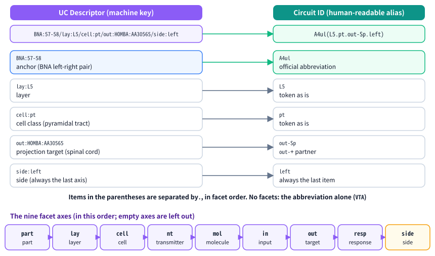

# Naming circuits: UC Descriptor, facets and Circuit ID (v0.17.0)

| Item | Content |
| ---- | ------- |
| Document | How CoBRAC names UCs (Uniform Circuits) and Collections: why naming rules were needed, SABRA anchors, the nine facets, the UC Descriptor and the Circuit ID, laterality, how the Canon uses the descriptor, error codes aligned with WBAI's Error code List (Master), and the points to settle with WBAI |
| Readers | Users, WBAI members who review and merge BRAs, anyone who matches CoBRAC output against other data |
| Versions | The naming rules came with app 0.7.0. The `side` facet, the Circuit ID character set and separators, and the Master error codes are from 0.17.0. The SABRA boundary that uses BNA for the neocortex only is from 0.21.0 (§4.3) |
| Related | [05_CoBRAC_Harness_v1_to_v1_1.md](./05_CoBRAC_Harness_v1_to_v1_1.md) (harness v1.1, where the naming rules were introduced) / [06_Research_mode_and_Canon.md](./06_Research_mode_and_Canon.md) (Canon user guide) / [07_CoBRAC_Harness_v1_1_to_v2.md](./07_CoBRAC_Harness_v1_1_to_v2.md) (harness v2) / [01_設計仕様.md](./01_設計仕様.md) / 日本語: [08_Circuit_naming_ja.md](./08_Circuit_naming_ja.md) |

---

## 1. In short

CoBRAC ties every circuit of an HCD to **one SABRA unit (the anchor)**. Populations finer than a SABRA unit (a subregion, a layer, a cell type, a molecular marker, a projection target, one side, and so on) are added after the anchor as **facets**. The anchor and the facets in a fixed order form the **UC Descriptor**, the circuit's unique machine key. The **Circuit ID** is a human-readable alias that is derived mechanically from the descriptor.

For example, the DRD1-positive population of the nucleus accumbens shell has the descriptor `HOMBA:10341/mol:DRD1+` and the Circuit ID `NACs(DRD1+)` in every project. When two names are the same, the populations are the same, so circuits can be matched across projects; the Canon uses the descriptor as its key.

Version 0.17.0 changed three things:

- Laterality became the ninth facet, `side`, and anchors are always left-right pairs.
- Circuit IDs use WBAI's interim character set (plus the parentheses), and items inside the parentheses are separated by `.`.
- The error codes of the checks follow WBAI's Error code List (Master); checks without a Master code have local codes that start with `cobrac:`.


---

## 2. Terms

| Term | Meaning |
| ---- | ------- |
| UC | Uniform Circuit: the smallest mesoscopic neural population that encodes homogeneous information. A node of the HCD |
| Collection | A circuit the HCD splits into finer UCs (Uniform = FALSE). It has Sub-Circuits and is never the end of a connection |
| SABRA | The organisation's mixed atlas: BNA (Brainnetome) for the neocortex, DHBA for everything else (subcortical nuclei, the hippocampal formation and other allocortex, brainstem, cerebellum, ...; boundary of 2026-10-04, §4.3). SABRA has no IDs of its own |
| HOMBA / DHBA / BNA | HOMBA is the human brain ontology. A unit on the DHBA side is a HOMBA term that has a DHBA name. A unit on the BNA side is a BNA label (odd = left, even = right) |
| RCS | ROSETTA Candidate Search, an MCP server that returns HOMBA and BNA candidates for a name. The agent uses it to find the anchor |
| Anchor | The SABRA unit a UC is tied to (`HOMBA:<id>`, `BNA:<left>-<right>`, `BNAG:<L2 abbreviation>`, or several joined by `&`) |
| Facet | A property finer than the anchor, written `axis:value`, with nine axes in a fixed order |
| UC Descriptor | The machine key made of the anchor and the facets (the "descriptor" below) |
| Circuit ID | The human-readable alias of the descriptor. The ID on the BRA Circuits sheet, also referenced from the FRG as `U.<Circuit ID>` |
| Canon | A set of projects that want to share circuit definitions; generation uses those definitions as constraints |

---

## 3. Why naming rules were needed

### 3.1 Free names could not be matched across projects

Before 0.7.0 the agent gave each project's circuits free Circuit IDs. The old samples have names such as `PC`, `GrC`, `MF_VN`, `CA3-Pyr`, `L-DLPFC` and `FG-math`. The only check was that a Circuit ID had no spaces.

This had two problems.

- **The same population got different names in different projects.** One project might write the DRD1-positive population of the nucleus accumbens shell as `NAc_shell_D1`, another as `NACs-DRD1`; and the same string could also mean different populations. Circuits could therefore not be counted across projects, and their definitions could not be kept consistent.
- **The names did not say which atlas unit they meant.** Which region a name referred to was written only in the agent's descriptions, so there was no mechanical way to tell which SABRA unit it corresponded to. Circuits that are a whole SABRA unit (the whole VTA, say) tended to agree, but sub-populations cut out by layer, cell type or projection target varied widely in how they were written.

WBAI itself has no rule yet for circuits finer than a SABRA unit (ISS-001 is open). The examples in the Data Preparation Manual and the ontology vary as well: `CA1_distal`, `Cx.L2_3PV`, `M1C.L5PT`, `BL_fear`. At the same time, the organisation's discussions agree that UCs split by layer or cell type are needed.

### 3.2 Principles

CoBRAC's rules follow these principles.

- **The anchor is always a SABRA unit.** Everything finer goes into facets, so every circuit is tied to some place in SABRA.
- **UCs get no assigned numbers.** In the same way that SABRA has no IDs of its own, a name is built only from existing atlas IDs and explicit properties. The normalized descriptor itself is the cross-project key, so no central registry hands out numbers.
- **The same population has the same name in every project.** What differs between projects is only the circuit's role (inside or outside the ROI, Interface, Output Semantics, Uniform or Collection). No project prefix is added.
- **Species are not part of the name.** A BRA is about human circuits (and extrapolation to humans); findings from animals are recorded in the connection's Taxon.
- **A UC that is a whole SABRA unit is the normal case.** Facets are added only when the HCD needs a population finer than the unit. Facets are not added to describe a circuit; what it encodes still goes into Output Semantics.

---

## 4. SABRA anchors

### 4.1 Forms of an anchor

| Form | Meaning | Example |
| ---- | ------- | ------- |
| `HOMBA:<id>` | A unit on the DHBA side of SABRA; only HOMBA terms that have a DHBA name | `HOMBA:12261` (VTA) |
| `BNA:<left>-<right>` | One neocortical BNA area, always the left-right pair (odd, odd+1) | `BNA:57-58` (A4ul) |
| `BNAG:<L2 abbreviation>` | A whole neocortical BNA L2 group (a gyrus, for example), when the RCS distribution is broad and no single area stands out | `BNAG:MFG` |
| `A&B` | A circuit that spans several SABRA units | `HOMBA:…&HOMBA:…` |

- There is no `SABRA:` or `DHBA:` prefix, because SABRA has no IDs of its own.
- A subdivision inside BNA territory (the neocortex) is written as `part:HOMBA:…` under the BNA anchor. The reverse, a BNA area as `part` under a DHBA anchor, is not used.
- A region with no DHBA-named term on its path, such as the spinal cord, is not a SABRA unit. Its anchor is the nearest DHBA ancestor that RCS returns, with the finer region in `part`. Such regions can be written freely as projection targets or input sources (`out` / `in`).

### 4.2 Finding the anchor with RCS

The agent splits the description of a circuit into the words that name a region and the rest, and queries RCS with the region words only. The rest (genes, cell types and so on) become facets from the start.

| RCS result | Anchor | Facets |
| ---------- | ------ | ------ |
| Exact match on the DHBA side (`relation '='`, `dhba_exact: true`) | That `HOMBA:` term | The non-region words |
| DHBA side, query finer (`dhba_exact: false` or `relation <`) | The ancestor with a DHBA name that RCS returns (`sabra.dhba_homba_id`) | `part:<matched HOMBA term>` and the non-region words |
| BNA side (`atlas: BNA`, neocortex) | The area pair from the `search_bna_candidates` results with `sabra.atlas: BNA`; `BNAG:<L2>` when no single area clearly dominates | `part:<HOMBA term>` when the HOMBA term is finer than the BNA area |
| Query broader (`relation >`) | `A&B`, or the common SABRA ancestor | — |
| No candidates | Do not guess; ask the user | — |

A single BNA area is chosen when the top candidate has `p_raw` of at least 0.5 and `k_papers` of at least 2 (`prompts/phases/HCD.md`).

### 4.3 The BNA/DHBA boundary (v0.21.0)

On 2026-10-04 the SABRA specification changed: BNA is now used **for the neocortex only**. Until then the 36 subcortical BNA labels (amygdala `Amyg`, hippocampus `Hipp`, basal ganglia `BG`, thalamus `Tha`) and the allocortex (hippocampal formation, entorhinal cortex, ...) were BNA too. These regions are now named with DHBA terms.

| Region | SABRA before | SABRA now |
| ------ | ------------ | --------- |
| Neocortex (BNA cortical labels 1–210 except the two areas below: 206 labels) | BNA | BNA |
| Amygdala (BNA `mAmyg`, `lAmyg`) | BNA | DHBA (`AMY` and its nuclei such as `CEN`, `BLN`, `La`) |
| Hippocampus (BNA `rHipp`, `cHipp`) | BNA | DHBA (`HiF` and its parts such as `CA1`, `DG`, `S`) |
| Basal ganglia (BNA `vCa`, `dCa`, `GP`, `NAC`, `vmPu`, `dlPu`) | BNA | DHBA (`Ca`, `GP`, `NAC`, `NACs`, `Pu`, ...) |
| Thalamus (the 8 BNA subregions) | BNA | DHBA (`DTH` and its nuclei such as `MD`, `VPL`, `Pul`, `LG`) |
| Entorhinal cortex (BNA `A28/34`) and temporal agranular insular cortex (BNA `TI`) | BNA | DHBA (`EC`, `TI`; outside the neocortex in HOMBA) |
| Olfactory, piriform and other allocortex | BNA (no label) | DHBA |

- The boundary is defined in RCS `rcs/sabra.py`. RCS `get_homba_term` and `search_homba_candidates` return `sabra.atlas` under the new boundary, and `search_bna_candidates` marks non-neocortical areas `sabra.atlas: DHBA`, `sabra_unit: false`.
- In new projects, non-neocortical BNA areas (labels 211–246, `BNA:115-116`, `BNA:117-118`) and `BNAG:Amyg`, `BNAG:Hipp`, `BNAG:BG`, `BNAG:Tha` may not be used as anchors or as `in` / `out` or other values. The worker's check sends them back with the DHBA term that contains the area.
- **Existing projects do not change.** Projects created before 0.21.0 keep their BNA anchors: they load, pass the checks and export as before, and follow-ups do not ask for a rewrite (they have no `sabraBoundary`, so the checks use the earlier boundary). A copied project keeps the original's setting.
- **Canon**: stored Canon circuits are not rewritten either. A project that follows a Canon may use the Canon's descriptors as they are (such as `BNA:223-224` from the earlier boundary).

---

## 5. Facets (the nine axes)

Facets are written `axis:value[,value…]` and joined with `/` in the order below. Each axis appears at most once; empty axes are left out.

| Order | Axis | Content | Example |
| ----- | ---- | ------- | ------- |
| 1 | `part` | A region finer than the anchor; a finer HOMBA term first, otherwise a short word | `part:HOMBA:10341` |
| 2 | `lay` | Layer | `lay:L5` |
| 3 | `cell` | Morphology or cell class | `cell:pyr`, `cell:purkinje`, `cell:pt` |
| 4 | `nt` | Transmitter (`Glu` `GABA` `Gly` `ACh` `DA` `NE` `5HT` `His` `pep`) | `nt:DA` |
| 5 | `mol` | Molecular marker with polarity (`+` `-` `~hi` `~lo`) | `mol:DRD1+` |
| 6 | `in` | Population defined by its input | `in:HOMBA:12261` |
| 7 | `out` | Population defined by its projection target | `out:HOMBA:10339` |
| 8 | `resp` | Response property or functional tuning | `resp:rpe` |
| 9 | `side` | Side (one value, `left` or `right`; omitted means both sides or not distinguished) | `side:left` |

- Axes are used only for **properties that select the population**. `in` / `out` are used only when the projection defines the population; a plain projection is a connection.
- A `mol` value always has a polarity. Gene symbols are official (HGNC for human), and one descriptor uses one spelling.
- Values of `part`, `in` and `out` need not be SABRA units (the spinal cord `HOMBA:AA30565` has no DHBA name but can be a projection target).
- `side` was added in 0.17.0 and is always last ([chapter 7](#7-laterality-moved-to-the-side-facet-v0170)).

---

## 6. UC Descriptor and Circuit ID

### 6.1 UC Descriptor (the machine key)

```
UC Descriptor = <anchor>{&<anchor>}{/<axis>:<value>[,<value>]}
example: HOMBA:10341/mol:DRD1+, BNA:57-58/lay:L5/side:left
```

- The descriptor is written in `descriptor` of `uc.json`. It appears in the last column (UC Descriptor) of `Circuits.csv` and of the Circuits sheet of the xlsx, and in the node details of the HCD graph.
- **Descriptors are normalized before they are compared:** brought to the current form ([7.2](#72-reading-older-forms)), with `mol` values in alphabetical order and the whole string in lower case, so `DRD1+` and `Drd1+` are the same. The original form, with its case, is used for display.
- Two circuits of one HCD (UCs and Collections together) cannot have the same descriptor.

### 6.2 Circuit ID (the human-readable alias)

```
Circuit ID = <anchor abbreviation> [ "(" <item> { "." <item> } ")" ]
<item>     = <word> | ("out-" | "in-") <partner abbreviation> | "left" | "right"
characters = A-Z a-z 0-9 . _ ~ - (interim spec of 2026-08-06) and / + (agreed on 2026-08-19), ( ) around the items
```



**Head (the anchor abbreviation)**

- The anchor's official SABRA abbreviation, exactly, case included: the neocortical BNA area abbreviation on the BNA side (`A4ul`, `A44d`, `A9/46d`), the DHBA acronym on the DHBA side (the arcuate nucleus is DHBA `Arc`, not HOMBA `ArH`).
- The only conversion is a space to `_` (one case in BNA: `TE1.0 and TE1.2` → `TE1.0_and_TE1.2`). `/` and `+` joined the allowed characters on 2026-08-19, so `A9/46d`, `A1/2/3ll` and `V5/MT+` are used as they are.
- A circuit that spans several SABRA units (`BNAG:`, `A&B`) provisionally uses the common BNA L2 abbreviation (`MFG`), or the first anchor's abbreviation when there is none.
- Custom or colloquial abbreviations (`NAc`, `LC`) and abbreviations of subdivisions that are not SABRA units (such as `CH10` of the flocculus) never form the head; they go into the parentheses as the `part` item.

**Items in the parentheses**

- One item per facet value, in facet order, separated by `.`. No facets, no parentheses (`VTA`, `NAC`).
- `part` is a short English word for the subregion (`shell`, `floc`) or a well-known abbreviation (`CA1`). `lay`, `cell`, `nt`, `mol` and `resp` are the descriptor's words as they are (`L5`, `pyr`, `DA`, `DRD1+`, `rpe`).
- `out` / `in` become `out-<partner abbreviation>` / `in-<partner abbreviation>` (`out-NAC`, `in-VTA`). A partner that is not a SABRA unit uses its HOMBA acronym (the spinal cord is `out-Sp`).
- A `.` inside an item would look like a separator, so it becomes `_`. A `-` inside a word is fine (the gene `HLA-A`); a final `+` / `-` is a polarity.

**Characters and separators**

| Character | Use | Reason |
| --------- | --- | ------ |
| `A-Z a-z 0-9 . _ ~ -` | Allowed | WBAI's interim specification of 2026-08-06; the same set as RFC 3986 unreserved |
| `/` `+` | Allowed | Agreed on 2026-08-19, so that official BNA abbreviations (`A9/46d`, `V5/MT+`) can be used as they are |
| `( )` | Allowed only around the items | RFC 3986 sub-delims, usable in URL paths as they are; allowed in file names on the major operating systems; no bash brace expansion. Never nested |
| `.` (inside the parentheses) | Item separator | In the allowed set, and in line with the organisation's `BNA.A8m.L3` style |
| `,` `:` `@` | Not used | Outside the allowed set. A `,` needs CSV quoting, and the template's Graph Generator (CSV for draw.io) splits the ID at it |
| `{ }` `[ ]` `< >` `;` `\|` space | Not used | `{}` triggers brace expansion; `[]` must be encoded in URLs and looks like a `[U.X]` reference; `<>` clashes with HTML; `;` separates Subnodes; `\|` breaks Markdown tables |

- Circuit IDs are unique **case-sensitively**, because 45 pairs of official BNA and DHBA abbreviations differ only in case (`CB` and `cb`, for example). Descriptors are compared in lower case, as in 6.1.
- The `U.` prefix is removed by dropping the leading `U.` only, so `U.NACs(DRD1+)` and `[U.A4ul(L5.pt.left)]` do not clash with the separators. IDs in Interfaces and Subnodes are split only at separators outside parentheses.
- Some care is still needed: quote the ID when passing it to a shell (`'NACs(DRD1+)'`), write `)` as `%29` in the URL of a Markdown link, and escape `(` `)` `.` `+` `/` when putting an ID in a regular expression.

Recalculating the formulas of the templates (Template-v2-2 and v2-3) in LibreOffice found nothing that breaks on IDs with `( )`: the IDs are handled as strings by EXACT, VLOOKUP, SEARCH and SPLIT, and nowhere are the parentheses read as a function. The earlier comma-separated IDs (`Amyg(BL,out:CEN)`), on the other hand, were split in two in the Graph Generator's CSV. Switching to `.` in 0.17.0 removed that problem.

### 6.3 Examples

| Circuit | UC Descriptor | Circuit ID | Note |
| ------- | ------------- | ---------- | ---- |
| Ventral tegmental area (whole) | `HOMBA:12261` | `VTA` | No facets (a DHBA-side unit itself) |
| Nucleus accumbens (whole, both sides) | `HOMBA:10339` | `NAC` | No facets (DHBA side; `BNA:223-224` before 0.21.0) |
| Left area 4, upper limb region | `BNA:57-58/side:left` | `A4ul(left)` | The side is `side`; last item in the ID |
| Noradrenergic cells of the locus coeruleus | `HOMBA:12499/nt:NE` | `NC(NE)` | One axis (transmitter) |
| Nucleus accumbens shell | `HOMBA:10341` | `NACs` | The shell has a DHBA name, so it is a SABRA unit itself |
| AgRP neurons of the arcuate nucleus | `HOMBA:10492/mol:AGRP+` | `Arc(AGRP+)` | The head is the DHBA acronym `Arc` |
| DRD1-positive cells of the NAc shell | `HOMBA:10341/mol:DRD1+` | `NACs(DRD1+)` | One axis (molecular marker) |
| Purkinje cells of the flocculus | `HOMBA:12852/part:HOMBA:AA30423/cell:purkinje` | `FNCb(floc.purkinje)` | The flocculus has no DHBA name, so the anchor is its DHBA-named ancestor, the flocculonodular lobe |
| VTA dopamine cells that project to the NAc and encode reward prediction error | `HOMBA:12261/nt:DA/out:HOMBA:10339/resp:rpe` | `VTA(DA.out-NAC.rpe)` | A population defined by its target, plus a response property |
| Corticospinal cells of layer 5, left area 4 upper limb region | `BNA:57-58/lay:L5/cell:pt/out:HOMBA:AA30565/side:left` | `A4ul(L5.pt.out-Sp.left)` | The spinal cord is not a SABRA unit, so its HOMBA acronym `Sp` |
| Hippocampal CA1 pyramidal cells | `HOMBA:10297/cell:pyr` | `CA1(pyr)` | CA1 is a SABRA unit with a DHBA name (before 0.21.0: `BNAG:Hipp/part:HOMBA:10297/cell:pyr`, `Hipp(CA1.pyr)`) |
| Layer III cells of left dorsal area 9/46 | `BNA:15-16/lay:L3/side:left` | `A9/46d(L3.left)` | The official abbreviation `A9/46d` as it is |

### 6.4 What the worker checks

At the end of the HCD step the worker checks the names in `uc.json` in this order (`checkUcNaming`, `packages/shared/src/ucNaming.ts`). Problems go back to the agent in a fix turn.

1. **Descriptor syntax and meaning:** the form of the anchors, BNA numbers (1–246; a pair is odd and odd+1), facet order and repetition, `mol` polarity, the `side` value (one of `left` / `right`). A descriptor in an older form is asked to be rewritten in the current form. In projects created from 0.21.0, no anchor or value may be a non-neocortical BNA area or group (§4.3; descriptors in the pinned Canon are exempt).
2. **Duplicate descriptors:** no two UCs or Collections share a normalized descriptor.
3. **Items in the parentheses:** as many items as facet values; with `side`, the last item is its value; without `side`, no `left` / `right` item.
4. **Head abbreviation:** it equals the anchor's official abbreviation, case included (BNA from the built-in table, HOMBA / DHBA from RCS `get_homba_term`). An anchor on a HOMBA term in BNA territory, or on a term without a DHBA name, is sent back with the correct anchor. Anchors that RCS could not be asked about skip only this comparison.
5. **Characters:** the Circuit ID uses only the allowed characters and `( )` (also for Collections without a descriptor).

The checks also make sure that UCs and Collections do not share a Circuit ID, and that the `names` of a UC without facets start with its SABRA official name.

---

## 7. Laterality moved to the side facet (v0.17.0)

### 7.1 What changed

Up to 0.16 the side was part of the anchor. A one-sided BNA area was a single label (`BNA:57` is the left A4ul); on the DHBA side and for BNA groups it was `@L` / `@R` (`BNAG:FuG@L`); and Circuit IDs carried an `@` as in `A4ul@L`.

WBAI decided on 2026-07-14 to drop `_L` / `_R` from Circuit names (in line with DHBA and the hippocampal BIF; left-right duplicates are analysed separately). The interim specification of 2026-08-06 set the Circuit ID characters to `A-Za-z0-9._~-`, and on 2026-08-19 `/` and `+` were agreed in addition. `@` is outside that set. A first attempt removed the side from the ID and kept it only in the descriptor, but then the left and the right of one population got the same ID in one HCD and could not both exist. So 0.17.0 uses the following form ([PR #64](https://github.com/miyamoto9265/cobrac-web/pull/64)).

- **The side is the ninth facet, `side`.** Its value is `left` or `right`; leaving it out means both sides or not distinguished.
- **Anchors are always left-right pairs.** `BNA:57` is written `BNA:57-58/side:left`.
- **The Circuit ID shows the side only when it is distinguished, as the last item:** `A4ul(left)`, `A8m(L3.left)`, `A4ul(L5.pt.out-Sp.left)`; both sides are `A4ul`. Not distinguishing the side is the default, so this agrees with the 7/14 decision.
- **The left and the right of one population can be separate circuits in one HCD** (`A4ul(left)` and `A4ul(right)` differ in both descriptor and ID). If a both-sides circuit (`A4ul`) sits next to a one-sided one (`A4ul(left)`), the checks ask for the both-sides circuit to become a Collection, as with any other subdivision (`cobrac:nested-uc`).
- At the same time the separator inside the parentheses changed from `,` to `.`, and projections from `out:` to `out-` (`MVOcC(V1,L4Ca)` → `MVOcC(V1.L4Ca)`, `Amyg(BL,out:CEN)` → `Amyg(BL.out-CEN)`).

### 7.2 Reading older forms

Projects and Canons made up to 0.16 still contain descriptors and Circuit IDs in the older forms. **Stored data is not rewritten.** It is brought to the current form when read and compared in that form.


| Target | Older form | Form when read | Function |
| ------ | ---------- | -------------- | -------- |
| Descriptor (single BNA label) | `BNA:57` / `BNA:58` | `BNA:57-58/side:left` / `BNA:57-58/side:right` | `canonicalUcDescriptor` |
| Descriptor (`@L` / `@R`) | `BNAG:FuG@L`, `HOMBA:12261@R` | `BNAG:FuG/side:left`, `HOMBA:12261/side:right` | same |
| Circuit ID (`@`, `,`, `out:`) | `A4ul@L(L5,pt,out:Sp)` | `A4ul(L5.pt.out-Sp.left)` | `modernCircuitId` |
| Circuit ID (`,` separator) | `NAC(shell,DRD1+)` | `NAC(shell.DRD1+)` | same |
| Circuit ID (`@` and the `/` of an official abbreviation) | `A9/46d@L(L3)` | `A9/46d(L3.left)` | same |

- **Checks:** at the next follow-up of an older project the validator asks for the current form (also in connections, Sub-Circuits, Output Semantics and `[U.…]` references).
- **Output:** the viewer and the CSV / xlsx show the stored ID as it is. The CSV writer quotes older IDs that contain `,`.
- A descriptor that mixes a single label for one side with a `side` facet for the other (for example `BNA:57/side:right`) is not converted; it is an error.

---

## 8. How the Canon uses the descriptor

A Canon keys a project's circuits by the **normalized descriptor**. A project's JSON writes connections and the like with Circuit IDs, so they are resolved to descriptors on push or pull request: a Circuit ID can be renamed, but a descriptor is unique within the Canon. A Collection that only groups several units and has no descriptor (for example `Mesolimbic-loop`) is keyed `group:<Circuit ID>`.


The main checks that involve the descriptor are listed below (these codes are the Canon's own, separate from BRA error codes). During generation, error conflicts go back to the agent in a fix turn.

| Code | Content | During generation |
| ---- | ------- | ----------------- |
| C1 | The same descriptor is Uniform in one place and a Collection in the other | Error |
| C2b / C2c | A Collection has more Sub-Circuits than in the Canon / is split differently | Warning / error |
| C3 | A Uniform circuit has beside it a finer circuit: same anchor, all its facets and more | Error |
| C4 | Circuit ID and descriptor are not one-to-one (another ID for the same descriptor, or another descriptor for the same ID) | Error |
| C5 | A connection ends on a circuit that is a Collection in the Canon | Error |
| C6 | The official name (first of `names`) differs | Error |

- **"Finer" is decided by the descriptor's facets.** `side` counts as a facet, so adding `A4ul(left)` to a Canon with a Uniform both-sides `A4ul` is C3. The left and the right alone can coexist as separate circuits.
- **Older forms are compared in the current form** (`currentCanonSnapshot`): `bna:29` and `bna:29-30/side:left` are the same circuit, and `A44d@L` and `A44d(left)` the same Circuit ID, so they are not C4. When a project brings the current form, the pull request shows a rename and the merged Canon takes the current form.
- The `canon/` files given to the agent and the keys of already-verified quotes are written in the current form as well.

---

## 9. Error codes aligned with the WBAI Master (v0.17.0)

Up to 0.16, CoBRAC's check messages and its checker (`scripts/bra-appendix-d.mjs`) cited the numbers of Appendix D of the ontology report. Compared with WBAI's [BRA data: Error code List (Master)](https://docs.google.com/spreadsheets/d/1mCQOmjBRIx-k12a2x8uV3aSKKZ5dDW0na4bVnZtAzhM/edit) (the list Template-v2-2 / v2-3 refer to), Appendix D had numbers the Master lacks and numbers that mean something else there. Version 0.17.0 aligns every code with the Master and gives CoBRAC checks that have no Master code **local codes starting with `cobrac:`** ([PR #60](https://github.com/miyamoto9265/cobrac-web/pull/60)). They are names rather than borrowed numbers so that they cannot clash with Master numbers.

### 9.1 Codes about names and granularity

| Check | Old (Appendix D) | New |
| ----- | ---------------- | --- |
| Allowed characters of a Circuit ID | 104 | `cobrac:circuit-id-chars` (Master 104 is "suspected semantic duplicate") |
| A UC and a finer UC inside it are both UCs (including both sides vs one side) | 127 (design spec and article) | `cobrac:nested-uc` (Master 127 is "Uniform missing") |
| Sender not uniform (a Collection as sender, or a sender spanning several units without facets) | 205 (not in the Master) | **203** |
| Collection without Sub-Circuits | 128 (means something else in the Master) | **120** |
| Undefined Circuit ID in Sub-Circuits | included in 128 | **121** |
| A UC with Sub-Circuits | 129 (not in the Master) | `cobrac:uc-no-sub-circuits` |
| Source of ID of a Collection is not `collection` | 108 (design spec) | `cobrac:collection-source` |
| A U. node's ID is not `U.` + a defined Circuit ID | 415 | `cobrac:u-node-circuit` |
| A U. node without Circuit ID | 420 | **424** |

### 9.2 The local `cobrac:` codes

| Code | Content |
| ---- | ------- |
| `cobrac:circuit-id-chars` | A Circuit ID uses characters outside `A-Za-z0-9 . _ ~ - / +` and `( )` |
| `cobrac:nested-uc` | A UC and a finer UC inside it are both UCs |
| `cobrac:uc-no-sub-circuits` | A UC row has Sub-Circuits |
| `cobrac:collection-members` | A Collection contains itself, forms a cycle, or has only `makeshift` members |
| `cobrac:collection-end` | A Collection is the receiver of a connection (stricter than the Master) |
| `cobrac:collection-source` | The Source of ID of a Collection is not `collection` |
| `cobrac:ref-id-unique` | Duplicate Reference ID |
| `cobrac:u-node-circuit` | A U. node's ID is not `U.` + a defined Circuit ID |
| `cobrac:node-id-unique` | Duplicate Node ID |
| `cobrac:gn-no-circuit-id` | A node other than U. has a Circuit ID |
| `cobrac:capability-required` | Capability missing |
| `cobrac:frg-acyclic` | A cycle in the FRG |

- The checker's JSON output keeps each code's old Appendix D number as `appendixD`, and the Markdown report has an Appendix D column, so earlier reports can still be compared.
- Only the code numbers and wording changed, not what is checked. The Canon conflict codes (C1–C13) and the HCD↔FRG consistency checks (X1–X9) are CoBRAC's own and did not change.

---

## 10. Points to settle with WBAI

| Point | What CoBRAC does now | What we would like to settle |
| ----- | -------------------- | ---------------------------- |
| Adding `( )` to the Circuit ID characters | Uses the interim characters (8/6 and 8/19) plus `( )` only, checked as `cobrac:circuit-id-chars` | Whether `( )` can join the character set; we would like an ID with parentheses to go through the real Review Tool (GAS on Google) once |
| Code for character violations | A local code, because Master 104 means something else | Whether the Master assigns a code to the character violations the interim spec called 104 |
| How to write layers | Inside the parentheses, as `(L3)` | Whether to align with the organisation's `.L3` in the `BNA.A8m.L3` style (under discussion) |
| `BNA.` / `DHBA.` prefixes | Not used | Whether to follow the interim spec's prefixes |
| Naming circuits finer than SABRA (ISS-001) | The anchor + facets rules | Whether the organisation adopts them, and what to change |
| Head of circuits spanning several units | Provisionally the common BNA L2 abbreviation (`MFG`) | Whether this is acceptable |
| `BNA` as Source of ID | Written as a CoBRAC extension (the Review Tool may report 108) | Whether `BNA` can join the enumeration (U9) |
| Where the UC Descriptor and facets go | The last column of the CoBRAC xlsx; Template-v2-2 has no place for them | Whether the template can gain descriptor and facet columns (U21) |
| Checks without a Master code | 12 local `cobrac:` codes | Whether some should join the Master or the Review Tool's automatic checks |
| Uniform is relative to each BRA | The same descriptor can be a UC in a coarse HCD and a Collection in a fine one | How WholeBIF should merge circuits whose Uniform values differ (U20) |

Open on the CoBRAC side are also the thresholds for choosing a single BNA area (`p_raw`, `eff_n`), regions that are not SABRA units (such as the spinal cord), the source of the `cell` and `resp` vocabularies, and the detailed rules for qualifying a Circuit ID when two would collide.

---

## 11. Where the code is

| Content | Location |
| ------- | -------- |
| Descriptor and Circuit ID syntax, normalization, reading older forms, the naming checks | `packages/shared/src/ucNaming.ts` |
| `uc.json` checks (duplicates, Collections, granularity) | `packages/shared/src/harness.ts` |
| The table of the 246 BNA labels | `packages/shared/src/bnaLabels.ts` |
| Canon matching (C1–C13, comparing older forms) | `packages/shared/src/canonMerge.ts`, `canonConstraints.ts` |
| Naming instructions for the agent | `prompts/phases/HCD.md` |
| BRA output checker (Master codes, `cobrac:` codes, Appendix D numbers) | `scripts/bra-appendix-d.mjs` |
| Tests | `packages/shared/test/ucNaming.test.ts`, `harness.test.ts`, `canonMerge.test.ts`, `scripts/bra-appendix-d.test.mjs` |
