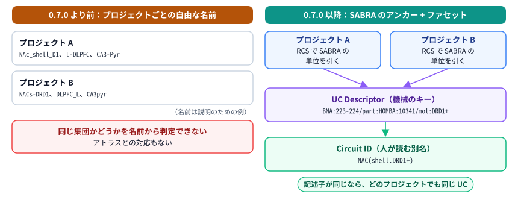
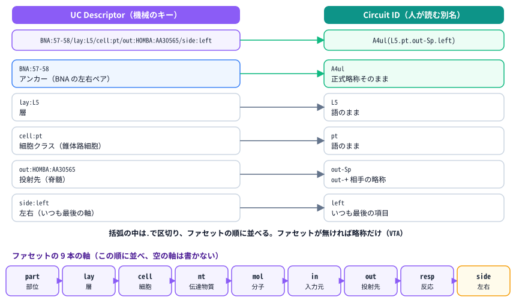
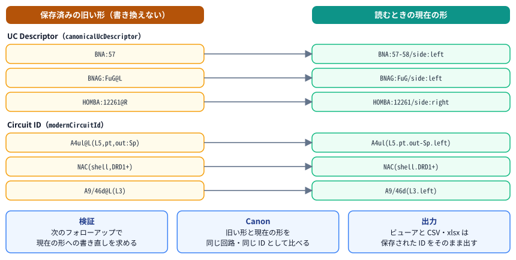
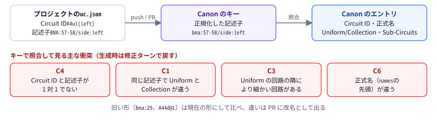

# 回路の名前の付け方：UC Descriptor・ファセット・Circuit ID（v0.17.0）

| 項目 | 内容 |
| ---- | ---- |
| 文書 | CoBRAC が UC（Uniform Circuit）と Collection に付ける名前の規則の解説。名前の規則が必要になった理由、SABRA のアンカー、9 本のファセット、UC Descriptor と Circuit ID、左右の扱い、Canon での使い方、WBAI の Error code List (Master) に合わせたエラーコード、WBAI に確認したい点 |
| 対象読者 | 利用者、BRA を審査・統合する WBAI のメンバー、CoBRAC の出力を他のデータと突き合わせる人 |
| 対象バージョン | 命名規則の導入はアプリ 0.7.0。左右のファセット `side`、Circuit ID の文字集合と区切り、Master に合わせたエラーコードは 0.17.0 から。BNA を新皮質だけに使う SABRA の境界は 0.21.0 から（§4.3） |
| 関連 | [05_CoBRAC_Harness_v1_to_v1_1_ja.md](./05_CoBRAC_Harness_v1_to_v1_1_ja.md)（命名規則が入った v1.1 の解説）/ [06_Research_mode_and_Canon_ja.md](./06_Research_mode_and_Canon_ja.md)（Canon の利用ガイド）/ [07_CoBRAC_Harness_v1_1_to_v2_ja.md](./07_CoBRAC_Harness_v1_1_to_v2_ja.md)（v2 の解説）/ [01_設計仕様.md](./01_設計仕様.md) / English: [08_Circuit_naming.md](./08_Circuit_naming.md) |

---

## 1. ひとことで言うと

CoBRAC は、HCD のすべての回路を **SABRA の単位（アンカー）1 つ**に結びつけて名付けます。SABRA の単位より細かい集団（部位の細分、層、細胞種、分子マーカー、投射先、左右など）は、アンカーの後ろに **ファセット**として足します。アンカーとファセットを決まった順に並べたものが **UC Descriptor** で、これが回路の機械向けの一意なキーです。**Circuit ID** は、その Descriptor から機械的に作る人が読むための別名です。

例えば、側坐核 shell の DRD1 陽性の集団は、どのプロジェクトでも Descriptor が `HOMBA:10341/mol:DRD1+`、Circuit ID が `NACs(DRD1+)` になります。名前が同じなら同じ集団だと分かるので、プロジェクトをまたいで回路を照合でき、Canon もこの Descriptor をキーにしています。

0.17.0 では次の 3 点を変えました。

- 左右を 9 本目のファセット `side` にし、アンカーは常に左右のペアにしました。
- Circuit ID の文字を WBAI の仮仕様の文字集合（と括弧）にそろえ、括弧の中の区切りを `.` にしました。
- 検査のエラーコードを WBAI の Error code List (Master) に合わせ、Master にコードの無い検査には `cobrac:` で始まるローカルコードを付けました。



---

## 2. 用語

| 用語 | 意味 |
| ---- | ---- |
| UC | Uniform Circuit。均質な情報を符号化する最小のメゾスコピックな神経集団。HCD のノードになる |
| Collection | その HCD が細かい UC に分けた回路（Uniform = FALSE）。Sub-Circuits に分解され、接続の端にはならない |
| SABRA | 組織の混合アトラス。新皮質は BNA（Brainnetome）、それ以外（皮質下核、海馬体などの不等皮質、脳幹、小脳など）は DHBA（2026-10-04 の境界。§4.3）。SABRA 自体は独自の ID を持たない |
| HOMBA / DHBA / BNA | HOMBA はヒトの脳のオントロジー。DHBA 側の単位は、DHBA 名を持つ HOMBA の項。BNA 側の単位は BNA のラベル（左が奇数、右が偶数） |
| RCS | ROSETTA Candidate Search。名前から HOMBA と BNA の候補を返す MCP サーバー。エージェントはこれでアンカーを引く |
| アンカー | UC が結びつく SABRA の単位（`HOMBA:<id>`、`BNA:<左>-<右>`、`BNAG:<L2 略称>`、それらを `&` でつないだもの） |
| ファセット | アンカーより細かい性質。`軸:値` の形で、9 本の軸を決まった順に並べる |
| UC Descriptor | アンカーとファセットを並べた機械向けのキー（以下 Descriptor） |
| Circuit ID | Descriptor の人が読む別名。BRA の Circuits シートの ID で、`U.<Circuit ID>` の形で FRG からも参照される |
| Canon | 回路の定義をそろえたいプロジェクトの集まり。生成時にその定義を制約として使う |

---

## 3. 名前の規則が必要になった理由

### 3.1 自由な名前では、プロジェクトをまたいで照合できなかった

0.7.0 より前は、エージェントがプロジェクトごとに自由に Circuit ID を付けていました。旧サンプルには `PC`、`GrC`、`MF_VN`、`CA3-Pyr`、`L-DLPFC`、`FG-math` といった名前があります。検査は「Circuit ID に空白が無いこと」だけでした。

この方法には 2 つの問題がありました。

- **同じ集団が、プロジェクトごとに別の名前になります。** 側坐核 shell の DRD1 陽性の集団を、あるプロジェクトは `NAc_shell_D1`、別のプロジェクトは `NACs-DRD1` と書くことがありえます。逆に、同じ文字列が別の集団を指すこともありえます。そのため、プロジェクトをまたいで回路を集計したり、同じ回路の定義をそろえたりできませんでした。
- **アトラスとの対応が、名前から分かりません。** 名前がどの領域を指すかはエージェントの説明文にしか書かれておらず、SABRA のどの単位に当たるかを機械的に確かめられませんでした。SABRA の単位そのものの回路（例えば VTA 全体）は比較的そろいやすいのですが、層・細胞種・投射先で切り出したサブ集団になると、書き方の揺れが大きくなりました。

WBAI の組織側にも、SABRA の単位より細かい回路の書き方の規則はまだありません（ISS-001 は未決）。データ準備マニュアルやオントロジーの実例も `CA1_distal`、`Cx.L2_3PV`、`M1C.L5PT`、`BL_fear` とまちまちです。一方で、層や細胞種で分けた UC が必要なこと自体は、組織の議論でも認められています。

### 3.2 規則の考え方

CoBRAC の規則は、次の考え方で組み立てています。

- **アンカーは常に SABRA の単位にします。** SABRA より細かいものは、すべてファセットに回します。こうすると、どの回路も SABRA のどこかに必ず結びつきます。
- **UC に採番の ID は付けません。** SABRA が独自の ID を持たないのと同じ考え方で、既存のアトラス ID と明示的な属性だけから名前を組み立てます。正規化した Descriptor そのものがプロジェクト横断の一意なキーになり、中央で番号を払い出すレジストリは要りません。
- **同じ集団はどのプロジェクトでも同じ名前にします。** プロジェクトによって変わるのは、その回路の役割（ROI の内外、Interface、Output Semantics、Uniform か Collection か）だけです。プロジェクト名の接頭辞も付けません。
- **種は名前に入れません。** BRA はヒトの回路（とヒトへの外挿）を扱うので、動物の知見に基づく場合は、接続のエビデンスの Taxon に書きます。
- **SABRA の単位そのものの UC が通常です。** ファセットは、単位より細かい集団が HCD に必要なときだけ足します。回路を説明するためにファセットを足すことはせず、符号化する内容は従来どおり Output Semantics に書きます。

---

## 4. SABRA のアンカー

### 4.1 アンカーの形

| 形 | 意味 | 例 |
| -- | ---- | -- |
| `HOMBA:<id>` | SABRA の DHBA 側の単位。DHBA 名を持つ HOMBA の項に限る | `HOMBA:12261`（VTA） |
| `BNA:<左>-<右>` | BNA の新皮質の 1 領域。常に左右のペア（奇数, 奇数+1） | `BNA:57-58`（A4ul） |
| `BNAG:<L2 略称>` | BNA の新皮質の L2 の群（回など）全体。RCS の分布が広く、1 つの領域に決まらないとき | `BNAG:MFG` |
| `A&B` | 複数の SABRA 単位にまたがる回路 | `HOMBA:…&HOMBA:…` |

- `SABRA:` や `DHBA:` という接頭辞は作りません。SABRA は独自の ID を持たないためです。
- BNA の担当範囲（新皮質）の中の細分は、BNA のアンカーの下に `part:HOMBA:…` として書きます。逆向き、つまり DHBA のアンカーの下に BNA を `part` として置くことはしません。
- 脊髄のように経路上に DHBA 名を持つ項が無い領域は、SABRA の単位になりません。アンカーには RCS が返す最も近い DHBA の祖先を使い、細かい部位は `part` に書きます。投射先や入力元（`out` / `in`）の値としては、そのまま書けます。

### 4.2 RCS でアンカーを決める

エージェントは、回路の記述を「領域を表す語」と「それ以外の語」に分け、領域の語だけで RCS を引きます。遺伝子や細胞種などの残りの語は、最初からファセットになります。

| RCS の結果 | アンカー | ファセット |
| ---------- | -------- | ---------- |
| DHBA 側で完全一致（`relation '='`、`dhba_exact: true`） | その `HOMBA:` の項 | 領域以外の語 |
| DHBA 側で、クエリの方が細かい（`dhba_exact: false` か `relation <`） | RCS が返す DHBA 名を持つ祖先（`sabra.dhba_homba_id`） | `part:<一致した HOMBA の項>` と、領域以外の語 |
| BNA 側（`atlas: BNA`、新皮質） | `search_bna_candidates` の候補のうち `sabra.atlas: BNA` の領域のペア。1 つの領域がはっきり優勢でなければ `BNAG:<L2>` | HOMBA の項が BNA の領域より細かければ `part:<HOMBA の項>` |
| クエリの方が広い（`relation >`） | `A&B`、または共通の SABRA の祖先 | — |
| 候補が無い | 推測しない。ユーザーに質問する | — |

BNA の領域を 1 つに決める目安は、上位の候補の `p_raw` が 0.5 以上で、`k_papers` が 2 以上であることです（`prompts/phases/HCD.md`）。

### 4.3 BNA と DHBA の境界（v0.21.0）

2026-10-04 に SABRA の仕様が変わり、BNA を使うのは**新皮質だけ**になりました。それまでは、BNA の皮質下の 36 ラベル（扁桃体 `Amyg`、海馬 `Hipp`、大脳基底核 `BG`、視床 `Tha`）と、不等皮質（海馬体・嗅内皮質など）も BNA で表していました。現在は、これらの領域を DHBA の項で表します。

| 領域 | 以前の SABRA | 現在の SABRA |
| ---- | ------------ | ------------ |
| 新皮質（BNA の皮質ラベル 1–210 のうち、下の 2 領域を除く 206 ラベル） | BNA | BNA |
| 扁桃体（BNA の `mAmyg`・`lAmyg`） | BNA | DHBA（`AMY` と、その中の `CEN`・`BLN`・`La` などの核） |
| 海馬（BNA の `rHipp`・`cHipp`） | BNA | DHBA（`HiF` と、その中の `CA1`・`DG`・`S` など） |
| 大脳基底核（BNA の `vCa`・`dCa`・`GP`・`NAC`・`vmPu`・`dlPu`） | BNA | DHBA（`Ca`・`GP`・`NAC`・`NACs`・`Pu` など） |
| 視床（BNA の 8 亜領域） | BNA | DHBA（`DTH` と、その中の `MD`・`VPL`・`Pul`・`LG` などの核） |
| 嗅内皮質（BNA の `A28/34`）と側頭無顆粒島皮質（BNA の `TI`） | BNA | DHBA（`EC`・`TI`。HOMBA では新皮質の外にある） |
| 嗅皮質・梨状皮質などの不等皮質 | BNA（ラベルは無い） | DHBA |

- 境界の正本は RCS の `rcs/sabra.py` です。RCS の `get_homba_term` と `search_homba_candidates` は新しい境界で `sabra.atlas` を返し、`search_bna_candidates` は新皮質でない領域に `sabra.atlas: DHBA`、`sabra_unit: false` を付けます。
- 新しく作るプロジェクトでは、新皮質でない BNA の領域（ラベル 211–246、`BNA:115-116`、`BNA:117-118`）と、`BNAG:Amyg`・`BNAG:Hipp`・`BNAG:BG`・`BNAG:Tha` を、アンカーにも `in` / `out` などの値にも使えません。ワーカーの検査が、その領域を含む DHBA の項を示して直させます。
- **既存のプロジェクトは変えません。** 0.21.0 より前に作ったプロジェクトは、BNA のアンカーのまま読み込み・検査・出力でき、フォローアップでも書き直しを求めません（プロジェクトの `sabraBoundary` が無いため、検査は以前の境界のまま）。複製したプロジェクトは元の設定を引き継ぎます。
- **Canon**: 保存済みの Canon の回路も書き換えません。Canon に従うプロジェクトは、Canon にある Descriptor（以前の境界で作られた `BNA:223-224` など）をそのまま使えます。

---

## 5. ファセット（9 本の軸）

ファセットは `軸:値[,値…]` の形で、次の順に `/` でつなぎます。各軸は 1 回までで、空の軸は書きません。

| 順 | 軸 | 内容 | 例 |
| -- | -- | ---- | -- |
| 1 | `part` | アンカーより細かい部位。より細かい HOMBA の項を優先し、無ければ短い語 | `part:HOMBA:10341` |
| 2 | `lay` | 層 | `lay:L5` |
| 3 | `cell` | 形態・細胞クラス | `cell:pyr`、`cell:purkinje`、`cell:pt` |
| 4 | `nt` | 伝達物質（`Glu` `GABA` `Gly` `ACh` `DA` `NE` `5HT` `His` `pep`） | `nt:DA` |
| 5 | `mol` | 分子マーカーと極性（`+` `-` `~hi` `~lo`） | `mol:DRD1+` |
| 6 | `in` | 入力元で定義される集団 | `in:HOMBA:12261` |
| 7 | `out` | 投射先で定義される集団 | `out:HOMBA:10339` |
| 8 | `resp` | 反応性・機能的なチューニング | `resp:rpe` |
| 9 | `side` | 左右（`left` / `right` の 1 値。付けなければ両側、または区別しない） | `side:left` |

- 軸は、**集団を選び出す性質**にだけ使います。`in` / `out` は、投射で集団が定義される場合だけに使い、単に投射するだけなら接続で表します。
- `mol` の値には必ず極性を付けます。遺伝子記号は公式のもの（ヒトなら HGNC）を使い、1 つの Descriptor の中では表記をそろえます。
- `part`・`in`・`out` の値は SABRA の単位でなくてもかまいません（例：脊髄 `HOMBA:AA30565` は DHBA 名を持ちませんが、投射先には書けます）。
- `side` は 0.17.0 で加わった軸で、常に最後に置きます（[7 章](#7-左右をファセット-side-に移したv0170)）。

---

## 6. UC Descriptor と Circuit ID

### 6.1 UC Descriptor（機械のキー）

```
UC Descriptor = <アンカー>{&<アンカー>}{/<軸>:<値>[,<値>]}
例: HOMBA:10341/mol:DRD1+、BNA:57-58/lay:L5/side:left
```

- Descriptor は `uc.json` の `descriptor` に書き、`Circuits.csv` と xlsx の Circuits シートの最後の列（UC Descriptor）と、HCD グラフのノードの詳細に出ます。
- **比べるときは正規化します。** 現在の形に直し（[7.2](#72-旧い形の読み替え)）、`mol` の値をアルファベット順に並べ、全体を小文字にします。`DRD1+` と `Drd1+` は同じものとして扱います。表示には、大文字小文字を保った元の形を使います。
- 1 つの HCD の中で、2 つの回路が同じ Descriptor を持つことはできません（UC と Collection を合わせて）。

### 6.2 Circuit ID（人が読む別名）

```
Circuit ID = <アンカーの略称> [ "(" <項目> { "." <項目> } ")" ]
<項目>     = <語> | ("out-" | "in-") <相手の略称> | "left" | "right"
文字       = A-Z a-z 0-9 . _ ~ -（2026-08-06 の仮仕様）と / +（2026-08-19 に合意）、項目を囲む ( )
```



**前半（アンカーの略称）**

- アンカーの SABRA の正式略称を、大文字小文字も含めてそのまま使います。BNA 側は BNA の新皮質の領域の略称（`A4ul`、`A44d`、`A9/46d`）、DHBA 側は DHBA の略称（弓状核は HOMBA の `ArH` ではなく DHBA の `Arc`）です。
- 変換は、空白を `_` にすることだけです（BNA の `TE1.0 and TE1.2` → `TE1.0_and_TE1.2` の 1 件）。`/` と `+` は 2026-08-19 の合意で許容文字に入ったので、`A9/46d`、`A1/2/3ll`、`V5/MT+` はそのまま使います。
- 複数の SABRA 単位にまたがる回路（`BNAG:`、`A&B`）は、暫定的に、共通する BNA の L2 の略称を使います（例 `MFG`）。共通のものが無ければ、最初のアンカーの略称を使います。
- 独自の略称や慣用的な略称（`NAc`、`LC`）や、SABRA の単位でない細分の略称（片葉の `CH10` など）は前半に置きません。これらは括弧の中の `part` の項目にします。

**括弧の中（項目）**

- Descriptor のファセットの値 1 つにつき 1 項目を、ファセットの順に `.` で区切って並べます。ファセットが無ければ括弧も書きません（`VTA`、`NAC`）。
- `part` は細分の部位を表す短い英単語（`floc`、`rostral`）か、広く通用する略称にします。`lay`・`cell`・`nt`・`mol`・`resp` は Descriptor の語をそのまま書きます（`L5`、`pyr`、`DA`、`DRD1+`、`rpe`）。
- `out` / `in` は `out-<相手の略称>` / `in-<相手の略称>` にします（`out-NAC`、`in-VTA`）。相手が SABRA の単位でなければ HOMBA の略称を使います（脊髄は `out-Sp`）。
- 項目の中の `.` は区切りと紛れるので `_` にします。語の中の `-` はかまいません（遺伝子 `HLA-A` など）。語の末尾の `+` / `-` は極性です。

**使える文字と区切り**

| 記号 | 扱い | 理由 |
| ---- | ---- | ---- |
| `A-Z a-z 0-9 . _ ~ -` | 使える | WBAI の 2026-08-06 の仮仕様の文字。RFC 3986 の unreserved と同じ |
| `/` `+` | 使える | 2026-08-19 に合意。BNA の正式略称（`A9/46d`、`V5/MT+`）をそのまま使うため |
| `( )` | 項目を囲むときだけ使える | RFC 3986 の sub-delims で、URL のパスにそのまま置ける。主要な OS のファイル名に使え、bash のブレース展開も起きない。入れ子にはしない |
| `.`（括弧の中） | 項目の区切り | 許容文字に入っていて、組織の `BNA.A8m.L3` 型の書き方ともそろう |
| `,` `:` `@` | 使わない | 許容文字の外。`,` は CSV のクォートが要り、テンプレートの Graph Generator（draw.io 用の CSV）で ID が分かれてしまう |
| `{ }` `[ ]` `< >` `;` `\|` 空白 | 使わない | `{}` はブレース展開、`[]` は URL のエンコードの対象で `[U.X]` 参照と紛らわしい、`<>` は HTML と衝突、`;` は Subnodes の区切り、`\|` は Markdown の表を壊す |

- Circuit ID の一意性は、**大文字小文字を区別して**判定します。BNA と DHBA の正式略称には、大文字小文字だけが違う組が 45 組あるためです（例 `CB` と `cb`）。Descriptor の比較は、6.1 のとおり小文字にしてから行います。
- `U.` の接頭辞は先頭の `U.` を外すだけなので、`U.NACs(DRD1+)` や `[U.A4ul(L5.pt.left)]` と書いても区切りと衝突しません。Interface や Subnodes の ID の分割は、括弧の外の区切りだけで判定します。
- 注意点もあります。シェルに渡すときは引用符で囲みます（`'NACs(DRD1+)'`）。Markdown のリンクの URL に `)` を入れるときは `%29` にします。正規表現に埋め込むときは `(` `)` `.` `+` `/` をエスケープします。

テンプレート（Template-v2-2 と v2-3）の数式を LibreOffice で再計算して確かめたところ、`( )` を含む ID で壊れる箇所はありませんでした。ID は EXACT・VLOOKUP・SEARCH・SPLIT で文字列として扱われ、括弧を関数として解釈する箇所はありません。一方、以前の `,` 区切りの ID（`Amyg(BL,out:CEN)`）は Graph Generator の CSV で 2 つに分かれました。0.17.0 で `.` にそろえたので、この問題は解消しています。

### 6.3 例

| 回路 | UC Descriptor | Circuit ID | 見どころ |
| ---- | ------------- | ---------- | -------- |
| 腹側被蓋野（全体） | `HOMBA:12261` | `VTA` | ファセットなし（DHBA 側の単位そのもの） |
| 側坐核（全体、両側） | `HOMBA:10339` | `NAC` | ファセットなし（DHBA 側。0.21.0 より前は `BNA:223-224`） |
| 左の一次運動野上肢域 | `BNA:57-58/side:left` | `A4ul(left)` | 左右は `side`。ID では最後の項目 |
| 青斑核のノルアドレナリン細胞 | `HOMBA:12499/nt:NE` | `NC(NE)` | 伝達物質の 1 軸 |
| 側坐核 shell | `HOMBA:10341` | `NACs` | shell は DHBA 名を持つので、それ自体が SABRA の単位 |
| 弓状核の AgRP ニューロン | `HOMBA:10492/mol:AGRP+` | `Arc(AGRP+)` | 前半は DHBA の略称 `Arc` |
| 側坐核 shell の DRD1 陽性細胞 | `HOMBA:10341/mol:DRD1+` | `NACs(DRD1+)` | 分子マーカーの 1 軸 |
| 片葉の Purkinje 細胞 | `HOMBA:12852/part:HOMBA:AA30423/cell:purkinje` | `FNCb(floc.purkinje)` | 片葉は DHBA 名を持たないので、アンカーは DHBA 名を持つ祖先の片葉小節葉 |
| 側坐核へ投射し報酬予測誤差を表す VTA のドーパミン細胞 | `HOMBA:12261/nt:DA/out:HOMBA:10339/resp:rpe` | `VTA(DA.out-NAC.rpe)` | 投射先で定義される集団と反応性 |
| 左の一次運動野上肢域 L5 の皮質脊髄路細胞 | `BNA:57-58/lay:L5/cell:pt/out:HOMBA:AA30565/side:left` | `A4ul(L5.pt.out-Sp.left)` | 脊髄は SABRA の単位でないので HOMBA の略称 `Sp` |
| 海馬 CA1 の錐体細胞 | `HOMBA:10297/cell:pyr` | `CA1(pyr)` | CA1 は DHBA 名を持つ SABRA の単位（0.21.0 より前は `BNAG:Hipp/part:HOMBA:10297/cell:pyr`、`Hipp(CA1.pyr)`） |
| 左の背側 9/46 野 III 層の細胞 | `BNA:15-16/lay:L3/side:left` | `A9/46d(L3.left)` | 正式略称 `A9/46d` をそのまま使う |

### 6.4 ワーカーの検査

HCD の段の終わりに、ワーカーは `uc.json` の名前を次の順に検査します（`checkUcNaming`、`packages/shared/src/ucNaming.ts`）。問題があれば修正ターンでエージェントに戻します。

1. **Descriptor の構文と意味。** アンカーの形、BNA の番号（1〜246、ペアは奇数と奇数+1）、ファセットの順と重複、`mol` の極性、`side` の値（`left` / `right` の 1 つ）を確かめます。旧い形で書かれていれば、現在の形での書き直しを求めます。0.21.0 以降に作ったプロジェクトでは、新皮質でない BNA の領域と群をアンカーや値に使っていないことも確かめます（§4.3。Canon にある Descriptor は除く）。
2. **Descriptor の重複。** 正規化した Descriptor が、UC と Collection の中で重ならないことを確かめます。
3. **括弧の中の項目。** 項目の数がファセットの値の数と一致すること、`side` があるときは最後の項目がその値であること、`side` が無いのに `left` / `right` を書いていないことを確かめます。
4. **前半の略称。** アンカーの正式略称（BNA は組み込みの表、HOMBA / DHBA は RCS の `get_homba_term`）と、大文字小文字も含めて一致することを確かめます。BNA の担当範囲の HOMBA の項や、DHBA 名を持たない項をアンカーにしていれば、正しいアンカーを示して直させます。RCS に問い合わせられなかったアンカーは、この照合だけを省きます。
5. **文字。** Circuit ID が許容文字と `( )` だけでできていることを確かめます（Descriptor の無い Collection の ID も対象）。

あわせて、Circuit ID が UC と Collection で重ならないこと、ファセットの無い UC の `names` が SABRA の正式名で始まることも検査します。

---

## 7. 左右をファセット `side` に移した（v0.17.0）

### 7.1 何を変えたか

0.16 までは、左右をアンカーで表していました。片側の BNA 領域は単一のラベル（`BNA:57` が左の A4ul）、DHBA 側や BNA の群は `@L` / `@R`（`BNAG:FuG@L`）で書き、Circuit ID にも `A4ul@L` のように `@` を付けていました。

WBAI では、2026-07-14 に Circuit 名から `_L` / `_R` を外すことが決まり（DHBA と海馬の BIF に合わせ、左右の重複は別に分析する）、2026-08-06 の仮仕様で Circuit ID の文字が `A-Za-z0-9._~-` と決まり、2026-08-19 に `/` と `+` を足すことで合意しました。`@` はこの文字集合の外です。最初は左右を ID から外して Descriptor だけに残す案を試しましたが、それでは同じ集団の左と右が 1 つの HCD で同じ ID になり、両立できませんでした。そこで 0.17.0 では次の形にしました（[PR #64](https://github.com/miyamoto9265/cobrac-web/pull/64)）。

- **左右は 9 本目のファセット `side`** です。値は `left` か `right` の 1 つで、付けなければ「両側、または区別しない」を意味します。
- **アンカーは常に左右のペア**です。`BNA:57` は `BNA:57-58/side:left` と書きます。
- **Circuit ID には、左右を区別するときだけ最後の項目として書きます。** `A4ul(left)`、`A8m(L3.left)`、`A4ul(L5.pt.out-Sp.left)` のようになり、両側なら `A4ul` です。左右を区別しないのが既定なので、7/14 の決定とも矛盾しません。
- **1 つの HCD の中で、同じ集団の左と右を別の回路として置けます**（`A4ul(left)` と `A4ul(right)` は Descriptor も ID も違います）。両側の回路（`A4ul`）と片側の回路（`A4ul(left)`）を並べると、ほかの細分と同じく、両側の回路を Collection にするよう求めます（`cobrac:nested-uc`）。
- あわせて、括弧の中の区切りを `,` から `.` に、投射の書き方を `out:` から `out-` に変えました（`MVOcC(V1,L4Ca)` → `MVOcC(V1.L4Ca)`、`Amyg(BL,out:CEN)` → `Amyg(BL.out-CEN)`）。

### 7.2 旧い形の読み替え

0.16 までに作ったプロジェクトと Canon には、旧い形の Descriptor と Circuit ID が残っています。**保存済みのデータは書き換えません。** 読むときに現在の形へ直し、その形で比べます。



| 対象 | 旧い形 | 読むときの形 | 関数 |
| ---- | ------ | ------------ | ---- |
| Descriptor（単一の BNA ラベル） | `BNA:57` / `BNA:58` | `BNA:57-58/side:left` / `BNA:57-58/side:right` | `canonicalUcDescriptor` |
| Descriptor（`@L` / `@R`） | `BNAG:FuG@L`、`HOMBA:12261@R` | `BNAG:FuG/side:left`、`HOMBA:12261/side:right` | 同上 |
| Circuit ID（`@`、`,`、`out:`） | `A4ul@L(L5,pt,out:Sp)` | `A4ul(L5.pt.out-Sp.left)` | `modernCircuitId` |
| Circuit ID（`,` 区切り） | `NAC(shell,DRD1+)` | `NAC(shell.DRD1+)` | 同上 |
| Circuit ID（`@` と正式略称の `/`） | `A9/46d@L(L3)` | `A9/46d(L3.left)` | 同上 |

- **検証**：旧いプロジェクトの次のフォローアップでは、検証器が現在の形への書き直しを求めます（接続、Sub-Circuits、Output Semantics、`[U.…]` の参照も含めて）。
- **出力**：ビューアと CSV / xlsx は、保存された ID をそのまま出します。旧い `,` 入りの ID は、CSV の書き出しが自動でクォートします。
- 片側を表す単一のラベルと、逆側の `side` が 1 つの Descriptor に混ざっている場合（例 `BNA:57/side:right`）は、読み替えずにエラーにします。

---

## 8. Canon での使い方

Canon は、プロジェクトの回路を**正規化した Descriptor をキーにして**持ちます。プロジェクトの JSON は Circuit ID で接続などを書くので、push や PR のときに Descriptor に解決します。Circuit ID は改名がありえますが、Descriptor は Canon の中で一意だからです。複数の単位をまとめただけで Descriptor を持たない Collection（例 `Mesolimbic-loop`）は、`group:<Circuit ID>` をキーにします。



Descriptor に関わる主な照合は次のとおりです（コードは CoBRAC の Canon 独自の体系で、BRA のエラーコードとは別です）。生成時には、エラーの衝突を修正ターンでエージェントに戻します。

| コード | 内容 | 生成時の扱い |
| ------ | ---- | ------------ |
| C1 | 同じ Descriptor が、片方で Uniform、もう片方で Collection | エラー |
| C2b / C2c | Collection の Sub-Circuits が Canon より多い / 分け方が違う | 警告 / エラー |
| C3 | Uniform の回路の隣に、同じアンカーでファセットを全部含み、さらに多く持つ回路（より細かい回路）がある | エラー |
| C4 | Circuit ID と Descriptor が 1 対 1 でない（同じ Descriptor に別の ID、同じ ID に別の Descriptor） | エラー |
| C5 | 接続の端が Canon で Collection になっている | エラー |
| C6 | 正式名（`names` の先頭）が違う | エラー |

- **「より細かい」の判定は Descriptor のファセットで行います。** `side` もファセットの 1 つとして数えるので、Canon に両側の Uniform の `A4ul` があるときに `A4ul(left)` を足すと C3 になります。左と右だけなら、別の回路として共存できます。
- **旧い形は現在の形にして比べます**（`currentCanonSnapshot`）。`bna:29` と `bna:29-30/side:left` は同じ回路、`A44d@L` と `A44d(left)` は同じ Circuit ID として扱うので、C4 にはなりません。プロジェクトが現在の形を持ち込むと、PR に改名として表示され、マージ後の Canon は現在の形になります。
- エージェントに渡す `canon/` のファイルと、確認済みの引用のキーも、現在の形で書き出します。

---

## 9. エラーコード（WBAI の Master に合わせる、v0.17.0）

0.16 まで、CoBRAC の検査メッセージとチェッカー（`scripts/bra-appendix-d.mjs`）は、オントロジー報告書の付録 D の番号を引いていました。付録 D の番号を WBAI の [BRA data: Error code List (Master)](https://docs.google.com/spreadsheets/d/1mCQOmjBRIx-k12a2x8uV3aSKKZ5dDW0na4bVnZtAzhM/edit)（Template-v2-2 / v2-3 が参照する表）と照合すると、Master に無い番号や、Master では別の意味の番号が含まれていました。0.17.0 では、すべてのコードを Master に合わせ、Master にコードの無い CoBRAC の検査には **`cobrac:` で始まるローカルコード**を付けました（[PR #60](https://github.com/miyamoto9265/cobrac-web/pull/60)）。番号を借りずに名前にしたのは、Master の番号と衝突させないためです。

### 9.1 名前と粒度に関わるコード

| 検査 | 旧（付録 D） | 新 |
| ---- | ------------ | -- |
| Circuit ID の許容文字 | 104 | `cobrac:circuit-id-chars`（Master の 104 は「意味的な重複の疑い」） |
| UC とその中のより細かい UC が両方 UC（両側と片側を含む） | 127（設計仕様と記事） | `cobrac:nested-uc`（Master の 127 は「Uniform の未記載」） |
| 送り手が Uniform でない（Collection の送り手、ファセットの無い複数単位の送り手） | 205（Master に無い） | **203** |
| Collection の Sub-Circuits が未記載 | 128（Master では別の意味） | **120** |
| Sub-Circuits に未定義の Circuit ID | 128 に含めていた | **121** |
| UC に Sub-Circuits がある | 129（Master に無い） | `cobrac:uc-no-sub-circuits` |
| Collection の Source of ID が `collection` でない | 108（設計仕様） | `cobrac:collection-source` |
| U. ノードの ID が「U. + 定義済みの Circuit ID」でない | 415 | `cobrac:u-node-circuit` |
| U. ノードで Circuit ID が未記載 | 420 | **424** |

### 9.2 `cobrac:` のローカルコードの一覧

| コード | 内容 |
| ------ | ---- |
| `cobrac:circuit-id-chars` | Circuit ID が許容文字（`A-Za-z0-9 . _ ~ - / +` と `( )`）を外れる |
| `cobrac:nested-uc` | UC とその中のより細かい UC が両方 UC になっている |
| `cobrac:uc-no-sub-circuits` | UC の行に Sub-Circuits がある |
| `cobrac:collection-members` | Collection が自分自身を含む、循環する、構成要素がすべて `makeshift` |
| `cobrac:collection-end` | Collection が接続の受け手になっている（Master より厳しい） |
| `cobrac:collection-source` | Collection の Source of ID が `collection` でない |
| `cobrac:ref-id-unique` | Reference ID の重複 |
| `cobrac:u-node-circuit` | U. ノードの ID が「U. + 定義済みの Circuit ID」でない |
| `cobrac:node-id-unique` | Node ID の重複 |
| `cobrac:gn-no-circuit-id` | U. 以外のノードに Circuit ID がある |
| `cobrac:capability-required` | Capability が未記載 |
| `cobrac:frg-acyclic` | FRG の循環 |

- チェッカーの JSON 出力では、各コードに旧い付録 D の番号を `appendixD` として残しています。Markdown の報告にも「付録 D」の列があるので、以前の報告と照合できます。
- 変えたのはコードの番号と文言だけで、判定の挙動は変えていません。Canon の衝突コード（C1〜C13）と HCD↔FRG の整合チェック（X1〜X9）は CoBRAC 独自の体系で、今回は変えていません。

---

## 10. WBAI に確認したいこと

| 論点 | 今の CoBRAC の扱い | 確認したいこと |
| ---- | ------------------ | -------------- |
| Circuit ID の文字に `( )` を足すこと | 仮仕様の文字（8/6 と 8/19）に `( )` だけを足して使い、`cobrac:circuit-id-chars` で検査している | 文字集合に `( )` を加えてもらえるか。Review Tool の実物（Google 上の GAS）で括弧入りの ID を 1 回通してもらいたい |
| Circuit ID の文字の違反のコード | Master の 104 は別の意味なので、ローカルコードにしている | 仮仕様が 104 とした文字の違反に、Master のコードを割り当てるか |
| 層の書き方 | `(L3)` のように括弧の中に書く | 組織の `BNA.A8m.L3` 型の `.L3` とどちらにそろえるか（議論中） |
| `BNA.` / `DHBA.` の接頭辞 | 付けていない | 仮仕様の接頭辞に合わせるか |
| SABRA より細かい回路の命名（ISS-001） | アンカー + ファセットの規則で書いている | 組織の規則として採るか、どこを変えるか |
| 複数の単位にまたがる回路の略称 | 暫定で共通の BNA の L2 略称（`MFG`） | この扱いでよいか |
| Source of ID の `BNA` | CoBRAC の拡張として書いている（Review Tool は 108 を出しうる） | 列挙値に `BNA` を足してもらえるか（U9） |
| UC Descriptor とファセットの置き場所 | CoBRAC 形式の xlsx の最後の列に書く。Template-v2-2 には置き場所が無い | テンプレートに Descriptor やファセットの列を足せるか（U21） |
| Master にコードの無い検査 | `cobrac:` のローカルコード 12 個 | Master に加えるもの、Review Tool の自動判定に入れるものがあるか |
| Uniform が BRA ごとに相対的であること | 同じ Descriptor が、粗い HCD では UC、細かい HCD では Collection になりうる | WholeBIF に統合するとき、Uniform の値が違う場合をどう扱うか（U20） |

このほか、CoBRAC の側で未決の点として、BNA の領域を 1 つに決める閾値（`p_raw`・`eff_n`）、脊髄のような SABRA の単位にならない領域の扱い、`cell`・`resp` の語彙の出典、Circuit ID が衝突したときの修飾の細則が残っています。

---

## 11. コードの場所

| 内容 | 場所 |
| ---- | ---- |
| Descriptor と Circuit ID の構文、正規化、旧い形の読み替え、名前の検査 | `packages/shared/src/ucNaming.ts` |
| `uc.json` の検査（重複、Collection、粒度） | `packages/shared/src/harness.ts` |
| BNA の 246 ラベルの表 | `packages/shared/src/bnaLabels.ts` |
| Canon の照合（C1〜C13、旧い形の比較） | `packages/shared/src/canonMerge.ts`、`canonConstraints.ts` |
| エージェントへの命名規則の指示 | `prompts/phases/HCD.md` |
| BRA 出力のチェッカー（Master のコード、`cobrac:` のコード、付録 D の番号） | `scripts/bra-appendix-d.mjs` |
| テスト | `packages/shared/test/ucNaming.test.ts`、`harness.test.ts`、`canonMerge.test.ts`、`scripts/bra-appendix-d.test.mjs` |
