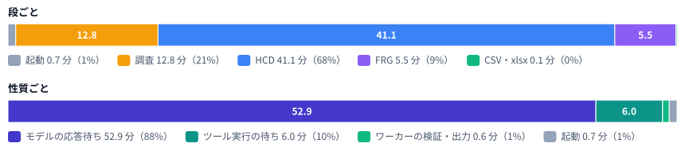
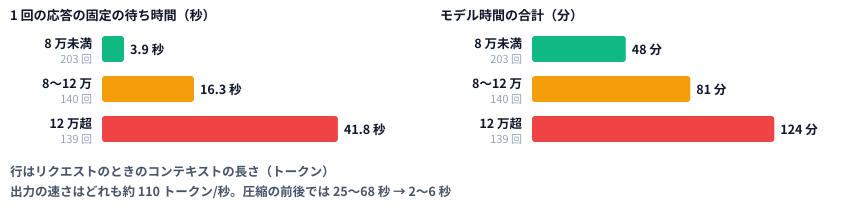
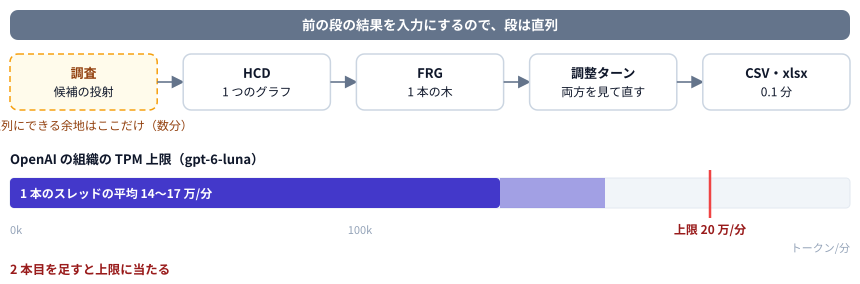
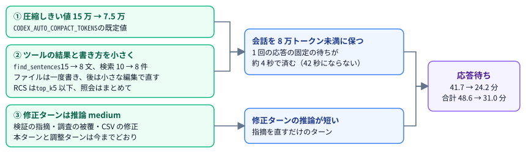
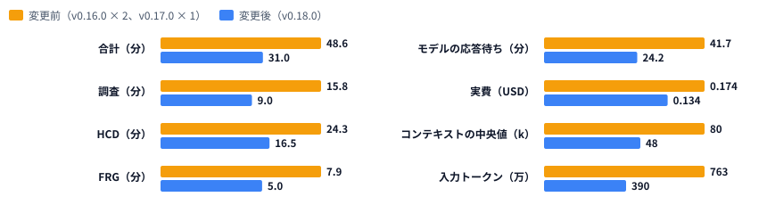
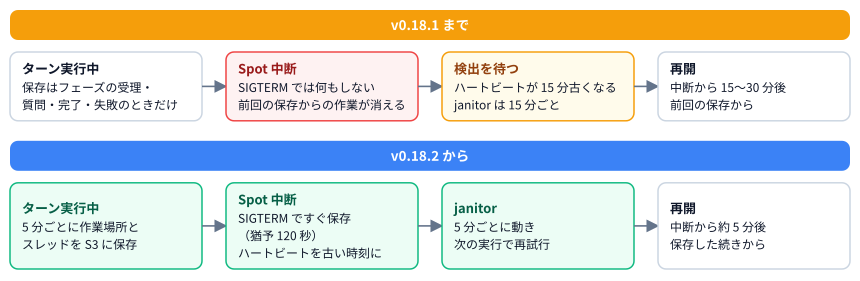

# BRA 作成の速さと費用（v0.17.1〜v0.18.2）

| 項目 | 内容 |
| ---- | ---- |
| 文書 | BRA 作成にかかる時間と OpenAI の費用についての解説。遅さの原因の調査、v0.18.0 の高速化と変更前後の比較、費用の二重計上の修正（v0.17.1）と過去のジョブの補正（v0.18.1）、Spot 中断からの再開の改善（v0.18.2） |
| 対象読者 | 利用者、運用者、BRA の作成時間や OpenAI の利用料を確認する人 |
| 対象バージョン | アプリ 0.17.1〜0.18.2（すべて 2026-10-01 リリース）。調査の対象は 0.16.0 の本番の実行 |
| 関連 | [07_CoBRAC_Harness_v1_1_to_v2_ja.md](./07_CoBRAC_Harness_v1_1_to_v2_ja.md)（ハーネス v2）/ [03_AWSインフラと予算.md](./03_AWSインフラと予算.md) / [01_設計仕様.md](./01_設計仕様.md) / English: [09_BRA_speed_and_cost.md](./09_BRA_speed_and_cost.md) |
| PR | [#61](https://github.com/miyamoto9265/cobrac-web/pull/61)（0.18.0 高速化）、[#63](https://github.com/miyamoto9265/cobrac-web/pull/63)（0.17.1 二重計上）、[#69](https://github.com/miyamoto9265/cobrac-web/pull/69)（0.18.1 過去のジョブの補正）、[#66](https://github.com/miyamoto9265/cobrac-web/pull/66)〜[#68](https://github.com/miyamoto9265/cobrac-web/pull/68) と [#70](https://github.com/miyamoto9265/cobrac-web/pull/70)（0.18.2 Spot 中断・複製・メッセージの言語） |

---

## 1. ひとことで言うと

0.16.0 の本番の実行を調べると、BRA の作成 1 件にかかる時間（平均 60 分）の 88% は、モデルの応答を待っている時間でした。1 回の応答の待ち時間は、そのリクエストのコンテキスト（それまでの会話の長さ）でほぼ決まります。コンテキストが 8 万トークン未満なら固定の待ちは約 4 秒ですが、12 万を超えると約 42 秒になります。当時は会話の圧縮を 15 万トークンで行っていたので、モデル時間の 4 分の 3 近くが、この遅い領域で使われていました。

そこで v0.18.0 では、圧縮のしきい値を 7.5 万トークンに下げ、ツールの結果とファイルの書き方を小さくし、修正ターンの推論レベルを medium にしました。同じ ROI と TLF で変更前と変更後を 3 件ずつ実行したところ、**平均の所要時間は 48.6 分から 31.0 分に（36% 短縮）、実費は $0.174 から $0.134 に（23% 減）** なりました。ただし件数は 3 件ずつと少なく、調査ステップで挙げる候補が減ったことなど、注意して見るべき点があります（[5.4](#54-注意点)）。

同じ調査の中で、**アプリに記録される費用が実際の 2〜3 倍になっている**ことも分かりました。Codex が返す使用量はスレッドの累計なのに、ワーカーがそれを毎ターン足していたためです。v0.17.1 で新しいジョブの記録を直し、v0.18.1 で過去のジョブを読み込むときに補正するようにしました。さらに v0.18.2 では、Fargate Spot の中断でターンの途中の作業が消える問題を直し、中断からの再開を 15〜30 分後から約 5 分後に早めました。

---

## 2. 用語

| 用語 | 意味 |
| ---- | ---- |
| コンテキスト | 1 回のリクエストでモデルに送る会話全体（指示、これまでの応答、ツールの結果）。トークン数で数える |
| 圧縮（compaction） | 会話が一定の長さを超えたときに、Codex がそれまでの会話を要約して短くすること。しきい値は `CODEX_AUTO_COMPACT_TOKENS` |
| 本ターン・修正ターン | 本ターンは各段（調査・HCD・FRG）の作業そのもの。修正ターンは、ワーカーの検証が返した問題の一覧を直すためのターン |
| TPM | OpenAI の組織ごとの 1 分あたりのトークン数の上限（tokens per minute）。gpt-6-luna では 20 万トークン/分 |
| セッション記録 | Codex がスレッドごとに残す記録（`rollout-…jsonl`）。応答ごとの時刻・トークン数・ツール呼び出しが入っており、S3 の `thread/sessions/` に保存される |
| 実費 | セッション記録のトークン数と単価から計算した費用 |
| 記録上の費用 | アプリがジョブごとに DynamoDB に記録し、画面に表示する費用 |
| Fargate Spot | ワーカーを動かす AWS の割安な実行環境。AWS の都合で中断されることがあり、中断の 2 分前に SIGTERM が届く |
| ハートビート・janitor | ワーカーは 1 分ごとにハートビート（生存の時刻）を書く。janitor は定期的に動く Lambda で、ハートビートが 15 分以上古いジョブを自動で再開する |

---

## 3. 遅さの原因を調べる

### 3.1 調べ方

調査は、有料のジョブを新しく起動せず、すでにある記録だけで行いました。

- **データ**: DynamoDB のジョブとメッセージ、S3 に保存された Codex のセッション記録、CloudWatch のログ（ワーカーのログは保持期間が短く、ほとんど残っていませんでした）
- **対象**: フル実行が完了したユーザーのプロジェクト 3 件（以下 A・B・C。中身は使わず、集計値だけを使っています）と、テストユーザーの `ufwwj0jg-1`。どれも 0.16.0、`gpt-6-luna`、推論レベル high、調査モード on です
- **方法**: セッション記録から、応答ごとの待ち時間、そのときのコンテキストの長さ、出力トークン数、直後のツール呼び出しを取り出して集計しました

### 3.2 時間の内訳

A・B・C の 3 件の平均は 60.2 分でした（55.2 分、71.9 分、53.4 分）。段ごとに見ると HCD が 68% を占めますが、性質ごとに見ると、どの段でもほとんどの時間はモデルの応答待ちです。

| 性質 | 時間（3 件の平均） | 割合 |
| ---- | -----------------: | ---: |
| モデルの応答待ち | 52.9 分 | 88% |
| ツール実行の待ち（文献 MCP、RCS、シェル。並列に動いた分は重ねて数えない） | 6.0 分 | 10% |
| ワーカーの検証（参照・引用文・RCS・スキーマの照合）と CSV・xlsx の作成 | 0.6 分 | 1% |
| 起動と待ち行列 | 0.7 分 | 1% |
| レート制限による待ち（Reconnecting） | 0 | 0%（3 件では一度も起きていません） |
| 圧縮 | 合計で数秒 | ほぼ 0 |

1 件あたりの応答は 105〜146 回、出力は 14〜19 万トークン（うち推論が 8〜9.5 万）、入力は 880 万〜1,200 万トークンでした。入力の 93% はキャッシュから読まれています。ワーカーの処理や文献ツールを速くしても縮む時間はわずかで、短縮の余地はモデルの応答待ちにあることが分かります。

### 3.3 応答の待ち時間はコンテキストの長さで決まる

4 件の実行の応答 482 回について、待ち時間を「固定分 + 出力トークン数 ÷ 出力の速さ」として当てはめ、コンテキストの長さごとに分けました。

| コンテキスト | 応答の数 | 固定分 | 出力の速さ | モデル時間の合計 |
| ------------ | -------: | -----: | ---------: | ---------------: |
| 8 万トークン未満 | 203 | 3.9 秒 | 112 トークン/秒 | 48 分 |
| 8〜12 万 | 140 | 16.3 秒 | 105 トークン/秒 | 81 分 |
| 12 万超 | 139 | 41.8 秒 | 112 トークン/秒 | 124 分 |

- 出力の速さはどの帯でも約 110 トークン/秒で変わりません。長いコンテキストで遅くなるのは、出力が遅いからではなく、応答が始まるまでの固定の待ちが長いからです。
- 圧縮の前後（11 回）で比べると、直前の 6 回の応答は中央値 25〜68 秒（コンテキスト 12〜19 万）、直後の 6 回は 2〜6 秒（2〜6 万）でした。出力の量がほぼ同じ例もあり、321 トークンの出力に 43 秒かかった応答と、383 トークンの出力が 3.3 秒で返った応答があります。
- 当時の圧縮しきい値は 15 万トークンだったので、モデル時間の 73% が 8 万トークン以上のコンテキストで使われていました。
- 長いコンテキストの応答は、直前 60 秒の送信量が少ないときでも中央値 22 秒かかり、送信量が 20 万を超えても 429（レート制限）は返っていません。そのため、主な原因は TPM による抑制ではなく、サーバー側で長いコンテキストほど遅くなることだと考えています。ただし OpenAI 側の内部の仕組みは確認できていません。
- 8 万以上の応答がすべて 8 万未満の速さで返っていれば、1 件あたり 17〜23 分縮んでいた計算になります。これがコンテキストを小さくすることで得られる短縮の上限です。

HCD の本ターンについて、応答の直後のツール呼び出しで待ち時間を分けると、ファイルの書き込みが 31%、文献 MCP が 26%、エージェント自身による確認（Python で JSON を読む、手作業のスキーマ確認など）が 15% でした。書き込みの出力は最終的な HCD のファイルの約 3 倍あり、ファイル全体の書き直しを繰り返していました。自分で行う確認は、後でワーカーが同じ検査をするので重複しています。

### 3.4 失敗と再試行も遅さに効いていた

当時のジョブ 21 件のうち、失敗が 12 件、取消が 1 件ありました。失敗 12 件のうち 11 件は、コンテキストか TPM が原因でした（1 回のリクエストが TPM の上限を超えた、事前の圧縮に失敗した、Reconnecting のまま止まった、のいずれか）。残る 1 件はハートビートの途絶で、Spot の中断と思われます（[7 章](#7-spot-中断からの再開と運用の修正v0182)）。たとえば `ufwwj0jg-1` は 67 分走った後に失敗し、ユーザーが再試行するまで待ちになりました。利用者が感じる遅さには、こうした失敗と再試行も含まれています。コンテキストを小さくすれば、この失敗も減ると考えられます。

---

## 4. v0.18.0 の変更

### 4.1 検討した選択肢

調査の結果をもとに、次の選択肢を比べました。短縮の見積もりは平均 60 分のジョブに対するものです。選択肢どうしは効果が重なるので（コンテキストが小さくなると往復 1 回が安くなり、往復を減らす効果は小さくなる）、単純には足せません。

| # | 選択肢 | 期待できる短縮 | 品質のリスク | 扱い |
| - | ------ | -------------: | ------------ | ---- |
| 1 | コンテキストを小さく保つ（圧縮しきい値を下げる、ツールの結果を短くする） | 10〜20 分 | 低〜中。圧縮で引用文の細部が落ちうるが、ファイルが記憶の正本なので作業は失われない | **0.18.0 で採用** |
| 2 | 文献と RCS の事前取得（HCD の前にワーカーが並列でまとめて取得し、資料ファイルにする） | 5〜10 分 | 中立〜改善 | ワークフローに段が 1 つ増えるので、相談してから |
| 3 | 検証を 1 コマンドにする（ワーカーの検査を CLI として渡し、手作業の確認をやめさせる） | 3〜8 分 | 改善 | 次の候補 |
| 4 | 出力を減らす（ファイルは一度書き、後は差分で直す） | 3〜6 分 | 低〜中 | **0.18.0 で採用** |
| 5 | 段ごとの推論レベル（修正ターンを medium にする） | 1〜3 分 | 修正ターンは低 | **0.18.0 で採用** |
| 6 | 調査の並列化（候補の投射を 2〜4 本のサブスレッドに分ける） | 2〜4 分（今の TPM で） | 中 | TPM に余裕ができるまで見送り |
| 7 | 優先処理の階層（`service_tier`） | 不明 | なし | 有料の実測が必要で未確認 |
| 8〜11 | 文献ツールの調整、結果のキャッシュ、出力のパイプライン化、待機させたワーカー | それぞれ 2 分以下 | 低〜中 | 効果が小さいので見送り |
| 12 | HCD の領域ごと・UC ごとの並列、FRG の並列 | 実質 0 | 高 | できない（[4.2](#42-並列化で縮められる範囲が小さい理由)） |

選択肢 1・4・5 は、どれも設定値・定数・プロンプトの変更で済み、費用も下がる方向なので、1 つの PR（[#61](https://github.com/miyamoto9265/cobrac-web/pull/61)）にまとめて先に入れました。

### 4.2 並列化で縮められる範囲が小さい理由

「並列に動かせば速くなるのではないか」という案は最初に検討しましたが、縮められるのは調査ステップの数分だけでした。

- **段の順番は動かせません。** FRG は HCD の UC と接続を入力にし、調整ターンは HCD と FRG の両方を見て直します。調査 → HCD → FRG → 調整の順は、依存関係のために直列になります。
- **HCD の中身も分けられません。** UC の粒度、領域をまたぐ接続、インターフェースの対応、Collection が互いに依存する 1 つのグラフなので、領域ごとに別のスレッドで作ると、結合するときに整合をとり直す作業がもう一度必要になります。FRG（平均 5.5 分）も 1 本の木で、全 UC の割り当てとインターフェースの合成が要るため、分ける利点がありません。出力（CSV・xlsx・グラフ）はもともと 0.1 分です。
- **並列にできるのは証拠を集める部分だけです。** 調査ステップの候補の投射は複数のスレッドに分けられますが、組織の TPM 上限は gpt-6-luna で 20 万トークン/分で、1 本のスレッドだけで平均 14〜17 万トークン/分を使っています。2 本目を足すとすぐに上限に当たり、待ちが発生します。今の TPM での短縮は 2〜4 分と見積もりました。
- 新しいジョブ（B・C）では、Codex が「コードモード」（`exec` の中の JavaScript から複数のツールをまとめて呼ぶ方式）を使っているので、ツール呼び出しはすでに部分的に並列になっています。

### 4.3 入れた 3 つの変更

| 変更 | 内容 | 場所 |
| ---- | ---- | ---- |
| ① 圧縮しきい値 | `CODEX_AUTO_COMPACT_TOKENS` の既定値を 150,000 から 75,000 にしました。インフラ側では値を設定していないので、コードの既定値だけで切り替わります。圧縮そのものは数秒で終わり、作業の内容はプロジェクトのファイルに残っています | `packages/worker/src/env.ts` |
| ② ツールの結果を短くする | `find_sentences` が返す文を最大 15 文から 8 文に、文献検索の既定の件数を 10 件から 8 件にしました | `packages/worker/src/litsearch.ts`、`litMcp.ts` |
| ② 書き方を小さくする | エージェント共通ルールに「Working efficiently」の節を足しました。ファイルは内容が決まったときに一度書き、その後は小さな編集で直すこと、確認のためにファイル全体を表示しないこと、文献は `max_results` 5〜8、RCS は `top_k` 5 以下で照会し、独立した照会はまとめて行うことを求めています | `prompts/AGENTS.md` |
| ③ 修正ターンは medium | 検証の指摘、調査の被覆の不足、CSV の問題を直す修正ターンを、`min(プロジェクトの推論レベル, medium)` で動かします。調査の本ターン、HCD と FRG の本ターン、調整ターンはプロジェクトの推論レベルのままです | `fixTurnEffort`（`packages/shared/src/types.ts`）、`packages/worker/src/index.ts`、`pipeline.ts`（`Prompt.effort`） |

①と②は、どちらも会話を 8 万トークン未満に保つための変更です。③は、問題の一覧を直すだけのターンで長く推論する必要はない、という考えによります。本ターンの推論レベルは品質に効く可能性が高いので変えていません。

---

## 5. 変更前後の比較

### 5.1 比べ方

- テストユーザー（`cobrac/langrerun-test-user`）とそのキーで、`ufwwj0jg-1` と同じ条件で実行しました。ROI は「Angular gyrus, fosiform gyrus, VWFA, Broca, Wernicke」、TLF は「nonword reading」、調査モード on、`gpt-6-luna`、推論レベル high、日本語です。
- 変更前（`ufwwj0jg-6`〜`8`）と変更後（`ufwwj0jg-9`〜`11`）を 3 件ずつ、1 件ずつ順番に実行しました。TPM を取り合わないように、同時には走らせていません。
- どれも本番の Fargate Spot で実行しました。時間は API とメッセージの記録から、使用量と実費は S3 のセッション記録から出しています。記録上の費用は、二重計上があるので使っていません（[6 章](#6-費用の二重計上v0171と過去のジョブの補正v0181)）。
- 比較のための実行の費用は合計 $0.92 でした（変更前 $0.52、変更後 $0.40）。

### 5.2 所要時間と費用

| | 変更前 | 変更後 | 差 |
| - | -----: | -----: | -: |
| **合計** | **48.6 分**（43.1 / 52.6 / 50.1） | **31.0 分**（28.6 / 35.5 / 28.9） | **−36%** |
| 起動 | 0.6 分 | 0.5 分 | |
| 調査 | 15.8 分 | 9.0 分 | −43% |
| HCD（修正ターン・検証を含む） | 24.3 分 | 16.5 分 | −32% |
| FRG | 7.9 分 | 5.0 分 | −37% |
| CSV・xlsx | 0.1 分 | 0.1 分 | |
| モデルの応答待ち | 41.7 分 | 24.2 分 | −42% |
| 応答の回数 | 97 | 89 | −8% |
| コンテキストの中央値 / 最大 | 8.0 万 / 15.4 万 | 4.8 万 / 8.6 万 | |
| 圧縮の回数 | 2.7 | 5.0 | |
| 入力トークン（キャッシュを含む） | 763 万 | 390 万 | −49% |
| 出力トークン（推論を含む） | 11.6 万 | 11.7 万 | ±0 |
| **実費** | **$0.174**（0.166 / 0.182 / 0.174） | **$0.134**（0.126 / 0.157 / 0.118） | **−23%** |
| 記録上の費用 | $0.441（実費の 2〜3 倍） | $0.134（実費と一致） | |

- 縮んだ時間のほとんどは、応答待ちが短くなったこと（−17.5 分）によるものです。コンテキストの中央値が 8 万から 4.8 万トークンに下がり、最大でも 8.6 万に収まりました。3.3 の見立てどおりの結果です。圧縮は 1 件あたり 2 回ほど増えましたが、圧縮にかかる時間はわずかです。
- 入力トークンがほぼ半分になったので、実費も下がりました。出力トークンは変わっていません。
- 事前の見積もりは 35〜40 分でしたが、それより短くなりました。
- 変更後の記録上の費用はセッション記録の実費と一致しており、v0.17.1 の修正が本番で正しく動いていることも確かめられました。

### 5.3 品質

| | 変更前（各件） | 変更後（各件） |
| - | -------------- | -------------- |
| UC の数 | 6 / 7 / 7 | 6 / 7 / 6 |
| Collection | 0 / 2 / 1 | 1 / 1 / 0 |
| BIF / UC 間の接続 | 5・6 / 8・13 / 8・13 | 6・13 / 7・12 / 7・10 |
| 参考文献 | 13 / 12 / 14 | 12 / 13 / 12 |
| FRG のノード | 3 / 4 / 4 | 3 / 3 / 3 |
| 修正ターン（戻ってきた問題の数） | 1（10）/ 0 / 1（8） | 1（10）/ 1（7）/ 1（5） |
| 警告のまま残った問題 | 0 / 0 / 0 | 0 / 0 / 0 |
| 参照の照合（DOI / PMID） | すべて verified | すべて verified |
| 引用文の照合（verified / unverified） | 6/0、6/1、12/1 | 12/1、11/1、8/2 |
| 整合チェック（cross_check） | 3 件とも所見なし | 2 件は所見なし、1 件で X9 が 1 |
| 調整ターン | 発動なし | 発動なし |
| 調査の候補の投射 | 11 / 9 / 11 | 8 / 7 / 7 |

HCD と FRG の規模（UC・接続・文献の数）と検査の結果（参照はすべて verified、警告は 0）は、変更の前後で同じ程度でした。

### 5.4 注意点

この比較の結果を使うときは、次の点に注意してください。

- **件数が少ないこと。** 前後 3 件ずつなので、品質の差が偶然なのかどうかは、この数では判断できません。時間の差（48.6 分と 31.0 分）は各件のばらつき（変更前 43.1〜52.6 分、変更後 28.6〜35.5 分）より大きいので、短縮したこと自体は確かだと考えていますが、短縮の幅には誤差があります。
- **調査の候補が減ったこと。** 調査ステップで挙げる候補の投射が、平均 10.3 件から 7.3 件に減りました。被覆の検査はどちらも全件合格していますが、調査ステップが短くなったこと（15.8 分 → 9.0 分）と合わせると、調べる範囲が狭くなっている可能性があります。原因としては、検索結果の件数を 10 件から 8 件に減らしたことと、修正ターンを medium にしたことが考えられますが、切り分けはしていません。必要なら、調査ステップだけ検索の既定件数を戻して確かめます。
- **変更前の版がそろっていないこと。** 変更前の 1・2 件目は v0.16.0、3 件目は v0.17.0 で走りました。比較の途中で、別の PR（[#60](https://github.com/miyamoto9265/cobrac-web/pull/60)・[#62](https://github.com/miyamoto9265/cobrac-web/pull/62)・[#64](https://github.com/miyamoto9265/cobrac-web/pull/64)）による v0.17.0 が本番に出たためです。v0.17.0 は HCD のプロンプト（左右を `side` という項目で表す、Circuit ID の文字集合）とエラーコードの番号を変えています。変更後は v0.18.0 で、v0.17.x の変更も含みます。3 件目（v0.17.0）の 50.1 分は 1・2 件目（43.1 分・52.6 分）と同じ範囲なので、v0.17.0 の変更が時間に与えた影響は小さいとみていますが、厳密に同じ版どうしの比較ではありません。
- **その他の小さな変化。** FRG のノードが 4 から 3 になった件があり、記録だけの検査 X9 が 1 件出ました。
- **出力を減らす効果は見えていません。** 出力トークンは前後で変わらなかったので、全体の書き直しをやめさせる指示（選択肢 4）の効き目は、この計測では確認できていません。

---

## 6. 費用の二重計上（v0.17.1）と過去のジョブの補正（v0.18.1）

### 6.1 何が起きていたか

3 章の調査で、セッション記録から計算した実費と、アプリが記録した費用が合わないことに気づきました。A・B・C の実費は $0.24 / $0.28 / $0.21 でしたが、記録上の費用は $0.51 / $0.83 / $0.61 で、2〜3 倍になっていました。

原因は、Codex がターンの終わり（`turn.completed`）に返す使用量の意味の取り違えです。この値はそのターンで使った分ではなく、**スレッドが始まってからの累計**です。後のジョブでスレッドを再開したときも、累計はそのまま続きます。ワーカーはこの累計を毎ターン足していたので、ターンが進むほど過去の分を何度も数えていました。

`ufwwj0jg-1` の記録で確かめると、DynamoDB に足した各ターンの値は、セッション記録の各ターン終了時の累計（`total_token_usage`）と 6 ターンすべてで一致しました。

| ターン | DB に足した入力トークン | セッション記録の累計 |
| ------ | ----------------------: | -------------------: |
| 1 | 3,265,610 | 3,265,610 |
| 2 | 5,826,689 | 5,826,689 |
| 3 | 6,088,575 | 6,088,575 |
| 4 | 8,400,808 | 8,400,808 |
| 5 | 9,319,890 | 9,319,890 |
| 6（再試行のジョブ。別のプロセスで再開） | 10,175,056 | 10,175,056 |

### 6.2 v0.17.1 の修正

[#63](https://github.com/miyamoto9265/cobrac-web/pull/63) で、ターンの使用量を次のように数えるようにしました（`packages/worker/src/codex.ts`）。

- ターンの使用量 = ターン後の累計（`turn.completed`）− ターン前の累計
- ターン前の累計は、スレッドのセッション記録の最後の `token_count` から読みます（`sessionTotalUsage`）。新しいスレッドは 0 から数えます。後のジョブで再開したスレッドも、同じ方法で前の続きから数えます。
- レート制限で待ってから再開したターンは、最後の累計を 1 回だけ使います。
- 失敗（`turn.failed`）で終わったターンも、セッション記録の累計から使用量を数えるようにしました。それまでは 0 として扱っていたので、失敗したジョブは実際より少なく記録されていました。

変更後の比較実行（5.2）では、記録上の費用がセッション記録の実費と一致しました。

### 6.3 過去のジョブの補正（v0.18.1）

v0.17.1 より前のジョブは、DynamoDB に 2〜3 倍の値が残っています。本番のデータは書き換えず、**読み込むときに補正して表示する**ことにしました（[#69](https://github.com/miyamoto9265/cobrac-web/pull/69)）。

- **対象**: `USAGE_FIX_AT`（2026-10-01 18:33 UTC。0.17.1 のワーカーのタスク定義を登録した時刻）より前に始まったジョブです。これ以降に作ったプロジェクトには何もしません。
- **方法**: ジョブが各ターンの後に書いた使用量の行（`kind: "usage"` のメッセージ）から各ターンの累計を取り出し、累計が増えた分だけを数えます。累計が減ったら新しい会話として 0 から数えます。プロジェクトの会話を引き継いだジョブ（再試行・回答・追加指示）は、前のジョブの最後の累計から数え、解説記事のジョブは独立した会話として扱います。補正した使用量から費用を計算し直します。
- **補正する画面**: プロジェクトの一覧、プロジェクトのジョブの表と合計、エージェント欄の使用量の行、利用状況のまとめ、管理者のプロジェクト一覧です。DB には書き込みません。

本番の DynamoDB を読み取りだけで使って補正した結果は次のとおりです。

| プロジェクト | 記録上の費用 | 補正後 | セッション記録から出した実費 |
| ------------ | -----------: | -----: | ---------------------------: |
| `ufwwj0jg-6` | $0.416 | $0.166 | $0.166 |
| `ufwwj0jg-7` | $0.374 | $0.182 | $0.182 |
| `ufwwj0jg-1` | $0.879 | $0.202 | $0.309 |

この補正には次の限界があります。

- **記録されなかった分は戻せません。** 0.17.1 より前は、失敗で終わったターンの使用量を 0 として記録していました。補正は記録された累計から差分を出すだけなので、この分は復元できません。`ufwwj0jg-1` の補正後（$0.202）と実費（$0.309）の差は、追加指示の 2 つのジョブで失敗したターンの分です。補正後の値は、実費より低めになることがあります。
- **WebSocket で届く更新は補正しません。** 古いプロジェクトで新しいジョブが終わった直後は、画面を読み込み直すまで補正前の合計が見えます。
- **調査ステップの指標**（`researchStep.usage`）は補正しません。
- 0.17.1 以降も、時間切れ（調査ステップの 60 分）や取消で打ち切ったターンと、`codex exec` が理由を返さずに落ちたターンの使用量は記録されません（[8 章](#8-残る課題と次の候補)）。

---

## 7. Spot 中断からの再開と運用の修正（v0.18.2）

### 7.1 Spot 中断で作業が消えていた

ワーカーは Fargate Spot で動いています。AWS の都合で中断されると、中断の 2 分前に SIGTERM が届きます。v0.18.1 までは、作業場所を S3 に保存するのがフェーズの受理・質問・完了・失敗のときだけで、SIGTERM を受けても何もしていませんでした。そのため、中断が起きると、前回の保存から後の作業がすべて消えていました。HCD⇄FRG の試行（2026-09-29）では、15 分ぶんの作業を失い、中断の検出にも 27 分かかりました。

中断の検出が遅かったのは、janitor の仕組みのためです。janitor はハートビートが 15 分以上古いジョブを再開しますが、janitor 自体が 15 分ごとにしか動いていなかったので、再開は中断の 15〜30 分後になっていました。

### 7.2 変更（[#66](https://github.com/miyamoto9265/cobrac-web/pull/66)）

- **ターンの途中でも 5 分ごとに保存します。** 1 分ごとのハートビートのついでに、前回の保存から 5 分たっていれば、作業場所と Codex のスレッドを S3 に上げます（`PERIODIC_PERSIST_MS`）。対象は BRA の実行だけで、解説記事のジョブは作業場所を書き戻さないので対象外です。ハートビート、フェーズの受理、SIGTERM のときの保存が重ならないように、保存は 1 本ずつ順に実行します。
- **SIGTERM を受けたらすぐ保存し、janitor に返します**（`packages/worker/src/interrupt.ts` の `handleStop`）。実行中のジョブでは、エージェント欄に「ワーカーが停止されます…自動で再開します」と出し、保存してから `lastHeartbeat` を古い時刻にします。こうすると、次の janitor の実行でジョブが再試行されます。取消したジョブ（取消の StopTask も SIGTERM を送ります）では保存だけを行い、終わったジョブや回答待ちのジョブには何もしません。保存に失敗しても janitor には返します。
- **インフラ**: ワーカーのコンテナの `stopTimeout` を 120 秒（Fargate の上限）にして、保存のための時間を確保しました。janitor は 15 分ごとから 5 分ごとにしました。ハートビートが古いとみなす 15 分は変えていません。
- この結果、中断からの再開は 15〜30 分後から約 5 分後になり、失う作業も最大で 5 分ぶん（SIGTERM のときの保存が成功すればほぼなし）になります。

### 7.3 そのほかの修正

v0.18.2 には、次の 2 つの修正も含まれています。

- **ワーカーの起動と janitor のメッセージの言語**（[#68](https://github.com/miyamoto9265/cobrac-web/pull/68)）。「ワーカーを起動しました」「応答が途絶えたため自動で再開します」や、janitor が書く失敗の理由は、UI の言語によらず日本語で出ていました。英語の本文と翻訳キー（`meta.i18n`）で書くようにし、10 言語に訳しました。失敗の理由はプロジェクトのエラー表示にも出ます。保存済みの日本語のメッセージも、同じキーに読み替えて表示します。
- **公開プロジェクトの複製と調査モード**（[#67](https://github.com/miyamoto9265/cobrac-web/pull/67)）。複製では作業場所（調査ステップの `research.json` を含む）は写るのに、調査モードの設定が写らず、複製への追加指示で調査モードの注記が付きませんでした。複製に元のプロジェクトの調査モードの設定を写すようにしました。モデルと推論レベルは、今までどおり複製する人の既定値を使います。

### 7.4 確かめていないこと

本番の Spot 中断を意図して起こすことはできないので、7.2 の変更は単体テストと `cdk synth`（タスク定義の `StopTimeout: 120`、janitor の `rate(5 minutes)`）で確かめています。次に実際の中断が起きたときに、ワーカーのログの `SIGTERM handled: retry` と、エージェント欄の「ワーカーが停止されます…」のメッセージで動作を確認します。

---

## 8. 残る課題と次の候補

| 項目 | 今の状態 | 次に行うこと |
| ---- | -------- | ------------ |
| 調査の候補の減少 | 変更後に候補の投射が平均 10.3 件から 7.3 件に減った。被覆の検査は全件合格 | 調査ステップだけ検索の既定件数を戻すなどして、原因を切り分ける |
| さらなる短縮 | 出力トークンは減っていない | 検証を 1 コマンドにする（選択肢 3）、文献と RCS の事前取得（選択肢 2。段が増えるので相談してから）、書き込みの往復を減らす工夫 |
| 長いコンテキストが遅い理由 | サーバー側の処理によると推定しているが、確認していない | コンテキスト 4 万と 14 万で同じ小さなリクエストを送れば切り分けられる。費用は数セントだが有料の呼び出しなので、許可を得てから |
| 優先処理の階層（`service_tier`） | 使えるか、どれだけ速くなるかが未確認 | 同じく有料の実測が必要 |
| 並列化 | 見送り | OpenAI の利用 tier が上がり、TPM に余裕ができたら調査の並列化を検討する |
| 打ち切られたターンの使用量 | 時間切れ・取消・理由なしの異常終了のターンは記録されない | 次の実行の前にセッション記録から数えて足すか、足すならどのジョブに付けるかを決める |
| 過去のジョブの補正 | WebSocket の更新と調査ステップの指標は補正しない。失敗したターンの分は戻せない | 必要が出たら対応する |
| Spot 中断の対応 | 単体テストと synth だけで確認 | 実際の中断が起きたらログで確かめる |

---

## 9. コードの場所

| 内容 | 場所 |
| ---- | ---- |
| 圧縮しきい値の既定値 | `packages/worker/src/env.ts` |
| 文献ツールの件数 | `packages/worker/src/litsearch.ts`、`litMcp.ts` |
| エージェントへの書き方の指示（Working efficiently） | `prompts/AGENTS.md` |
| 修正ターンの推論レベル | `packages/shared/src/types.ts`（`fixTurnEffort`）、`packages/worker/src/index.ts`、`pipeline.ts` |
| ターンの使用量の数え方（差分、セッション記録の読み取り） | `packages/worker/src/codex.ts` |
| 過去のジョブの補正 | `packages/shared/src/usageCorrection.ts`、`packages/api/src/lib/usageCorrection.ts` |
| 途中の保存と SIGTERM の処理 | `packages/worker/src/interrupt.ts`、`index.ts` |
| `stopTimeout` と janitor の間隔 | `packages/infra/lib/cobrac-stack.ts` |
| janitor と起動のメッセージ | `packages/api/src/handlers/janitor.ts`、`dispatcher.ts`、`packages/shared/src/systemMessage.ts` |
| 公開プロジェクトの複製（`POST /public/projects/:id/clone`） | `packages/api/src/app.ts` |
| テスト | `packages/worker/test/codex.test.ts`、`interrupt.test.ts`、`packages/shared/test/usageCorrection.test.ts`、`research.test.ts`、`systemMessage.test.ts`、`packages/api/test/publish.test.ts` |
