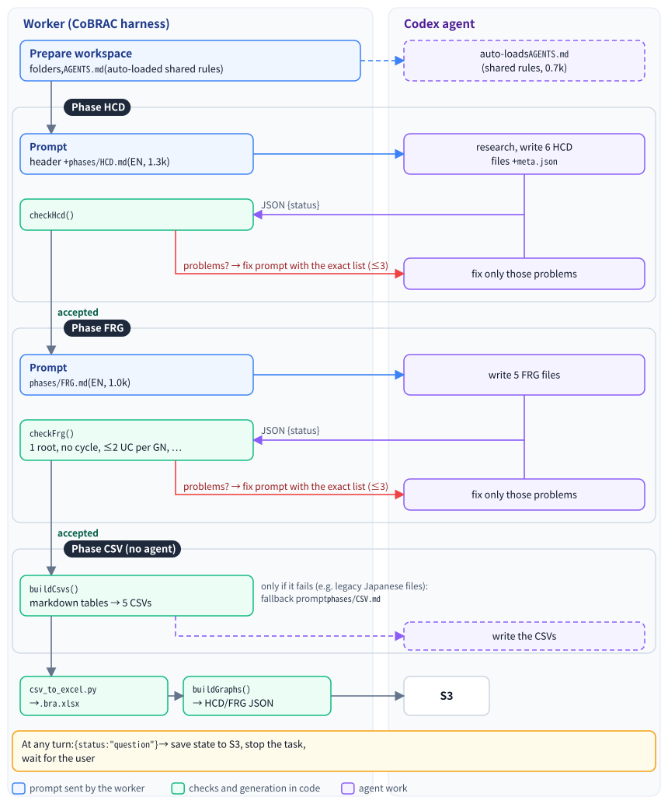
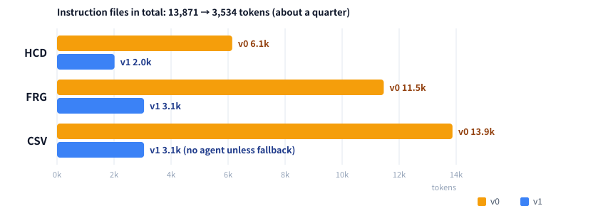

# CoBRAC Harness v0 → v1: What Changed and Why

| Item | Description |
| ---- | ----------- |
| Document | Explainer: how the agent harness moved from the legacy instruction files (v0) to the dedicated CoBRAC harness (v1), with a cost comparison |
| Audience | Users, operators, and anyone reviewing BRA output quality or OpenAI spend |
| Applies to | v0 = app up to 0.4.2 / v1 = app 0.5.0–0.6.0. Sections 3–5 describe v1 (markdown tables); since 0.8.0 the harness is v1.1 and the data files are JSON, see [section 8](#8-v08-json-data-files) and [05_CoBRAC_Harness_v1_to_v1_1.md](./05_CoBRAC_Harness_v1_to_v1_1.md) |
| Related | [01_設計仕様.md](../01_設計仕様.md) / [03_AWSインフラと予算.md](../03_AWSインフラと予算.md) / 日本語版: [04_CoBRAC_Harness_v0_to_v1_ja.md](./04_CoBRAC_Harness_v0_to_v1_ja.md) |

---

## 1. In one paragraph

v0 was the desktop Cursor workflow moved onto a server as-is. The agent received a single instruction ("read `instruction_0.md` and follow it") and had to read four Japanese instruction files in order, decide by itself when each phase was finished, print text markers such as `[STEP_COMPLETE] HCD`, and finally translate everything into five CSVs. v1 turns this around. **The worker drives the workflow.** It hands the agent one compact English phase spec at a time, checks the files with code after every turn, sends back an exact list of problems, and builds the CSVs, xlsx, and graphs itself. The agent does what only an LLM can do: literature research and scientific interpretation.

---

## 2. Terms

| Term | Meaning |
| ---- | ------- |
| Harness | Everything around the model: prompts, the control loop, validation, and post-processing |
| Worker | The Fargate task that runs one job (`packages/worker`) |
| Phase | HCD, FRG, or CSV. xlsx and graphs follow CSV |
| Turn | One `runStreamed` call. A turn contains many model requests (one per tool call) |
| Validator | Deterministic checks in `packages/shared/src/harness.ts` (`checkHcd`, `checkFrg`, `buildCsvs`) |

---

## 3. Architecture

### 3.1 v0: the agent reads the manual and runs everything

")

Weak points:

- **① Nobody checked the content.** "Done" meant "the CSV files exist". A missing column, an unknown circuit ID, or a broken FRG only showed up later in the graph or the xlsx.
- **② Progress relied on free text.** A missed or misspelled marker, or a `[QUESTION]` block inside a longer message, confused the step display.
- **③ The CSV phase was manual translation.** The agent read all markdown again, translated Japanese to English, and typed five CSVs. This was slow and expensive, and the output was sometimes inconsistent.
- **④ All instructions stayed in the context.** By the CSV phase, about 13.9k tokens of instructions were re-sent with every model request.

### 3.2 v1: the worker drives the phases and verifies them

### 3.3 Side by side

| Aspect | v0 | v1 |
| ------ | -- | -- |
| Who sequences phases | The agent, by reading `instruction_0.md` | The worker (`packages/worker/src/index.ts`) |
| Instructions | 4 Japanese files, 13.9k tokens, all read in-thread | `AGENTS.md` (0.7k, auto-loaded) + one phase spec at a time (0.5–1.3k) |
| Phase completion | Text marker `[STEP_COMPLETE] X` | Validator accepts the files |
| Questions | `[QUESTION]…[/QUESTION]` in free text | Structured output `{status, message, question}` (`outputSchema`) |
| Quality checks | None (only "CSV files exist") | Columns, IDs, references, interfaces vs connections, FRG rules |
| Retry on problems | Generic "continue" nudge | Exact problem list, up to 3 fix turns per phase |
| Artifact language | Japanese, translated at the CSV phase | English from the start. Chat replies follow the user's language |
| HCD files | 8 (incl. beginner explainer and Mermaid diagram) | 6 (+ `meta.json`) |
| FRG files | 5, each table also drawn as Mermaid | 5, tables only |
| CSV | Written by the agent | Generated by code; the agent is only a fallback |
| Folder creation, `Project.csv` | Agent | Worker |

---

## 4. The five changes in detail

How the weak points in 3.1 map to the changes:

| v0 weak point | Change in v1 | Details |
| ------------- | ------------ | ------- |
| ① Nobody checked the content | A validator checks the files after every turn and returns a problem list | [4.4](#44-validation-with-exact-feedback) |
| ② Progress relied on free text | Every turn ends with JSON that matches a schema | [4.5](#45-structured-turn-output-and-english-artifacts) |
| ③ The CSV phase was manual translation | Artifacts are written in English from the start, and code generates the CSVs | [4.3](#43-deterministic-work-is-done-by-code), [4.5](#45-structured-turn-output-and-english-artifacts) |
| ④ All instructions stayed in the context | Fixed rules move to `AGENTS.md`, and phase specs are sent one at a time | [4.1](#41-fixed-rules-move-to-agentsmd), [4.2](#42-the-worker-runs-one-phase-at-a-time) |

### 4.1 Fixed rules move to `AGENTS.md`

Codex automatically loads `AGENTS.md` from its working directory. The worker writes `prompts/AGENTS.md` there. It holds everything that is true in every phase: workspace layout, table formatting, citation rules, the turn protocol, and how to handle validator feedback and follow-ups. The file is short (721 tokens) and identical for every project, so it sits in the cacheable prefix of each request.

### 4.2 The worker runs one phase at a time

The agent never sees a later phase's instructions early. The HCD prompt inlines only `phases/HCD.md`. The FRG prompt is sent once HCD is accepted. Because the worker knows the current phase, retry and resume restart exactly there, and a follow-up re-validates every phase instead of redoing all of them.

### 4.3 Deterministic work is done by code

| Task | v0 | v1 |
| ---- | -- | -- |
| Create `{P}/`, `{P}_HCD/`, `{P}_FRG/`, `{P}_CSV/` | Agent | Worker |
| `Project.csv` | Agent copied a template | `buildProjectCsv()` |
| References / Circuits / Connections / FRG CSV | Agent read, translated, typed | `buildCsvs()` from the markdown tables |
| Diagrams | Mermaid in `8_diagram.md` and every FRG file | Web graphs from the CSVs |
| Beginner explainer (`7_EasyToUnderstand.md`) | Always written | Removed. Ask for it in a follow-up if needed |

### 4.4 Validation with exact feedback

After each turn the worker parses the markdown tables and checks, among other things:

- required files and table columns exist; IDs contain no spaces;
- every connection endpoint is a UC defined in `3_UC.md`, and every Reference ID exists in `2_BIF.md`;
- each ROI-internal UC's interface inputs and outputs match its senders and receivers in `4_Connection.md`;
- FRG: exactly one root, no cycles, a GN has at most 2 UC children, a GN made only of UCs has exactly 2, a UC has at most 2 GN parents, and every ROI-internal UC is attached;
- the CSV content is English;
- UC naming (projects with a `UC Descriptor` column, i.e. every project created from v0.7): the descriptor syntax and facet order, the Circuit ID syntax `<SABRA abbreviation>[@L|@R][(item,item)]`, that the Circuit ID starts with the official abbreviation of the anchor (BNA areas from a built-in table, HOMBA/DHBA terms looked up by the worker with RCS `get_homba_term`), that the parenthesized items match the facets (none for an anchor-only UC, the normal case), and that no two UCs share a descriptor. Interfaces and Subnodes are split only on separators outside brackets, so IDs such as `NAC(shell,DRD1+)` parse.

Problems go back to the agent as a list ("`PC`: Interface inputs [GC] differ from the senders in 4_Connection.md [GC, IO]"). In the chat, the check notice can be expanded to show every issue. After 3 fix attempts the phase continues with a warning, or fails if the output cannot be used at all.

### 4.5 Structured turn output and English artifacts

Every turn ends with JSON that matches a schema, so a question can no longer be missed or misread. Artifacts are written in English from the start, so the CSV phase no longer needs translation, and the tables can be converted mechanically.

---

## 5. Cost comparison

### 5.1 How the bill is made

For each model request, the whole context (rules + instructions + conversation + tool output) is sent again. Most of it is billed at the cached-input rate, which is 10% of the input rate. Output (including reasoning) is the most expensive part. So a harness saves money in three ways: a smaller always-present context, less output, and less rework.

Prices used below (USD per 1M tokens, standard short context, `packages/shared/src/pricing.ts` as of 2026-09-25):

| Model | Input | Cached input | Output |
| ----- | ----: | -----------: | -----: |
| gpt-6-luna (default) | 0.10 | 0.01 | 0.50 |
| gpt-6-sol | 2.00 | 0.20 | 10.00 |
| gpt-5.6-sol | 4.00 | 0.40 | 20.00 |
| gpt-6-astra | 10.00 | 1.00 | 50.00 |

### 5.2 Instruction tokens (measured)

Measured with the `o200k_base` tokenizer:

| v0 file | Tokens | v1 file | Tokens |
| ------- | -----: | ------- | -----: |
| `instruction_0.md` | 1,350 | `AGENTS.md` | 721 |
| `instruction_1_HCD.md` | 4,796 | `phases/HCD.md` | 1,296 |
| `instruction_2_FRG.md` | 5,315 | `phases/FRG.md` | 1,036 |
| `instruction_3_csv.md` | 2,410 | `phases/CSV.md` (fallback only) | 481 |
| **Total** | **13,871** | **Total** | **3,534** |

Instructions in the context of every request, by phase:

The prompts shrink to about a quarter. Roughly a third of the reduction comes from writing them in English: the same sentence costs about 1.75× more tokens in Japanese (42 vs 24 tokens in our sample). The rest comes from removing duplicated explanations and the steps that code now does.

### 5.3 Artifact output (estimated from real v0 projects)

We measured the final artifacts of five v0-era projects kept in `archive/v0/samples/` (VOR learning, deductive reasoning, associative memory, and two perceptual-speed projects). Average per project:

| Item | Tokens | In v1 |
| ---- | -----: | ----- |
| All HCD/FRG artifacts written by the agent | 62,400 | |
| Beginner explainer + Mermaid diagram file | −9,100 | not generated |
| Mermaid blocks inside FRG files | −1,000 | not generated |
| CSVs typed by the agent | −6,300 | generated by code |
| Japanese text in the remaining markdown, rewritten in English | −10,300 | English is shorter |
| **Estimated v1 artifact output** | **≈35,700** | **≈ −43%** |

")

These are the sizes of the final files, so this is a lower bound. The agent usually rewrites `3_UC.md` several times while filling steps 3–6, and each rewrite is output again.

### 5.4 What this means per project (illustrative)

Assumptions: about 200 model requests per run (120 in HCD, 60 in FRG, 20 in CSV for v0). Instruction savings: 120×4.1k + 60×8.4k + 20×10.8k ≈ 1.2M context tokens, almost all cached. Output savings: about 26.7k tokens.

| Model | Context savings (cached) | Output savings | Total per project |
| ----- | -----------------------: | -------------: | ----------------: |
| gpt-6-luna | $0.01 | $0.01 | **≈ $0.03** |
| gpt-6-sol | $0.24 | $0.27 | **≈ $0.51** |
| gpt-5.6-sol | $0.48 | $0.53 | **≈ $1.01** |
| gpt-6-astra | $1.21 | $1.33 | **≈ $2.54** |

Not counted above:

- **Less context from artifacts.** English files are smaller when the agent reads them back, which saves further input tokens on every request.
- **No CSV re-read.** In v0 the CSV phase read all markdown again (tens of thousands of tokens) before translating. In v1 this only happens in the fallback.
- **Fewer wasted runs.** v0 could finish with broken tables that needed a follow-up job, which is a whole new run. v1 catches those problems during the run.
- **New cost in v1: fix turns.** Each fix turn re-sends the context. It is limited to 3 per phase and targets only the listed problems, but a very broken first draft can cost more than in v0.

Reasoning tokens depend mostly on the model and the reasoning effort, not on the harness, so the percentage saved on the whole bill is smaller than the figures above. On the default gpt-6-luna the absolute difference is small. The harness matters more on larger models and for data quality. The usage line in each chat and the OpenAI dashboard remain the source of truth. Compare a v0 and a v1 run of the same ROI/TLF to see the real effect.

---

## 6. Compatibility

- Since 0.8.0 the harness reads only the JSON data files. Workspaces made before 0.8.0 (markdown tables, including v0 projects) are not read: their xlsx and graphs stay viewable and downloadable, but a follow-up or retry stops at once with a message to start a new project.
- The `[QUESTION]` marker is still recognized for threads started before v1.

---

## 7. Where to look in the code

| Piece | Location |
| ----- | -------- |
| Shared agent rules | `prompts/AGENTS.md` |
| Phase specs | `prompts/phases/HCD.md`, `FRG.md` |
| Job control | `packages/worker/src/index.ts` |
| Phase loop and checks per phase | `packages/worker/src/pipeline.ts` |
| Turn runner and structured output | `packages/worker/src/codex.ts` |
| JSON Schemas, validators and CSV generation | `packages/shared/src/harness.ts`, `jsonSchema.ts` |
| Tests | `packages/shared/test/harness.test.ts`, `packages/worker/test/pipeline.test.ts` (HCD → FRG → CSV → xlsx with a mock agent) |

---

## 8. v0.8: JSON data files

In v1 the agent still wrote its data as markdown tables that the worker parsed back (with escapes such as `\|` and ` `, and repair code for column-name drift and split tables), and a fallback phase let the agent type the CSVs by hand. Since 0.8.0 (harness v1.1; the full explainer, including the UC naming rules and RCS, is [05_CoBRAC_Harness_v1_to_v1_1.md](./05_CoBRAC_Harness_v1_to_v1_1.md)):

| Before (0.5–0.7) | Since 0.8.0 | Why |
| ---------------- | ----------- | --- |
| `2_BIF.md` References table | `{P}_HCD/references.json` | Parsed into References.csv; no reason to be markdown |
| `2_BIF.md` Connections table + `4_Connection.md` | `{P}_HCD/connections.json` (`bif[]` + `connections[]`) | The UC connections were a copy of Connections.csv; the tissue-level BIF is their evidence and lives next to them |
| `3_UC.md` (14-column table) | `{P}_HCD/uc.json` | The largest and most fragile table, rewritten several times per project; long cells are safer as JSON strings. External UCs have an explicit `roi` value instead of a tag in Comments |
| `3_FinalFRG.md` + `4_FunctionDetails.md` | `{P}_FRG/frg.json` | Two tables keyed by the same node; one entry per node now |
| `1_InitialDecomposition.md`, `2_OptimizedFRG.md` | removed (working steps; merge rationale goes into the report) | Nobody read them after they were written; only their presence was checked, and the user could not see them |
| `5_Verification.md` | removed (the validator checks structure; open points go into the report's Limitations) | Most of its checks are the validator's; the rest belongs in the report |
| `6_FinalReport.md` + `5_Report.md` | `report.md` (`## HCD` and `## FRG` sections) | One report for the user, readable and downloadable in the chat screen |
| `1_Thinking.md` | `decision_log.md` (project root) | Its useful part is the record of decisions and their reasons; the copy of RCS queries is dropped because the worker keeps every call in `rcs_mcp_calls.jsonl` |
| CSV fallback phase (`phases/CSV.md`) | removed | CSVs are generated only by code; problems go back as fixes to the JSON files |

Each JSON file has a JSON Schema (`HARNESS_SCHEMAS`), written to `schemas/` for the agent and used by the validator, which reports problems with a JSON pointer (`uc.json: /ucs/3/implementation is required`). The UC naming checks (UC Descriptor, Circuit ID) and the RCS lookups are unchanged.
