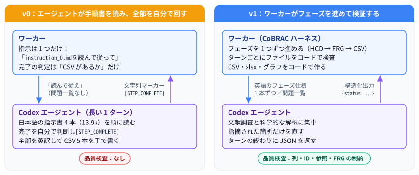
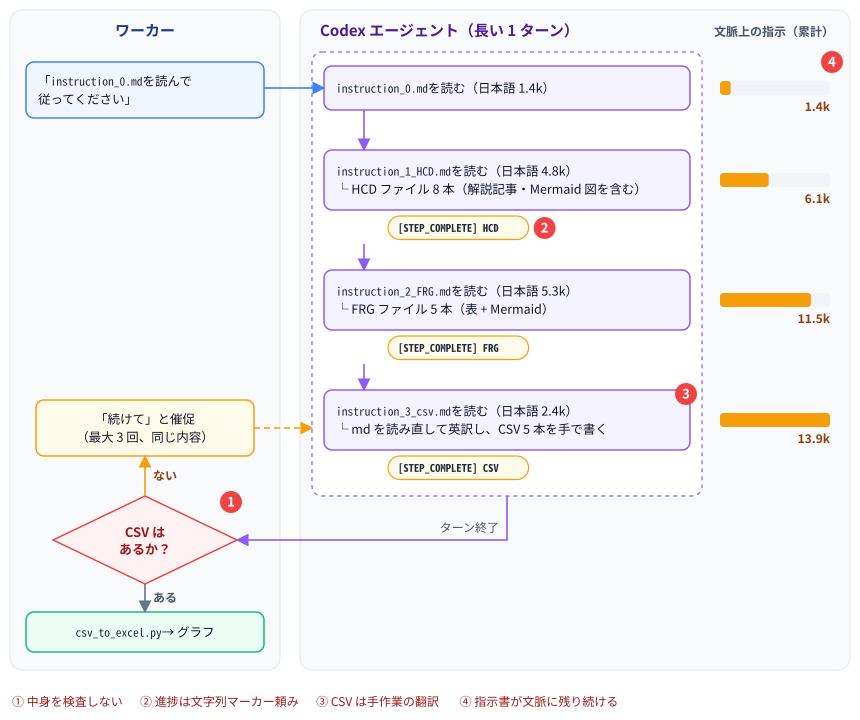
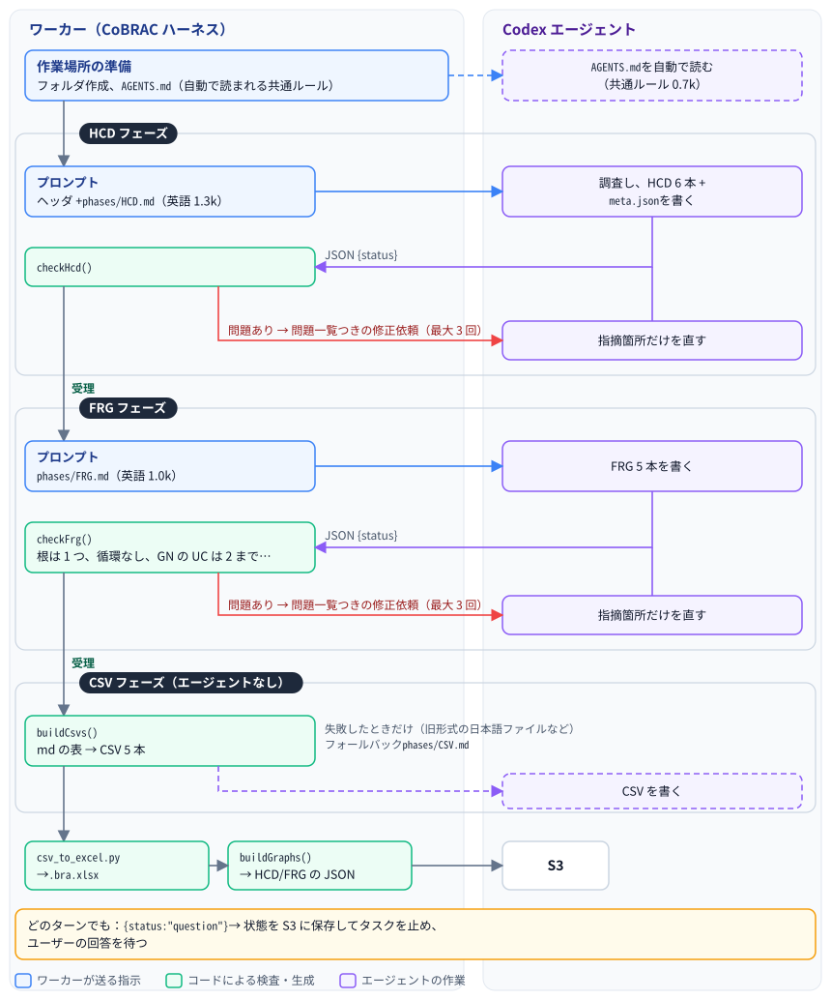
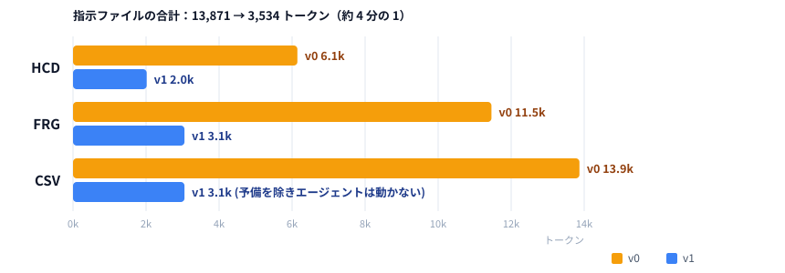
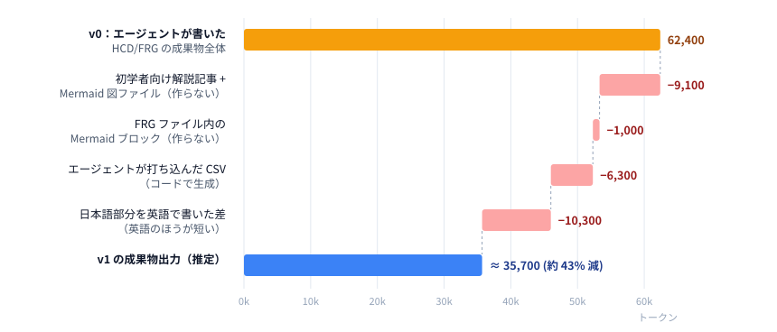

# CoBRAC ハーネス v0 → v1 解説：何が変わり、なぜ変えたか

| 項目 | 内容 |
| ---- | ---- |
| 文書 | 旧指示書方式（v0）から CoBRAC 専用ハーネス（v1）への変更点の解説と、コスト比較 |
| 対象読者 | 利用者、運用者、BRA の品質や OpenAI の利用料を確認する人 |
| 対象バージョン | v0 = アプリ 0.4.2 まで / v1 = アプリ 0.5.0〜0.6.0。3〜5 章は v1（md の表）の説明。0.8.0 以降はハーネス v1.1 で、データファイルが JSON になった（[8 章](#8-v08json-のデータファイル)。全体は [05_CoBRAC_Harness_v1_to_v1_1_ja.md](./05_CoBRAC_Harness_v1_to_v1_1_ja.md)） |
| 関連 | [01_設計仕様.md](../01_設計仕様.md) / [03_AWSインフラと予算.md](../03_AWSインフラと予算.md) / English: [04_CoBRAC_Harness_v0_to_v1.md](./04_CoBRAC_Harness_v0_to_v1.md) |

---

## 1. ひとことで言うと

v0 は、Cursor で md を順番に読ませていたデスクトップの手順を、そのままサーバーに載せたものでした。エージェントは「`instruction_0.md` を読んで従え」という指示だけを受け取ります。そこから日本語の指示書 4 本を順に読み、各フェーズが終わったかを自分で判断し、`[STEP_COMPLETE] HCD` のような文字列マーカーを出し、最後に全部を英訳して 5 つの CSV を手で書いていました。

v1 ではこれを逆転させました。**ワーカーがワークフローを進めます。** エージェントには英語の短いフェーズ仕様を 1 つずつ渡し、ターンごとにファイルをコードで検査し、問題があればその一覧をそのまま返します。CSV、xlsx、グラフはワーカーが自分で作ります。エージェントは、LLM にしかできない文献調査と科学的な解釈に集中します。

---

## 2. 用語

| 用語 | 意味 |
| ---- | ---- |
| ハーネス | モデルの周りのすべて。プロンプト、制御ループ、検証、後処理 |
| ワーカー | 1 ジョブを実行する Fargate タスク（`packages/worker`） |
| フェーズ | HCD、FRG、CSV。CSV の後に xlsx とグラフが続く |
| ターン | `runStreamed` の 1 回の呼び出し。1 ターンの中でモデルへのリクエストは何度も発生する（ツール呼び出しごとに 1 回） |
| バリデータ | `packages/shared/src/harness.ts` の決定的な検査（`checkHcd`、`checkFrg`、`buildCsvs`） |

---

## 3. アーキテクチャ

### 3.1 v0：エージェントが手順書を読み、全部を自分で回す

v0 の弱点：

- **① 中身を誰も検査していなかった。** 「完了」とは「CSV ファイルが存在する」ことでした。列の欠け、存在しない回路 ID、壊れた FRG は、あとでグラフや xlsx を開いて初めて気づくものでした。
- **② 進捗が自由記述の文字列頼みだった。** マーカーの出し忘れや綴り違い、長いメッセージに紛れた `[QUESTION]` で、ステップ表示が狂うことがありました。
- **③ CSV フェーズが手作業の翻訳だった。** エージェントが md を全部読み直し、日本語を英訳して CSV を 5 本打ち込んでいました。遅くて高く、出力の揺れもありました。
- **④ 指示書がずっと文脈に残っていた。** CSV フェーズの時点では、約 13.9k トークンの指示書がモデルへのリクエストのたびに送り直されていました。

### 3.2 v1：ワーカーがフェーズを進めて検証する

### 3.3 並べて比べる

| 観点 | v0 | v1 |
| ---- | -- | -- |
| フェーズを進める主体 | エージェント（`instruction_0.md` を読んで判断） | ワーカー（`packages/worker/src/index.ts`） |
| 指示 | 日本語 4 本、計 13.9k トークン。すべてスレッド内で読む | `AGENTS.md`（0.7k、自動読込）+ その時のフェーズ仕様 1 本（0.5〜1.3k） |
| フェーズ完了の判定 | 文字列マーカー `[STEP_COMPLETE] X` | バリデータがファイルを受理したとき |
| 質問 | 自由記述中の `[QUESTION]…[/QUESTION]` | 構造化出力 `{status, message, question}`（`outputSchema`） |
| 品質検査 | なし（「CSV がある」だけ） | 列、ID、参照、インターフェースと接続の整合、FRG の制約 |
| 問題があったとき | 一律の「続けて」 | 具体的な問題一覧を返し、フェーズごとに最大 3 回修正 |
| 成果物の言語 | 日本語で書き、CSV フェーズで英訳 | 最初から英語。チャットの返答はユーザーの言語 |
| HCD ファイル | 8 本（初学者向け解説記事と Mermaid 図を含む） | 6 本（+ `meta.json`） |
| FRG ファイル | 5 本。表ごとに Mermaid 図も描く | 5 本。表のみ |
| CSV | エージェントが書く | コードで生成。エージェントは失敗時の予備 |
| フォルダ作成、`Project.csv` | エージェント | ワーカー |

---

## 4. 5 つの変更点

3.1 の弱点と、それに対応する変更の関係です。

| v0 の弱点 | v1 での変更 | 詳細 |
| --------- | ----------- | ---- |
| ① 中身を誰も検査していなかった | ターンごとにバリデータがファイルを検査し、問題一覧を返す | [4.4](#44-具体的な指摘つきの検証) |
| ② 進捗が自由記述の文字列頼みだった | ターンの終わりをスキーマに合う JSON にした | [4.5](#45-ターン終了の構造化と成果物の英語化) |
| ③ CSV フェーズが手作業の翻訳だった | 成果物を最初から英語で書き、CSV はコードで生成する | [4.3](#43-決まった処理はコードが行う)、[4.5](#45-ターン終了の構造化と成果物の英語化) |
| ④ 指示書がずっと文脈に残っていた | 共通ルールを `AGENTS.md` に移し、フェーズ仕様は 1 本ずつ渡す | [4.1](#41-共通ルールを-agentsmd-に移した)、[4.2](#42-ワーカーが-1-フェーズずつ進める) |

### 4.1 共通ルールを `AGENTS.md` に移した

Codex は作業ディレクトリの `AGENTS.md` を自動で読みます。ワーカーは `prompts/AGENTS.md` をそこに置きます。中身は、どのフェーズでも変わらないルールです。作業フォルダの構成、表の書き方、引用の書き方、ターンの終え方、検査結果やフォローアップへの対応が入っています。短く（721 トークン）、どのプロジェクトでも同じ内容なので、毎回のリクエストでキャッシュが効く先頭部分に収まります。

### 4.2 ワーカーが 1 フェーズずつ進める

エージェントが先のフェーズの指示を早く目にすることはありません。HCD のプロンプトには `phases/HCD.md` だけを埋め込み、FRG のプロンプトは HCD が受理されてから送ります。ワーカーが今どのフェーズかを把握しているので、リトライや再開はちょうどその場所から始まります。フォローアップでも全部を作り直すのではなく、各フェーズを検証し直します。

### 4.3 決まった処理はコードが行う

| 作業 | v0 | v1 |
| ---- | -- | -- |
| `{P}/`、`{P}_HCD/`、`{P}_FRG/`、`{P}_CSV/` の作成 | エージェント | ワーカー |
| `Project.csv` | エージェントがテンプレートを写す | `buildProjectCsv()` |
| References / Circuits / Connections / FRG の CSV | エージェントが読んで英訳して打ち込む | `buildCsvs()` が md の表から生成 |
| 図 | `8_diagram.md` と FRG の各ファイルに Mermaid | CSV から作る Web のグラフ |
| 初学者向け解説記事（`7_EasyToUnderstand.md`） | 毎回作成 | 廃止。必要ならフォローアップで依頼 |

### 4.4 具体的な指摘つきの検証

ワーカーはターンが終わるたびに md の表を読み取り、主に次を検査します。

- 必要なファイルと列がそろっているか。ID に空白がないか
- 接続の両端が `3_UC.md` で定義された UC か。Reference ID が `2_BIF.md` にあるか
- ROI 内の各 UC のインターフェースの入力・出力が、`4_Connection.md` の送り手・受け手と一致するか
- FRG：根がちょうど 1 つ、循環なし、GN の UC の子は 2 つまで、UC だけでできた GN は UC がちょうど 2 つ、UC の親 GN は 2 つまで、ROI 内の UC がすべてどこかにつながっているか
- CSV の中身が英語か
- UC の命名（`UC Descriptor` 列があるプロジェクト。v0.7 以降に作ったものはすべて）：記述子の構文とファセットの順、Circuit ID の構文 `<SABRA 略称>[@L|@R][(項目,項目)]`、Circuit ID の先頭がアンカーの正式略称と一致するか（BNA は組み込みの表、HOMBA/DHBA はワーカーが RCS の `get_homba_term` で照会）、括弧内の項目がファセットと対応するか（アンカーのみの UC は括弧なしで、これが通常）、記述子が重複しないか。Interface と Subnodes は括弧の外の区切りだけで分けるので、`NAC(shell,DRD1+)` のような ID も読める

問題は一覧としてエージェントに返します（例：「`PC`: Interface inputs [GC] differ from the senders in 4_Connection.md [GC, IO]」）。チャットでは検査結果の通知を開くと、指摘を 1 件ずつ確認できます。3 回直しても残った場合は警告を出して先に進みます。出力がまったく使えない場合はジョブを失敗にします。

### 4.5 ターン終了の構造化と、成果物の英語化

どのターンも、スキーマに合う JSON で終わります。そのため、質問を見落としたり読み違えたりすることがなくなりました。成果物は最初から英語で書くので、CSV フェーズで翻訳する必要がなく、表を機械的に変換できます。

---

## 5. コスト比較

### 5.1 料金の仕組み

モデルへのリクエストのたびに、文脈全体（ルール、指示、会話、ツールの出力）が送り直されます。その大部分はキャッシュ入力の単価（入力単価の 10%）で課金されます。一番高いのは出力（推論を含む）です。したがってハーネスで節約できるのは、常に文脈に載っている部分を小さくすること、出力を減らすこと、やり直しを減らすことの 3 つです。

以下の計算で使う単価（USD / 100 万トークン、標準・短文脈、`packages/shared/src/pricing.ts`、2026-09-25 時点）：

| モデル | 入力 | キャッシュ入力 | 出力 |
| ------ | ---: | -------------: | ---: |
| gpt-6-luna（既定） | 0.10 | 0.01 | 0.50 |
| gpt-6-sol | 2.00 | 0.20 | 10.00 |
| gpt-5.6-sol | 4.00 | 0.40 | 20.00 |
| gpt-6-astra | 10.00 | 1.00 | 50.00 |

### 5.2 指示のトークン数（実測）

`o200k_base` トークナイザで数えた値です。

| v0 のファイル | トークン | v1 のファイル | トークン |
| ------------- | -------: | ------------- | -------: |
| `instruction_0.md` | 1,350 | `AGENTS.md` | 721 |
| `instruction_1_HCD.md` | 4,796 | `phases/HCD.md` | 1,296 |
| `instruction_2_FRG.md` | 5,315 | `phases/FRG.md` | 1,036 |
| `instruction_3_csv.md` | 2,410 | `phases/CSV.md`（予備のときのみ） | 481 |
| **合計** | **13,871** | **合計** | **3,534** |

各フェーズで、リクエストのたびに文脈に載っている指示の量：

プロンプトはおよそ 4 分の 1 になりました。削減分のうち約 3 分の 1 は英語化によるものです。同じ文でも日本語は英語の約 1.75 倍のトークンを使います（手元の例では 42 対 24）。残りは、重複した説明と、コードが引き受けた手順を削ったことによるものです。

### 5.3 成果物の出力量（v0 の実プロジェクトから推定）

`archive/v0/samples/` に保存している v0 時代の 5 プロジェクト（VOR 学習、演繹推論、連想記憶、知覚速度 2 件）の最終成果物を測りました。1 プロジェクトあたりの平均です。

| 項目 | トークン | v1 では |
| ---- | -------: | ------- |
| エージェントが書いた HCD/FRG の成果物全体 | 62,400 | |
| 初学者向け解説記事 + Mermaid 図ファイル | −9,100 | 作らない |
| FRG ファイル内の Mermaid ブロック | −1,000 | 作らない |
| エージェントが打ち込んだ CSV | −6,300 | コードで生成 |
| 残る md の日本語部分を英語で書いた場合の差 | −10,300 | 英語のほうが短い |
| **v1 の成果物出力（推定）** | **約 35,700** | **約 43% 減** |

これは最終ファイルの大きさなので、削減量の下限です。実際には、エージェントはステップ 3〜6 で `3_UC.md` を何度も書き直しており、そのたびに出力が発生しています。

### 5.4 1 プロジェクトあたりの目安（試算）

前提：1 回の実行でモデルへのリクエストが約 200 回（v0 で HCD 120、FRG 60、CSV 20）。指示の削減は 120×4.1k + 60×8.4k + 20×10.8k ≈ 120 万トークン分で、ほぼすべてキャッシュ入力です。出力の削減は約 26.7k トークンです。

| モデル | 文脈の削減（キャッシュ） | 出力の削減 | 1 プロジェクトあたり |
| ------ | -----------------------: | ---------: | -------------------: |
| gpt-6-luna | $0.01 | $0.01 | **約 $0.03** |
| gpt-6-sol | $0.24 | $0.27 | **約 $0.51** |
| gpt-5.6-sol | $0.48 | $0.53 | **約 $1.01** |
| gpt-6-astra | $1.21 | $1.33 | **約 $2.54** |

上の表に含めていないもの：

- **成果物による文脈の縮小。** 英語のファイルは小さいので、エージェントが読み返すたびに入力トークンがさらに減ります。
- **CSV のための読み直しがない。** v0 の CSV フェーズでは、翻訳の前に md 全体（数万トークン）を読み直していました。v1 では予備のときだけです。
- **無駄な実行が減る。** v0 では壊れた表のまま完了し、フォローアップ（丸ごと 1 回分の実行）が必要になることがありました。v1 は実行中に見つけて直します。
- **v1 で増えるもの：修正ターン。** 修正ターンのたびに文脈が送り直されます。フェーズごとに 3 回までで、指摘箇所だけを直させますが、初稿がひどく壊れている場合は v0 より高くつくこともあります。

推論トークンは主にモデルと推論強度で決まり、ハーネスではあまり変わりません。そのため、請求全体に占める削減の割合は上の数字より小さくなります。既定の gpt-6-luna では金額の差は小さく、ハーネスの効果が大きいのは大きなモデルを使うときと、データ品質の面です。正確な値は、各チャットの使用量の表示と OpenAI のダッシュボードで確認してください。同じ ROI/TLF で v0 と v1 を 1 回ずつ実行して比べると、実際の効果がわかります。

---

## 6. 互換性

- 0.8.0 以降、ハーネスは JSON のデータファイルだけを読みます。0.8.0 より前に作ったワークスペース（md の表。v0 のプロジェクトを含む）は読みません。xlsx とグラフは引き続き閲覧・ダウンロードできますが、フォローアップやリトライは、新しいプロジェクトを作るよう案内してすぐに止まります。
- v1 より前に始めたスレッドでは、`[QUESTION]` マーカーも引き続き認識します。

---

## 7. コードの場所

| 内容 | 場所 |
| ---- | ---- |
| エージェント共通ルール | `prompts/AGENTS.md` |
| フェーズ仕様 | `prompts/phases/HCD.md`、`FRG.md` |
| ジョブ制御 | `packages/worker/src/index.ts` |
| フェーズのループとフェーズごとの検査 | `packages/worker/src/pipeline.ts` |
| ターン実行と構造化出力 | `packages/worker/src/codex.ts` |
| JSON Schema・バリデータ・CSV 生成 | `packages/shared/src/harness.ts`、`jsonSchema.ts` |
| テスト | `packages/shared/test/harness.test.ts`、`packages/worker/test/pipeline.test.ts`（モックのエージェントで HCD → FRG → CSV → xlsx） |

---

## 8. v0.8：JSON のデータファイル

v1 でもエージェントはデータを md の表で書き、ワーカーがそれをパースし直していました（`\|` や ` ` のエスケープ、列名のゆれや分割された表を救済するコード）。さらに、エージェントが CSV を手で書く予備フェーズもありました。0.8.0 からはハーネス v1.1 として次のとおりです（UC の命名規則と RCS 連携を含む全体の解説は [05_CoBRAC_Harness_v1_to_v1_1_ja.md](./05_CoBRAC_Harness_v1_to_v1_1_ja.md)）。

| 以前（0.5〜0.7） | 0.8.0 以降 | 理由 |
| ---------------- | ---------- | ---- |
| `2_BIF.md` の References 表 | `{P}_HCD/references.json` | References.csv にパースするだけで、md である必要がない |
| `2_BIF.md` の Connections 表 + `4_Connection.md` | `{P}_HCD/connections.json`（`bif[]` + `connections[]`） | UC 間の接続は Connections.csv の写し。組織レベルの BIF はその根拠なので同じファイルに置く |
| `3_UC.md`（14 列の表） | `{P}_HCD/uc.json` | 最も大きく壊れやすい表で、1 プロジェクトで何度も書き直される。長文セルは JSON 文字列の方が安全。外部 UC は Comments のタグではなく `roi` の値で明示する |
| `3_FinalFRG.md` + `4_FunctionDetails.md` | `{P}_FRG/frg.json` | 同じノードをキーにした 2 つの表を、ノードごとの 1 エントリにまとめた |
| `1_InitialDecomposition.md`、`2_OptimizedFRG.md` | 廃止（作業手順。統合の理由はレポートへ） | 書いた後に誰も読まず、存在確認だけで、ユーザーにも見えなかった |
| `5_Verification.md` | 廃止（構造はバリデータが検査。残る論点はレポートの Limitations へ） | 検査の大半はバリデータと重複し、残りはレポートに書くべき内容 |
| `6_FinalReport.md` + `5_Report.md` | `report.md`（`## HCD` と `## FRG` の節） | ユーザー向けのレポートを 1 本にし、チャット画面で閲覧・ダウンロードできる |
| `1_Thinking.md` | `decision_log.md`（プロジェクト直下） | 役に立つのは判断とその理由の記録。RCS 照会の転記は、ワーカーが全呼び出しを `rcs_mcp_calls.jsonl` に残すので削った |
| CSV の予備フェーズ（`phases/CSV.md`） | 廃止 | CSV はコードだけが生成する。問題は JSON ファイルの修正依頼として返す |

JSON ファイルにはそれぞれ JSON Schema（`HARNESS_SCHEMAS`）があり、エージェント用に `schemas/` に書き出し、バリデータも同じものを使います。問題は JSON ポインタ付きで返します（`uc.json: /ucs/3/implementation is required`）。UC の命名規則の検査（UC Descriptor・Circuit ID）と RCS 照会は変わりません。
