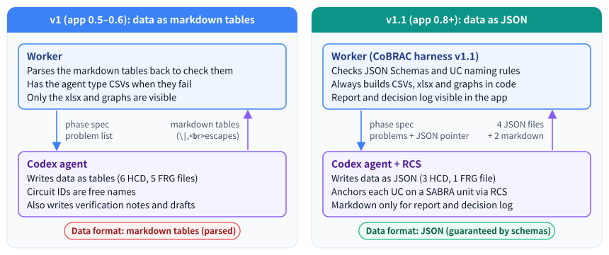
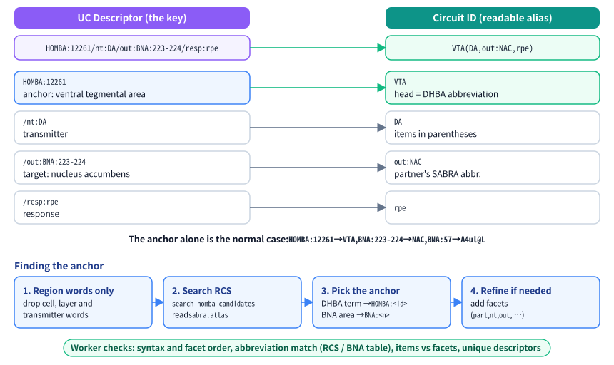
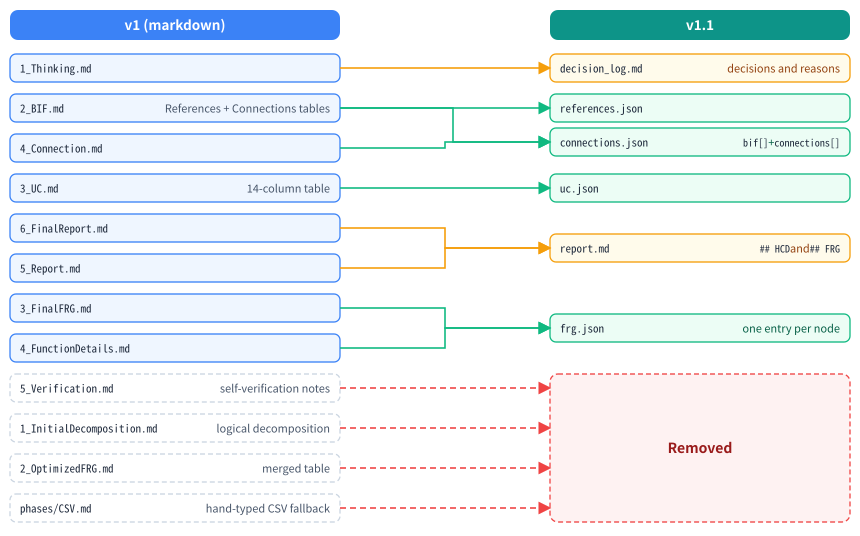

# CoBRAC Harness v1 → v1.1: What Changed and Why

| Item | Description |
| ---- | ----------- |
| Document | Explainer: how the CoBRAC harness changed from v1 to v1.1 — JSON data files, UC names based on SABRA, and a report and decision log you can read in the app |
| Audience | Users, operators, and anyone reviewing BRA output quality or OpenAI spend |
| Applies to | v1 = app 0.5.0–0.6.0 / v1.1 = app 0.8.0 and later. The UC naming rules and RCS came first, in 0.7.0 (0.7.x is an intermediate stage whose data was still markdown tables) |
| Related | [04_CoBRAC_Harness_v0_to_v1.md](./04_CoBRAC_Harness_v0_to_v1.md) (v0 → v1) / [01_設計仕様.md](../01_設計仕様.md) / 日本語版: [05_CoBRAC_Harness_v1_to_v1_1_ja.md](./05_CoBRAC_Harness_v1_to_v1_1_ja.md) |

---

## 1. In one paragraph

v1 made the worker drive the phases and verify them ([the 04 explainer](./04_CoBRAC_Harness_v0_to_v1.md)). The agent, however, still wrote its data as markdown tables. The worker parsed those tables back to check them, and when the CSVs could not be built it had the agent type them by hand. Circuit IDs were free names, and only the xlsx and graphs were visible in the app. v1.1 changes three things. **Data is written as JSON, and JSON Schemas guarantee its shape**; the CSVs are always built by code. **Every UC is anchored on a SABRA unit found with RCS and named after it, and the worker checks the names.** **Markdown is kept only for the two documents people read, the report and the decision log, and both can be read in the chat screen.**

---

## 2. Terms

| Term | Meaning |
| ---- | ------- |
| SABRA | The organisation's mixed atlas: BNA (Brainnetome) areas for neocortex, amygdala, hippocampus, basal ganglia and thalamus, and HOMBA terms that have a DHBA name for everything else |
| RCS | ROSETTA Candidate Search: an MCP server that finds SABRA units from brain-region names |
| Anchor | The SABRA unit a UC is fixed to (`HOMBA:12261`, `BNA:223-224`, …) |
| UC Descriptor | The UC's key: the anchor, plus facets (`part`, `nt`, `out`, …) only when needed |
| Circuit ID | The UC's readable alias, starting with the anchor's official abbreviation (`VTA`, `NAC(shell,DRD1+)`) |
| JSON Schema | The shape of each data file (`HARNESS_SCHEMAS`). Written to `schemas/` for the agent; the validator uses the same definitions |
| Decision log | `decision_log.md`: the decisions the agent took itself and why |

---

## 3. Architecture

### 3.1 v1: markdown tables, parsed back by the worker

")

Weak points:

- **① Table parsing was fragile.** A `|` inside a cell had to be written `\|` and a line break ` `, and the worker needed code that rescued column-name drift and split or vertical tables. The largest file, `3_UC.md`, was a 14-column table with five long-text cells, rewritten several times per project.
- **② Some files were never read.** `1_InitialDecomposition.md`, `2_OptimizedFRG.md` and `5_Verification.md` were only checked for existence: no later step used them and users could not see them. The two reports were not visible in the app either.
- **③ Circuit IDs were free names.** The same neural population got different names in different projects, with no link to a brain atlas.
- **④ A hand-typed CSV fallback remained.** When table conversion failed, the agent typed the CSVs following `phases/CSV.md`.

### 3.2 v1.1: JSON data, names fixed to SABRA

")

The skeleton of the workflow is the same as in v1: HCD → FRG → CSV → xlsx, the worker drives and verifies the phases, and every turn ends with `{status, message, question}`. What changed are the files the agent writes and what the worker checks and generates.

### 3.3 Side by side

| Aspect | v1 | v1.1 |
| ------ | -- | ---- |
| Data files | Markdown tables (`2_BIF.md`, `3_UC.md`, `4_Connection.md`, `3_FinalFRG.md`, `4_FunctionDetails.md`) | JSON (`references.json`, `uc.json`, `connections.json`, `frg.json`) |
| Shape guaranteed by | Table-writing rules (`\|`, ` `, column names) and a forgiving parser | JSON Schemas; problems carry a JSON pointer (`uc.json: /ucs/3/implementation is required`) |
| HCD files | 6 markdown + `meta.json` | 3 JSON + `meta.json`, `report.md`, `decision_log.md` (project root) |
| FRG files | 5 markdown | `frg.json` only (the report gets a `## FRG` section) |
| Intermediate files | Draft decomposition, merged table, self-verification notes | None (reasons and open points go into the report) |
| External UCs | `noROI(...)` typed into Comments | A `roi` value (`internal`, `noROI(input)`, …); the worker writes the tag into the CSV |
| UC names | Free Circuit IDs | UC Descriptor and Circuit ID based on a SABRA anchor |
| Name checks | None (only "no spaces") | Syntax, abbreviation match (RCS / BNA table), items vs facets, unique descriptors |
| RCS | None | MCP server the agent queries; every call kept in `rcs_mcp_calls.jsonl` |
| CSV | Built by code; hand-typed by the agent on failure | Always built by code; problems go back as fixes to the JSON files |
| Visible in the app | xlsx, graphs | xlsx, graphs, report, decision log (view and download) |
| Earlier formats | Also reads v0 file names and table layouts | Not read ([section 6](#6-compatibility)) |

---

## 4. The changes in detail

How the weak points in 3.1 map to the changes:

| v1 weak point | Change in v1.1 | Details |
| ------------- | -------------- | ------- |
| ① Table parsing was fragile | Data is JSON, checked against JSON Schemas | [4.3](#43-json-data-files-checked-against-json-schemas) |
| ② Some files were never read | Three intermediate files removed; one report, readable in the app | [4.4](#44-report-and-decision-log) |
| ③ Circuit IDs were free names | Naming rules based on SABRA, checked by the worker | [4.1](#41-uc-naming-sabra-anchor-uc-descriptor-circuit-id), [4.2](#42-rcs) |
| ④ A hand-typed CSV fallback remained | Code always builds the CSVs; problems go back as fixes to the JSON | [4.5](#45-csvs-are-always-built-by-code) |

### 4.1 UC naming (SABRA anchor, UC Descriptor, Circuit ID)

Since 0.7.0 every UC, inside or outside the ROI, is fixed to exactly one SABRA unit and named after it. Neither SABRA nor UCs have IDs of their own: the **UC Descriptor** (anchor plus facets only when needed) is the UC's key and the **Circuit ID** its readable alias. The same population gets the same names in every project.

- **The anchor alone is the normal case.** When a UC is a whole SABRA unit, its descriptor is just the anchor and its Circuit ID just the abbreviation (`HOMBA:12261` / `VTA`, `BNA:223-224` / `NAC`, `BNA:57` / `A4ul@L`). Facets are added only when the HCD needs a population finer than the unit. The transmitter goes in Transmitter and the content in Output Semantics; facets are not used to describe a UC.
- **The Circuit ID starts with the anchor's official abbreviation**: the DHBA acronym or the BNA area abbreviation, exactly. Custom abbreviations (`NAc`, `LC`) and sub-unit ones (`NACs`, `CA1`) go inside the parentheses. One-sided UCs get `@L` / `@R`.
- **The worker checks** the descriptor syntax and facet order, that the head (and side) of the Circuit ID equals the anchor's abbreviation (BNA from a built-in table, HOMBA/DHBA looked up in RCS), that the parenthesized items match the facets, and that no two UCs share a descriptor.
- The `descriptor` in `uc.json` becomes the last column (UC Descriptor) of `Circuits.csv` and of the xlsx Circuits sheet, and the HCD graph shows it in the node details.

### 4.2 RCS

The agent uses RCS as an MCP server: `search_homba_candidates` to find candidates, `search_bna_candidates` on the BNA side, and `get_homba_term` to confirm when unsure. It sends RCS only region names and a short context (ROI, TLF, species).

- The worker keeps every RCS call of the agent in `rcs_mcp_calls.jsonl`. The decision log records which candidate was chosen and why, without copies of the queries.
- When checking, the worker asks RCS for the abbreviation of each HOMBA anchor itself (`get_homba_term`, cached within the job).
- A run without RCS still produces BRA data: the agent chooses anchors from its knowledge and states in the decision log that they were not checked with RCS. Anchors that could not be looked up skip only the abbreviation check.
- Circuit IDs containing brackets or commas (such as `[U.NAC(shell,DRD1+)]`) are now split correctly in Interfaces and FRG Subnodes: separators count only outside brackets.

### 4.3 JSON data files, checked against JSON Schemas

Since 0.8.0 the markdown tables that the worker parsed are JSON data files.

| v1 | v1.1 | Why |
| -- | ---- | --- |
| References table in `2_BIF.md` | `{P}_HCD/references.json` | It was only parsed into References.csv; it never needed to be markdown |
| Connections table in `2_BIF.md` + `4_Connection.md` | `{P}_HCD/connections.json` (`bif[]` + `connections[]`) | UC connections are what Connections.csv contains; the tissue-level BIF is their evidence, so it lives in the same file |
| `3_UC.md` (14-column table) | `{P}_HCD/uc.json` | The largest and most fragile table; long text is safe as a JSON string. External UCs are marked by the `roi` value |
| `3_FinalFRG.md` + `4_FunctionDetails.md` | `{P}_FRG/frg.json` | Two tables keyed by the same nodes, merged into one entry per node |

- Each JSON file has a JSON Schema. The worker writes them to `schemas/` in the workspace, the agent reads them when unsure, and the validator uses the same definitions.
- Shape problems come back with the file name and a JSON pointer (`uc.json: /ucs/3/implementation is required`). The checks of IDs, references, interfaces against connections, FRG rules and naming then run on the JSON.
- Values that are not in English are reported by the checks of the phase that wrote them.
- The markdown parser (`markdown.ts`) and the code that rescued legacy file names and layouts were removed.

### 4.4 Report and decision log

- There is one report, `report.md`, at the project root with `## HCD` and `## FRG` sections; it replaces `6_FinalReport.md` and `5_Report.md` of v1. The rationale of the FRG decomposition and merges (formerly `1_InitialDecomposition.md` and `2_OptimizedFRG.md`) and the open points of the self-verification (formerly `5_Verification.md`) go into the report body and its Limitations; the structure is checked by the validators.
- `1_Thinking.md` is now `decision_log.md`: dated entries on ROI/TLF validity, ROI_Input / ROI_Output, the choice of each UC's anchor, rejected alternatives, the user's answers and changes made by follow-ups.
- The chat screen has Report and Decision log buttons once the files exist; they open a viewer with a download button.

### 4.5 CSVs are always built by code

The CSV phase has no agent turn. `buildCsvs` generates the five CSVs from the JSON, `csv_to_excel.py` the xlsx and `buildGraphs` the graphs. The fallback in which the agent typed the CSVs (`phases/CSV.md`) was removed; problems go back as fix prompts for the JSON files. The phase loop moved to `packages/worker/src/pipeline.ts`, and a test runs HCD → FRG → CSV → xlsx with a mock agent.

---

## 5. Instructions and cost

### 5.1 Instruction tokens (measured)

Measured with the `o200k_base` tokenizer. The 0.7.0 column is the intermediate stage with the naming rules but markdown data.

| File | v1 (0.6.0) | 0.7.0 | v1.1 (0.8.0) |
| ---- | ---------: | ----: | -----------: |
| `AGENTS.md` | 721 | 942 | 1,241 |
| `phases/HCD.md` | 1,296 | 3,173 | 3,674 |
| `phases/FRG.md` | 1,036 | 1,063 | 1,064 |
| `phases/CSV.md` (fallback only) | 481 | 525 | removed |

Instructions in the context of every request, by phase:

")

The v1.1 instructions are about twice as long as v1's. About two thirds of the increase is the UC naming rules added to `HCD.md` in 0.7.0 (+1,877). The JSON switch added `AGENTS.md` +299 and `HCD.md` +501 (file layout, how to write JSON, the decision log). The JSON Schemas themselves sit in `schemas/` and are read only when needed, so they are not part of every request.

### 5.2 What this means per project (illustrative)

With the same assumptions as [section 5.4 of the 04 explainer](./04_CoBRAC_Harness_v0_to_v1.md#54-what-this-means-per-project-illustrative) (120 requests in HCD, 60 in FRG), the extra instructions are 120 × 2,898 + 60 × 2,926 ≈ 0.52M tokens, almost all cached input.

| Model | Cached input (USD per 1M) | Extra per project |
| ----- | ------------------------: | ----------------: |
| gpt-6-luna (default) | 0.01 | **≈ $0.01** |
| gpt-6-sol | 0.20 | **≈ $0.10** |
| gpt-5.6-sol | 0.40 | **≈ $0.21** |
| gpt-6-astra | 1.00 | **≈ $0.52** |

Not counted above:

- **Less:** the three intermediate files are not written, the decision log no longer copies RCS queries, there is no hand-typed CSV fallback, and no fix turns are spent on broken markdown escapes.
- **More:** RCS calls and their results enter the context, and naming problems can cost fix turns.

Neither side has been measured; the usage line in each chat and the OpenAI dashboard remain the source of truth. The main goal of v1.1 is not cost but guaranteed data shape and names that stay the same across projects.

---

## 6. Compatibility

- Since 0.8.0 the harness reads only the JSON data files. Workspaces created before 0.8.0 (markdown tables, including v0 and v1 projects) are not read: their xlsx and graphs can still be viewed and downloaded, but follow-ups and retries stop right away with a message to start a new project.
- Since 0.7.0 the xlsx Circuits sheet has UC Descriptor as its last column (column O); columns A–N keep their positions. The BRA version in `Project.csv` stays `CoBRAC-v1-0`: it is the version of the BRA data format, separate from the harness version, and this change only appends a column without changing the meaning or position of the existing ones.
- The `[QUESTION]` marker is still recognized for threads started before v1.

---

## 7. Related app change

Outside the harness, project IDs changed at the same time (0.7.0). The system assigns them as `<user key>-<number>` (for example `u7m2q9xa-12`); they are unique across all users and never change. The display name is separate and can be changed at any time; the agent writes an English `name` (`<TLF> in <ROI>`) to `meta.json`. The xlsx downloads as `{name}_{ID}.bra.xlsx`.

---

## 8. Where to look in the code

| Piece | Location |
| ----- | -------- |
| Shared agent rules | `prompts/AGENTS.md` |
| Phase specs (including the naming rules) | `prompts/phases/HCD.md`, `FRG.md` |
| JSON Schemas, validators, CSV generation | `packages/shared/src/harness.ts`, `jsonSchema.ts` |
| UC naming checks | `packages/shared/src/ucNaming.ts`, BNA table `bnaLabels.ts` |
| Phase loop | `packages/worker/src/pipeline.ts` |
| RCS connection and lookups | `packages/worker/src/rcs.ts` |
| Job control and the RCS call log | `packages/worker/src/index.ts` |
| Report / decision log viewer | `packages/web/src/components/DocViewer.tsx` |
| Tests | `packages/shared/test/harness.test.ts`, `ucNaming.test.ts`, `packages/worker/test/pipeline.test.ts`, `rcs.test.ts` |
