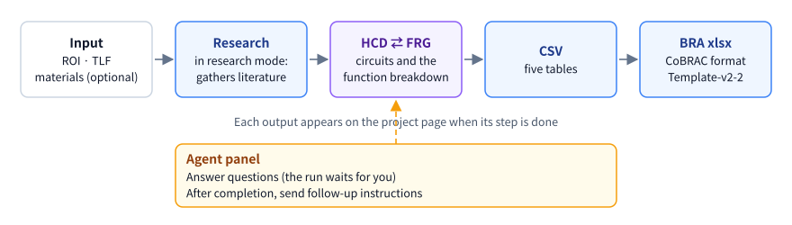
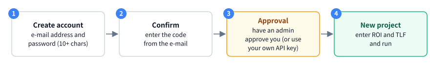
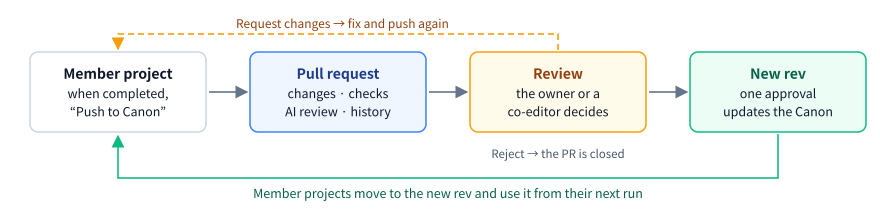

# CoBRAC Agents user manual

A guide for people who make BRA (Brain Reference Architecture) data with CoBRAC Agents. If you are new, read "What it does" and "Getting started" and you can run your first project. Open the other sections from the table of contents when you need them. The "?" buttons on the screens have short explanations as well.

## What it does

Enter an ROI (region of interest) and a TLF (top-level function) and run: an AI agent surveys the literature and builds the BRA data. The work runs on the server, so it goes on when you close the browser.

- **HCD** (circuit diagram): the circuits (UCs) of the region and the connections between them, with the papers that support them.
- **FRG** (function breakdown): a tree that breaks the TLF down through groups (GNs) to UCs.
- **CSV and BRA xlsx**: the data for submission, built from the HCD and the FRG. The xlsx comes in two formats: CoBRAC's own and the official Template-v2-2.
- When the agent needs a decision it asks you a question, and continues once you answer. After completion you can change the result with follow-up instructions.
- One run takes from tens of minutes to a few hours and costs OpenAI usage ([costs](#where-do-i-see-the-cost)).
- To build many projects, put them in a plan with the [BRA Planner](#bra-planner); it runs them in turn for you.

## Getting started

### Create an account

1. On the sign-in screen, choose "Create an account" and enter your e-mail address and a password (10 characters or more).
2. Enter the confirmation code from the e-mail, and you can sign in. If no code arrives, press "Resend code".
3. If you forget your password, use "Forgot password" on the sign-in screen.

If sign-up is closed, ask an admin.

### Get an API key

Runs need an OpenAI API key. You need one of these:

- **Your own key**: paste it under "OpenAI API key" in Settings and press "Register / update". It is checked with OpenAI and stored encrypted. Usage is billed to your OpenAI account.
- **The default API key**: without a key of your own, ask an admin to approve you for it. Once approved, Settings shows "Using the default API key". The model lists then show only the models this key can use.

If you have both, your own key is used.

## Create a project

Open "New project" in the sidebar.

1. Write a brain region in **ROI** and the function it serves in **TLF**. Either one alone is enough. Typing a Brainnetome abbreviation or an English region name in the ROI shows suggestions. "Use example" fills in an example.
2. If needed, use the buttons under the input:
   - "+": attach reference materials (PDF, images, text, Office files, URLs). Up to 10 files, 50 MB in total (20 MB per file), and 20 URLs. The agent uses them as hints but checks papers and quotes against the published literature.
   - "Canon": choose one when circuit definitions should match other projects ([using a Canon](#using-a-canon)).
   - "v": model, reasoning effort, research mode and evidence ([research mode and models](#research-mode-and-models), [hypothesis mode](#hypothesis-mode)).
3. Press "Run". Enter in the ROI moves to the TLF; Enter in the TLF runs (Shift+Enter adds a line).

The project gets a name automatically; you can change it on the project page. The Contributor name comes from Settings.

### Research mode and models

- **Research mode** (on by default): before the HCD, the agent surveys PubMed and Europe PMC in depth. It takes longer and costs more (the screen shows an estimate). When off, the agent only searches the web while it builds the HCD: faster and cheaper, but shallower. It cannot be changed after creation.
- **Model and reasoning effort**: the defaults come from Settings. High reasoning effort is recommended.

## The project page and the agent

After "Run" you are on the project page. You can also open it from "History" and "Projects" in the sidebar.

")

- **Header**: name (press it to rename), status, ROI and TLF, model, usage and reference materials. On a phone, open them with "Details".
- **Progress**: how far the run is: research → HCD ⇄ FRG → CSV → xlsx.
- **Tabs**: HCD, FRG, Tables, Report, Decision log, Article and Versions. Tabs of outputs that do not exist yet are greyed out.
- **Agent panel**: the log of the run, questions and the input box. The "Agent" button at the right end of the tabs opens and closes it.

### Status

| Status | Meaning |
| ------ | ------- |
| Queued | Waiting for its turn to start |
| Running, Finalizing | The agent is working |
| Waiting for answer | The agent asked a question; answering resumes the run |
| Completed | The BRA data is ready; follow-up instructions can change it |
| Failed, Cancelled | The run stopped; "Retry from here" resumes it |

### Answer a question

A question appears at the end of the Agent panel in an amber box. If it has options, pressing one puts it in the input box. Write your answer and send it, and the run resumes (Enter sends, Shift+Enter adds a line). A question waits for 7 days.

### Follow-up instructions

On a completed project, write what to change in the input box of the Agent panel (for example "Add a UC for … and review the connections"). The instruction runs as a new job and costs usage. For the "Allow hypotheses with this instruction" switch under the input box, see [hypothesis mode](#hypothesis-mode).

### Stop and retry

- While running, "Stop" in the header stops the run.
- A failed or cancelled project resumes from its last outputs with "Retry from here".
- When the run is cut off on the server side, it resumes by itself. One job stops after 6 hours; continue with a retry then as well.
- Delete a project you no longer need with the bin button in the header (stop it first if it is running).

## Reading the outputs

Each output appears in its tab when its step is done.

### HCD graph

- Nodes are circuits (UCs); arrows are connections. Colours tell circuits inside the ROI from those outside it (input and output side); inhibitory connections are blue with a square arrowhead.
- Select a node or an arrow to open its details: names, properties, connections, and the supporting papers and quotes.
- Dashed boxes are Collections (UCs that come from splitting one circuit). Turn them on and off in the "More" menu.
- Drag nodes to arrange them and use "Edit style" for colours and lines. Changes are saved automatically. You can also save the graph as PNG.

### FRG graph

A tree from the TLF through GNs to UCs. Collapse and expand child nodes. Select a UC and "Show this UC in HCD" takes you to the same circuit in the HCD; a GN can highlight its UCs on the HCD.

### Tables, report and decision log

- **Tables**: the five CSV files as tables. Press a header to sort and use the box above to filter rows. The raw files can be downloaded.
- **Report**: the agent's report of the work.
- **Decision log**: what the agent decided, where and why.

### BRA xlsx

When the data is complete, the header has two download buttons:

- **BRA xlsx**: CoBRAC's format.
- **BRA xlsx (Template-v2-2)**: the official template's format.

### Versions

Each time a run or a follow-up finishes, its result is kept as a version (v1, v2, …) that never changes. The "Versions" tab lists them with their date, model and how many rows changed. Pick one to:

- open its tables;
- see which rows were added, removed or changed compared with another version.

Projects finished before versions were kept show their current data as "Not saved yet"; the next follow-up saves it as a version before changing anything.

When the site has a BRA-DB, a saved version also has a **BRA-DB** box: it says which version BRA-DB holds, and "Register v<n> in BRA-DB" puts this version in BRA-DB. BRA-DB keeps the history of every registration (which version, its content hash, who and when). Registering the same content again changes nothing; if the version has fewer circuits or connections than BRA-DB holds, you are asked to confirm first.

## Hypothesis mode

By default, the BRA contains only connections and UCs that the literature directly supports ("Literature-supported only"). With "Allow hypotheses", connections and UC properties that the literature does not directly support can be included, marked as **hypotheses**. A hypothesis still needs at least one premise paper that can be verified (what other studies report, a homologous region, …). Citations, DOIs, the SABRA boundary and the other checks stay as they are.

### Choosing it

- **When creating**: under "v" in the input box, choose "Allow hypotheses" under "Evidence". Choose the claims that may be hypotheses (a connection's existence, direction and sign; a UC's cell population, transmitter and modulation, and role) and the share limit. You can add one line (up to 200 characters) on where hypotheses may be needed. The scope is the whole graph.
- **With a follow-up**: switch on "Allow hypotheses with this instruction" under the input box of the Agent panel. Choose the claims, the target ("Whole HCD" or "Circuits and GNs selected in the graph") and the limit, then send. To narrow the target, first select a circuit, Collection or GN in the HCD or FRG graph. The switch turns off after sending.
- Writing "hypotheses are fine" in an instruction does not allow hypotheses. Always use the switch.

The chosen claims and target are recorded as a scope (S1, S2, …), and the agent places hypotheses only inside the scopes. When a job completes with no hypothesis in its result, the project goes back to "Literature-supported only".

### Share limit

For connections and for UCs separately, a result whose hypotheses exceed this share of all elements (10%, 20%, 30% or 50%; 20% by default) is sent back to the agent. Exactly the limit passes. A follow-up can change the limit.

### Reading the graphs and screens

- **HCD graph**: a hypothesis connection is drawn with short dots and an "H" in the middle, a connection whose direction alone is a hypothesis with a hollow arrowhead, and a hypothesis UC with a dotted border and an "H" (Collections have a dashed border). Hover over an "H" to see the hypothesis numbers (H1, H2, …). "Hide hypotheses" in the toolbar shows the evidence-only graph.
- **FRG graph**: GNs that depend on hypotheses carry a small "H"; hover over it to see which hypotheses.
- **Detail panel**: the basis ("Basis: hypothesis (homology)" and so on), the rationale and the premise papers.
- **Header and project list**: a "Hypothesis mode" badge with the number of hypotheses in the latest version.
- **Versions**: the generation conditions show the evidence mode, the scopes, and for connections and UCs "hypotheses / all (share) · limit".
- **Canons**: hypotheses do not enter the Canon's shared definitions. The push screen shows "Hypotheses: n (kept out of the shared layer)".

### BRA-DB

Versions that contain hypotheses cannot be registered in BRA-DB for now (the button in the version's BRA-DB section is disabled and says why). Rules for registering hypotheses will be decided separately. Versions without hypotheses register as before.

### No suggestions for further study

Hypotheses show what the BRA contains. The tool does not suggest studies, experiments or predictions to test them; what to do with a hypothesis is the researcher's decision. To reduce hypotheses, ask in a follow-up, for example "Remove H3" or "Find evidence for H3 and replace it".

## Explanatory articles

When the BRA data is complete, the "Article" tab makes an illustrated article about it in a language you choose.

1. Choose the "Article language" and a model, then press "Create article". It takes a few minutes and its usage is added to the project.
2. Switch between finished articles with "Read in", and download one as .md.
3. If the BRA data changes after an article was written, its language button gets a dot; "Recreate article" brings it up to date.

The figures are drawn from the BRA data, and the article cites only the project's references.

## Canons

A **Canon** is a set of your projects that keep circuit definitions consistent. Within a Canon the same circuit has the same ID, name and breakdown in every project.

### Using a Canon

- Under "Canons" in the sidebar, create a "New Canon" with a name and a granularity policy (for example "neocortex by area × projection class, subcortex by whole nucleus"). Add existing projects with "Add a project".
- For a new project, use the "Canon" button on the create screen: choose "An existing Canon" or "A new Canon from existing projects".
- A project can be in one Canon only. Settings has a default Canon for new projects.

### How a Canon guides generation

Projects in a Canon are built to its definitions (circuit IDs, names, breakdowns, connections and references). Anything that contradicts the Canon goes back to the agent to fix. Circuits the Canon does not have yet follow its granularity policy.

### Push and review

1. **Push**: on a completed member project, "Push to Canon" shows the differences and creates a pull request (PR). The Canon does not change until the PR is approved.
2. **Review**: the Canon's owner or a co-editor checks the four tabs of the PR page:
   - Changes: the current Canon and the Canon after approval side by side, and the list of changes
   - Checks: conflicts to decide, and the results of the system checks
   - AI review: a model points out inconsistencies with reasons and sources (it does not decide)
   - History: who did what and when
3. **Decide**: "Approve" creates a new rev (version) of the Canon; one approval is enough. "Request changes" keeps the PR open until the sender fixes it and pushes again. "Reject" closes the PR.

**Co-editors**: the owner adds a co-editor on the Canon page by the e-mail address they signed up with. Co-editors open the Canon from "Shared with you" and can review its PRs. Settings and deletion stay with the owner.

### Keeping up with revs

The project header shows the rev the project follows (for example "rev 1 (latest 2)").

- **Newer revision**: "Update to latest" makes the next run follow the new definitions.
- **Changes affect this project**: definitions this project uses have changed. "Align with Canon" also sends a follow-up instruction to update the project.

## BRA Planner

**BRA Planner** builds many BRA projects (ROI × TLF) from one **plan**. Once you confirm the plan, the rows run automatically in **waves**, within the concurrency limits. A draft of the plan can be written for you from a goal and capability lists. No project is created before you confirm; the only job that can run before that is the one of "Create draft", and its cost is recorded.

### Create a plan

1. Under "BRA Planner" in the sidebar, enter a name and a goal (for example "Build the BRA of the language system").
2. Add capability list files (CSV, TSV, text, xlsx or PDF; up to 10) or paste rows. One row is one project. CSV, TSV and text files are read into rows as soon as the plan is created. With a header row the columns are read by name: ROI (region), TLF (function, capability), rationale (note), wave and priority. Without one, a single column is the TLF, otherwise the columns are ROI, TLF, rationale.
3. "Create plan" creates the plan from these rows. "Create draft" creates it and asks for a draft at the same time (it needs a goal, a file or pasted rows). xlsx and PDF files are read by the job of "Create draft" (also when you press it after creating the plan).
4. Rows that could not be read (neither ROI nor TLF, the same ROI × TLF as another row, …) are shown with the file name, the row number and the reason. Fix them and add them with "Import CSV".

### Create a draft

- "Create draft" runs a planning job that reads the goal, the capability lists and the current rows, and writes rows (ROI × TLF with a rationale), anchors, dependencies and a granularity policy. Every item of a capability list becomes a row; a broad goal such as "a full set of BRAs for language" gets about 8–15 rows. The rows already in the plan stay, with their ROI and TLF unchanged.
- Meanwhile the plan is "Drafting" and its rows cannot be edited. A banner shows the state of the job (waiting for a free job slot / about to start / running) and how long it has taken. The job starts once a slot under the concurrency limits is free and usually finishes within a few minutes (a job may run for at most 7 minutes; a draft that reads xlsx or PDF lists, or covers more than 20 rows, may run for up to 25 minutes). "Cancel draft" stops it.
- When it is done the plan is a draft again and you can change every row. Items the draft could not read (rows of an xlsx or PDF, part of the goal, …) are listed with the file, the place and the reason; add rows by hand where needed. Parts of the draft that referred to rows, anchors or projects that do not exist are not used, and their number is shown. A draft that failed shows why.
- The **granularity policy** says how finely the rows of this plan define circuits (for example "neocortex = area × projection class, subcortex = nucleus"). The draft writes it and you can edit it until you confirm; after that it changes only through an accepted proposal.
- **Cost**: the drafting job is billed like any other job: it takes one slot under the concurrency limits, runs on your API key (or the default API key) and its cost is recorded. It is one short run, so it costs little next to the rows' projects. A job you cancel or that runs out of time is still billed for what it used until then. You can press "Create draft" again at any time, but each press runs a new job.

### Arrange rows and waves

- While the plan is a draft you can add, remove and reorder rows and change their ROI, TLF, rationale and wave. "Waves of N" splits the rows, in their current order, into waves of as many rows as can run at once.
- The next wave starts once no row of the current wave is waiting to start or running. Rows waiting for an answer or needing attention do not hold it up.
- "Settings" sets the model, reasoning effort and research mode. Every row is built with these settings and the harness rules in force when the plan is confirmed.

### Seeds and anchors

- Drafted rows carry **anchors**: the IDs of the units of SABRA, the combined atlas of BNA and DHBA, that the row's ROI and its main input and output regions belong to (a BNA area is written like `BNA:57-58`, a DHBA region by its HOMBA ID like `HOMBA:12261`). The drafting job looks them up in RCS. A row shows its first 4 anchors and how many more it has.
- "hub n" is the number of other rows sharing an anchor with the row. "Overlaps" lists the rows sharing 2 or more anchors with it: they would build the same circuits, so they are never in the same wave. "Depends on" lists the rows it is built from (its function combines theirs, e.g. repetition from phonological processing and speech production); it goes into a later wave than them. Regions that rows share are not dependencies: the anchors keep such rows apart.
- **Seeds** are the rows sharing anchors with the most other rows (at most 3). They are built before the other rows, one at a time, each in a wave of its own, so the circuits many rows use are worked out once and the later rows can build on them. Their wave headings say "Seed".
- The other rows each go into the earliest wave that comes after the rows they depend on, still has room within the concurrency and holds no row they overlap with.
- "Order automatically" sets the waves and seeds again from the anchors and dependencies (no job is run, nothing is charged). A new draft is already in this order.
- Saving after adding, removing or moving rows, or changing a wave, switches the plan to a manual order: your waves are used as they are (and are not re-ordered after each wave). Saving only a changed rationale, ROI, TLF or "Rebuild" keeps the order as it is. Rows added with "Import CSV" to a draft in automatic order are ordered automatically together with the others. A plan in automatic order is ordered once more at confirmation, with the concurrency in force then.

### Existing projects

- When you already have a finished project with the same ROI × TLF, the row is marked "Existing" with a link to that project, and it is listed in the last wave. On confirmation the row is marked done without being built (and it is left out of the estimate). If you delete that project before confirming, the row is built.
- To build it anyway, tick "Rebuild" for the row in the editor and save. In a plan in automatic order the rows are then ordered again with it. The choice stays on the row: a new draft does not mark it "Existing" again. Untick it and save to undo it.
- When a project with the same ROI × TLF exists but is not finished, the row shows a warning with a link. If you confirm as is, the row is built separately.

### Confirm and run

- "Confirm and start" shows the estimate (time and cost) before starting. The estimate counts about 48 minutes per run, the seed rows one at a time and the other waves one after another, rework for 20% of the rows, and $0.18–0.39 per row. Rows done by an existing project are not counted, nor is time spent waiting for answers.
- How many rows run at once is the lower of the overall limit and the per-user limit set by an admin. The OpenAI rate limit (tokens per minute) can also make rows wait.
- A row that fails is retried automatically up to 2 times. If it still fails it "needs attention", and you can "Retry" or "Skip" it. The other rows go on.
- The projects a plan creates open in the usual project page; its header links back to the plan. Costs are recorded per project, and the plan page shows the total, including the drafting and re-planning jobs, with the cost of those planning jobs on its own line.

### Re-planning after each wave and proposals

- In a plan with an automatic order, the rows that have not started are ordered again after each wave. The anchors of the finished rows are first replaced by the anchors of the circuits their projects actually built, so overlaps that turned out differently than predicted count for the next waves. Rows that have started or finished, and rows waiting for an answer or needing attention, do not move.
- Then a planning job (the re-plan) may propose changes based on the finished rows: "Add a row" (a circuit the finished rows share that no row covers yet), "Remove a row" (a row that has not started and that a finished row already covers) or "Change the granularity policy", each with the reason. Often it proposes nothing.
- A proposal changes nothing until you "Accept" it. Accepting adds the row (it is placed in a wave automatically; when you have a finished project with the same ROI × TLF it is marked done without being built), skips the row, or replaces the policy; "Reject" leaves the plan as it is. A proposal to remove a row that has started in the meantime, or to add a row whose ROI × TLF is already in the plan, can no longer be accepted and becomes "Outdated". Decided proposals are listed under the history.
- The re-planning job also takes a slot under the concurrency limits and its cost is recorded. It waits for a free slot and does not run while the plan is paused. If it fails, the plan goes on.
- Re-ordering happens after every wave, but a plan runs the re-planning job about 10 times at most: once after the first wave, then each time a tenth of the plan's rows have finished (after every wave for plans of up to 10 rows). At a concurrency of 1 every wave is a single row, and a job after every wave would add one job's cost and wait per row.
- A plan in manual order is neither re-ordered nor re-planned.

### Question inbox

When an agent asks a question, only that row stops and the question appears in the plan's "Questions" inbox. Answering resumes the row; the other rows keep running. You can also answer on the project page.

### Pause, resume and cancel

- **Pause**: no new row starts; running rows continue. If your API key can no longer be used, the plan pauses itself and shows why.
- **Resume**: continues from where it stopped. Finished rows are not rebuilt.
- **Cancel**: stops the running jobs and starts nothing new. A cancelled plan can be resumed too (stopped rows continue from their work so far).
- Draft, completed and cancelled plans can be deleted (a plan that is drafting: cancel the draft first). Their projects stay.

## Publishing and cloning

- Projects (with outputs) and Canons can be made public with the button in their header, and made private again at any time.
- Anyone signed in can see public items in the "Public library". The agent's log, costs and e-mail addresses are not shown.
- "Clone" copies a public project into a new private project of yours (HCD, FRG, tables, report and articles). The original does not change. The BRA xlsx is rebuilt by a follow-up instruction.
- Other users can send PRs from their own Canons to a public Canon. Only the owner approves.

## Settings

"Settings" in the sidebar has:

- **OpenAI API key**: register, update or delete it, and the status of the default API key
- **Profile**: display name and Contributor name (written to Project.csv and the xlsx; English is recommended)
- **Default model / reasoning effort**: starting values for new projects
- **Default Canon for new projects**
- **Change password**

The display language and the theme (light or dark) are at the bottom of the sidebar. "Release notes" lists what changed in the app.

## Troubleshooting

### I cannot run a project

If the screen says that no OpenAI API key is available, register your own key in Settings or ask an admin to approve you for the default API key ([get an API key](#get-an-api-key)).

### The model I want is not in the list

With the default API key, the lists show only the models it can use. Register your own key to use other models.

### The run seems stuck

The last row of the Agent panel shows the current step and the elapsed time. If the status is "Waiting for answer", answer the question. If it is "Failed" or "Cancelled", press "Retry from here".

### Where do I see the cost?

Press the usage in the header for the tokens and estimated cost of each job. "Projects" shows the total of all projects. Costs are estimates from OpenAI's list prices; check the OpenAI dashboard for what you are actually billed.

### I want to change the result

On a completed project, send a follow-up instruction from the Agent panel. To start over, create a new project.

### I want to show a project to others

Make it public, and anyone signed in can see it in the "Public library" ([publishing and cloning](#publishing-and-cloning)).
