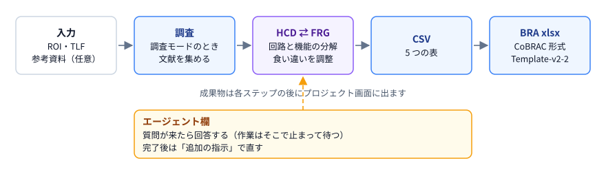
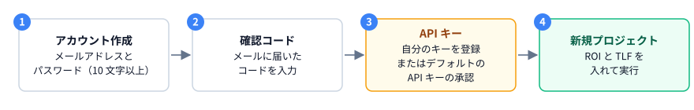
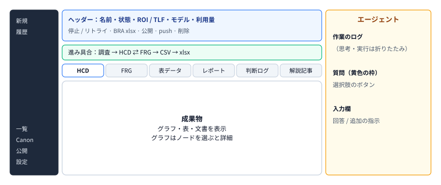
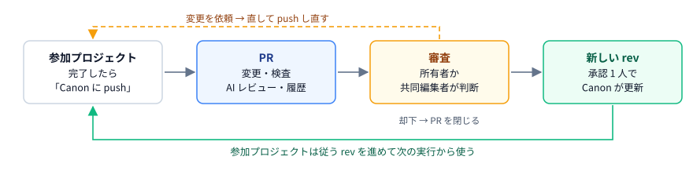

# CoBRAC Agents 利用マニュアル

CoBRAC Agents を使って BRA（Brain Reference Architecture）データを作る人のための手引きです。はじめての方は「できること」と「はじめに」を読めば、最初のプロジェクトを実行できます。そのほかの節は、必要になったときに目次から開いてください。画面の「?」にも短い説明があります。

## できること

ROI（対象領域）と TLF（トップレベル機能）を入れて実行すると、AI エージェントが文献を調べながら BRA データを作ります。作業はサーバーで進むので、ブラウザを閉じても止まりません。

- **HCD**（回路の図）: 領域の回路（UC）と、その間の接続を、根拠の文献とともにまとめます。
- **FRG**（機能の分解）: TLF を、グループ（GN）を経て UC まで分解した木です。
- **CSV と BRA xlsx**: HCD と FRG から作る提出用のデータです。xlsx は CoBRAC の形式と、公式テンプレート Template-v2-2 の形式の 2 種類を出せます。
- エージェントが判断に迷うと質問が来ます。答えると作業が続きます。完了した後は、追加の指示で直せます。
- 1 件の作成には数十分から数時間かかり、OpenAI の利用料がかかります（[費用](#費用はどこで見る)）。
- 多くのプロジェクトをまとめて作るときは、[CoBRAC オーケストレーター](#cobrac-オーケストレーター) で計画にして、順番に自動で実行できます。

## はじめに

### アカウントを作る

1. ログイン画面の「アカウントを作成」で、メールアドレスとパスワード（10 文字以上）を入れます。
2. メールに届いた確認コードを入れると、ログインできるようになります。コードが届かないときは「コードを再送」を押してください。
3. パスワードを忘れたときは、ログイン画面の「パスワードを忘れた」から再設定します。

アカウントの作成を受け付けていない場合は、管理者に相談してください。

### 利用の承認を受ける

エージェントを実行するには、管理者に利用を承認してもらいます。承認されると、設定画面に「登録は不要です。そのままジョブを実行できます。」と出て、すぐに使えます。

自分の OpenAI アカウントで実行したい場合は、「設定」の「自分の OpenAI API キー（任意）」で「自分のキーを使う」を開き、キーを貼り付けて「登録 / 更新」を押します。キーは暗号化して保存され、それ以降のジョブは自分のキーで実行し、利用料は自分の OpenAI アカウントに請求されます。削除すると元に戻ります。承認を受けていない場合も、自分のキーを登録すれば使えます。

## プロジェクトを作る

サイドバーの「新規プロジェクト」を開きます。

1. **ROI** に脳の領域を、**TLF** にその領域が担う機能を書きます。片方だけでも作れます。ROI に領域名を打つと候補が出ます。「例を使う」で入力例が入ります。
2. 必要に応じて、入力欄の下のボタンで設定します。
   - 「+」: 参考資料（ファイル・URL）を添付します。
   - 「Canon」: 回路の定義をそろえたいときに選びます（[Canon を使う](#canon-を使う)）。
   - 「仮説モード」: 文献が直接は裏付けない接続や UC を、仮説として含めたいときにチェックします（[仮説モード](#仮説モード)）。
   - 「v」: モデル、reasoning effort、調査モードを選びます（[調査モードとモデル](#調査モードとモデル)）。
3. 「実行」を押します（TLF で Enter でも実行できます。Shift+Enter は改行）。

プロジェクト名は自動で付き、あとでプロジェクト画面で変えられます。

### 調査モードとモデル

- **調査モード**（既定はオン）: HCD を作る前に、PubMed と Europe PMC で文献を詳しく調べます。オフにすると速く安く済みますが、調査は浅くなります。作成後は変えられません。
- **モデルと reasoning effort**: 既定は設定画面で決めた値です。reasoning effort は high を推奨します。

## プロジェクト画面とエージェント

実行するとプロジェクト画面に移ります。サイドバーの「履歴」と「プロジェクト一覧」からも開けます。

- **ヘッダー**: 名前、状態、ROI と TLF、モデル、利用量、ダウンロードなどが並びます。
- **進み具合**: 調査 → HCD ⇄ FRG → CSV → xlsx のどこまで進んだかを示します。
- **タブ**: HCD・FRG・表データ・レポート・判断ログ・解説記事・版を切り替えます。
- **エージェント欄**: 作業のログ、質問、入力欄です。

### 状態

| 状態 | 意味 |
| ---- | ---- |
| 待機中 | 作業を始める順番を待っています |
| 実行中・仕上げ中 | エージェントが作業しています |
| 回答待ち | エージェントが質問しています。答えると再開します |
| 完了 | BRA データができました。追加の指示で直せます |
| 失敗・中止 | 止まりました。「続きからリトライ」で再開できます |

### 質問に答える

質問はエージェント欄の最後に黄色の枠で出ます。選択肢のボタンを押すか、入力欄に答えを書いて送ると、作業が再開します。

### 追加の指示

完了したプロジェクトは、エージェント欄の入力欄から直したい内容を指示できます（例:「○○の UC を追加して、接続を見直してください」）。指示は新しいジョブとして実行され、利用料がかかります。

### 停止とリトライ

- 実行中は、ヘッダーの「停止」で止められます。
- 失敗・中止したプロジェクトは、「続きからリトライ」で前回の成果物から再開します。1 回のジョブは 6 時間で打ち切られるので、その場合もリトライで続けてください。
- 要らなくなったプロジェクトは、ヘッダーのごみ箱のボタンで削除できます。

## 成果物を読む

成果物は、各ステップが終わるとタブに出ます。

- **HCD グラフ**: ノードは回路（UC）、矢印は接続です。選ぶと、根拠の文献と引用を含む詳細が開きます。点線の枠は Collection（1 つの回路を分けた UC のまとまり）です。配置や色を変えられ、PNG で保存できます。
- **FRG グラフ**: TLF から GN を経て UC までの木です。UC や GN を選ぶと、HCD の対応する回路に移ったり強調したりできます。
- **表データ**: 5 つの CSV を表で見られ、元のファイルもダウンロードできます。
- **レポート・判断ログ**: エージェントの作業の報告と、何をなぜ判断したかの記録です。
- **BRA xlsx**: 完成すると、ヘッダーに「BRA xlsx」（CoBRAC の形式）と「BRA xlsx (Template-v2-2)」（公式テンプレートの形式）のダウンロードボタンが出ます。

### 版

実行や追加の指示が終わるたびに、その結果を版（v1、v2、…）として残します。「版」タブで、各版の表を開いたり、2 つの版を比べて変わった行を見たりできます。

BRA-DB がある環境では、版の「BRA-DB」欄から、その版を BRA-DB に登録できます。

## 仮説モード

既定では、BRA に入れる接続と UC は、文献が直接裏付けるものだけです。「仮説モード」をオンにすると、文献が直接は裏付けない接続や UC の性質を、**仮説**と明示して含められます。仮説にも、前提となる論文が 1 件以上必要です。

- **作るとき**: 作成画面の「仮説モード」にチェックを入れると、設定が開きます。仮説にしてよい主張の種類と、割合の上限（既定は 20%）を選べます。上限を超えると、エージェントに差し戻されます。
- **追加の指示で**: 入力欄の下の「この指示で仮説を許す」をオンにして送ります。グラフで回路や GN を選んでおくと、対象をそこに絞れます。指示の文に「仮説でよい」と書くだけでは許されません。
- **見え方**: グラフでは、仮説の接続や UC に点線と「H」の印が付きます。「仮説を隠す」で、文献の裏付けだけのグラフにできます。
- 仮説は Canon の共有の定義に入りません。仮説を含む版は、いまは BRA-DB に登録できません。
- このツールは、仮説を確かめるための調査や実験は提案しません。仮説を減らしたいときは、追加の指示で「H3 の根拠を探して置き換えてください」のように頼めます。

## 解説記事

BRA データが完成したら、「解説記事」タブで、選んだ言語の図入りの解説記事を作れます。「記事の言語」とモデルを選び、「解説記事を作成」を押します。数分かかり、利用料はこのプロジェクトに加算されます。できた記事は .md でダウンロードできます。記事の後で BRA データが変わったときは、「解説記事を作り直す」で反映します。

## Canon

**Canon** は、複数のプロジェクトで回路の定義をそろえるための、プロジェクトのまとまりです。同じ Canon の中では、同じ回路はどのプロジェクトでも同じ ID・名前・分け方になります。

### Canon を使う

- サイドバーの「Canon」で「新しい Canon」を作り、名前と粒度方針（例:「新皮質は野 × 投射クラス、皮質下は核全体」）を書きます。既存のプロジェクトを「プロジェクトを追加」で入れられます。
- 新しいプロジェクトでは、作成画面の「Canon」ボタンで Canon を選びます。設定画面で、新しいプロジェクトの既定の Canon を決められます。
- 1 つのプロジェクトが入れる Canon は 1 つだけです。

### Canon に従って作る

Canon に入ったプロジェクトは、Canon の定義（回路の ID・名前・分け方・接続・文献）に従って作られます。Canon にまだ無い回路は、粒度方針に沿って作ります。

### push と審査

1. **push**: 完了したプロジェクトの画面で「Canon に push」を押すと、差分を確かめて PR（プルリクエスト）を作れます。承認されるまで Canon は変わりません。
2. **審査**: Canon の所有者か共同編集者が、PR の画面で変更・検査の結果・AI レビュー（指摘を挙げるだけで、判断はしません）を確かめます。
3. **判断**: 「承認」すると Canon に新しい rev（版）ができます。「変更を依頼」「却下」も選べます。矛盾の無い PR は、Canon の画面の「まとめて承認」で一度に承認できます。

Canon の所有者は、登録済みのメールアドレスで**共同編集者**を追加できます。共同編集者は「共有された Canon」から開き、PR を審査できます。

### rev に追従する

プロジェクトのヘッダーに、従っている rev が出ます（例:「rev 1（最新 2）」）。「最新の rev にする」で、次の実行から新しい定義に従います。このプロジェクトが使う定義が変わったときは、「Canon に合わせる」でプロジェクトを直す追加の指示も送れます。

## CoBRAC オーケストレーター

**CoBRAC オーケストレーター**は、作りたい BRA プロジェクト（ROI × TLF）を「計画」にまとめて、まとめて作る機能です。計画を確定すると、同時実行数の上限の範囲で、行を「バッチ」ごとに自動で実行します。確定するまでプロジェクトは作られません。

### 計画を作る

1. サイドバーの「CoBRAC オーケストレーター」で「新しい計画」を押し、名前と目標（例:「言語の BRA を一通りそろえたい」）を入れます。
2. 資料のファイル（CSV・xlsx・PDF など）を追加するか、行を貼り付けます。1 行が 1 プロジェクトです。
3. 「計画を作る」で読み込んだ行から計画を作ります。「下書きを作成」を押すと、AI が目標と資料から行を書きます（数分かかり、費用が記録されます）。目標・資料・行のどれも無いときは押せません。
4. 下書きの画面は 4 つに分かれます。「1. 作るもの」で目標を書き直し、資料を追加・削除し、下書きを作ります。「2. 行とバッチ」で行の追加・削除・並べ替えをします。「3. 進め方」で自律実行・Canon・モデル・調査モードを選びます。「4. 確定して開始」で見積もりを確かめて開始します。

### 並べ方

- 各行には、関わる領域を表す**アンカー**が付きます。同じ回路を作ることになる行（アンカーが重なる行）は、同じバッチに入れません。
- ほかの多くの行と共有する行は**基準プロジェクト**として、先に 1 件ずつ作ります。あとの行は、その回路を基準にします。
- 「自動で並べる」で、アンカーと依存関係からバッチを決め直します。行やバッチを手で変えて保存すると、その順序がそのまま使われます。
- 同じ ROI × TLF の完成したプロジェクトがすでにある行には「既存」が付き、作らずに完了になります。作り直したいときは「作り直す」にチェックを入れます。

### 確定して実行する

- 「確定して開始」を押すと、見積もり（時間と費用）を確かめてから開始します。
- 失敗した行は自動で 2 回までやり直し、それでも失敗すると「要対応」になります（「リトライ」か「スキップ」を選びます）。
- 自動で並べた計画では、バッチが終わるたびに残りの行を並べ直し、行の追加・削除を提案することがあります。提案は「承認」するまで計画を変えません。
- 計画の一覧の「あなたの番」に、質問・承認待ちなど、あなたの操作を待っているものがまとまって出ます。
- 計画が作ったプロジェクトは、通常のプロジェクトと同じ画面で開けます。

### Canon と組み合わせる

計画に Canon を決めておくと、完成した行を自動で Canon に push し、行は「承認待ち」になります。PR を人が承認すると、行が「完了」になります。AI レビューも自動で実行されます。矛盾が解けないなど、自動で進められない行は「人の判断」になり、理由が出ます。

### 自律実行

**自律実行**は、オーケストレーターがあなたの代わりになって、計画を最後まで進める設定です。新しい計画のフォームで「自律実行」をオンにし、**費用の上限**（USD）を入れて「自律実行で開始」を押します。

- 下書きができると、自動で確定して実行を始めます。Canon を選ばなければ、計画の名前で新しい Canon を作ります。
- 各行のエージェントは質問できます。質問にはオーケストレーターの AI が、行・計画の目標・Canon の方針・判断ログを読んで答えます。回数の上限はありません（行に「AI の回答 n 回」と出ます）。
- PR は AI が内容を読んで、承認・変更依頼・却下を決めます。
- 「要対応」「人の判断」になった行は、オーケストレーターの AI があなたと同じ選択肢から選び、理由を残します。計画の Canon が見つからなくなったときだけは、一時停止してあなたが決めます。
- 再計画の提案（行の追加・削除）は、届くとすぐ反映します。
- オーケストレーターのジョブが失敗したときは、少し間をおいて（最大 1 時間）依頼し直します。
- 費用が上限に達すると新しい作業を始めず、計画は一時停止します。上限を上げると再開できます。

### 質問・一時停止・中止

- エージェントが質問すると、その行だけが止まり、計画の画面の「質問箱」に出ます。答えるとその行が再開します。
- 「一時停止」は新しい行を始めず、実行中の行は続けます。「再開」で止まったところから続けます。
- 「中止」は実行中のジョブも止めます。中止した計画も再開できます。
- 計画を削除しても、作られたプロジェクトは残ります。

## 公開と複製

- プロジェクトと Canon は、ヘッダーのボタンで「公開」にでき、いつでも非公開に戻せます。
- 公開したものは、ログインした誰でも「公開ライブラリ」で見られます。エージェントの履歴・費用・メールアドレスは公開されません。
- 公開プロジェクトは「複製」で自分の非公開プロジェクトにできます。元のプロジェクトは変わりません。
- 公開した Canon には、ほかのユーザーが PR を送れます。承認するのは所有者です。

## 設定

サイドバーの「設定」で次のものを変えられます。

- **OpenAI API キー**: ジョブを実行できる状態か、自分のキーの登録・更新・削除
- **プロフィール**: 表示名と Contributor 名（Project.csv と xlsx に記録されます。英語表記を推奨します）
- **既定のモデル / reasoning effort / Canon**: 新しいプロジェクトの初期値
- **パスワード変更**
- **言語**

表示の言語とテーマ（ライト・ダーク）は、サイドバーの下でも切り替えられます。アプリの変更点は、サイドバーの一番下のバージョン番号を押すとリリースノートで確かめられます。

## 困ったとき

### 実行できない

「OpenAI API キーが未登録です」と出る場合は、管理者に利用の承認を依頼するか、設定画面で自分のキーを登録してください（[利用の承認を受ける](#利用の承認を受ける)）。「いまはジョブを実行できません」と出る場合は、管理者に連絡してください。

### 使いたいモデルが一覧に無い

一覧には、あなたが使えるモデルだけが出ます。ほかのモデルを使いたい場合は、管理者に相談するか、自分のキーを登録してください。

### 長い時間止まっているように見える

エージェント欄の最後の行に、作業中のステップと経過時間が出ます。状態が「回答待ち」なら質問に答え、「失敗」「中止」なら「続きからリトライ」を押してください。

### 費用はどこで見る

ヘッダーの利用量を押すと、ジョブごとのトークンと推定料金が出ます。「プロジェクト一覧」には全プロジェクトの合計が出ます。料金は推定値なので、実際の請求額は OpenAI のダッシュボードで確かめてください。

### 結果を直したい

完了したプロジェクトなら、エージェント欄から追加の指示を送ります。最初からやり直す場合は、新しいプロジェクトを作ってください。
