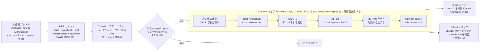

# CoBRAC Agents 運用手順

> 仕様書から移した運用手順です。サイトには出しません。
>
> 仕様（何がどう動くか）は仕様書が正本です。この文書には、リリースとデプロイの手順、権限と承認、緊急時の操作、撤去の手順と、AWS アカウントなどの環境の情報を置きます。仕様書の該当する節は「仕様書 9.1」の形で示します。

## 目次

1. [環境](#1-環境)
2. [リポジトリの構成](#2-リポジトリの構成)
3. [リリースの手順](#3-リリースの手順)
4. [ワークフロー](#4-ワークフロー)
5. [RETAIN ガード](#5-retain-ガード)
6. [設定値](#6-設定値)
7. [緊急時のローカルからのデプロイ](#7-緊急時のローカルからのデプロイ)
8. [権限と承認：人・CI・クラウドエージェント](#8-権限と承認人ciクラウドエージェント)
9. [監視の操作](#9-監視の操作)
10. [緊急停止の操作](#10-緊急停止の操作)
11. [BRA-DB の保守](#11-bra-db-の保守)
12. [撤去と残る費用](#12-撤去と残る費用)

---

## 1. 環境

| 項目 | 値 |
|---|---|
| AWS アカウント（本番） | `765959262011`（RCS＝rosetta-candidate-search と共用） |
| リージョン | 東京（`ap-northeast-1`） |
| CDK のスタック | `CobracAgents`（アプリ本体）、`BraDb`（BRA-DB） |
| DNS のアカウント | 個人アカウント `618703232062`（`cobrac.site` の Route 53 のゾーン） |
| サイトの URL | `https://cobrac.site`（CloudFront の distribution に CDK の外で付けた別名） |
| リポジトリ | GitHub の `miyamoto9265/cobrac-web`（公開） |
| 所有者 | GitHub の `miyamoto9265`。ローカルの IAM ユーザー `miyamoto`（AWS CLI のプロファイル `rcs-org`） |
| GitHub OIDC プロバイダー | `arn:aws:iam::765959262011:oidc-provider/token.actions.githubusercontent.com`（`aud` は `sts.amazonaws.com`） |
| CI のデプロイロール | `gha-cobrac-web-deploy` |
| AWS Budgets | アカウントには `My Monthly Cost Budget`（10 USD）があります（RCS と共用）。cobrac-web には、予測 $20・実績 $30 でメールを送る予算を勧めます（仕様書 9.8） |

所有者のローカルの AWS のセッションが切れたら、`aws login --remote --profile rcs-org` で入り直します。

## 2. リポジトリの構成

npm workspaces のモノレポです。作業の規則は `AGENTS.md` にあり、人もコーディングエージェントもそれに従います。

| 場所 | 中身 |
|---|---|
| `package.json` | workspaces の定義。`version` がアプリ全体のバージョンの唯一の正本 |
| `CHANGELOG.md` | リリースノート（Keep a Changelog の形式）。全員が「リリースノート」の画面（サイドバーの下端のバージョンから開く）で読む |
| `scripts/` | `release.mjs`（バージョンの更新と CHANGELOG の確定）、`retain-guard.mjs`（デプロイ前の RETAIN ガード）、`bra-appendix-d.mjs`（BRA の出力をエラーコードごとに判定する）、文書の図の生成 |
| `.github/workflows/` | `ci.yml`・`deploy.yml`・`claude.yml`（[4. ワークフロー](#4-ワークフロー)） |
| `prompts/` | エージェントへの指示書（仕様書 第 3 部・付録 B）、`csv_to_excel.py`、公式テンプレート |
| `packages/shared`・`worker`・`api`・`web`・`infra` | 共有の型と検査・単価表、Fargate のワーカー、Lambda、React の SPA、AWS CDK（仕様書 第 8 部） |

バージョンの付け方、変更するときの約束、ローカルでの開発と確認は、仕様書 8.9 にあります。

## 3. リリースの手順

1. 変更の内容を `CHANGELOG.md` の `## [Unreleased]` に、「追加・変更・修正・削除」の見出しで書きます。利用者に見える挙動を主語にし、ファイル名や関数名だけの記述にしません。
2. 作業ブランチで `npm run release -- patch --no-git`（または `minor`・`major`・バージョン番号）を実行します。ルートと全 workspace の `package.json`・`package-lock.json` のバージョンを更新し、`[Unreleased]` を `## [X.Y.Z] - YYYY-MM-DD` に確定します。この変更をコミットして PR に含めます。`--no-git` を付けないと、main を前提にコミットとタグを作るので、PR の運用では使いません。
3. PR の CI（`ci.yml`）が、AWS の認証なしで build・typecheck・test・`release:check`・`cdk synth` を行います。ジョブの要約に「マージでデプロイされるか」が出ます。
4. 人が PR を `main` にマージします。**バージョンを上げた PR のマージが、デプロイの承認**になります（[8. 権限と承認](#8-権限と承認人ciクラウドエージェント)）。
5. `deploy.yml` が `v<version>` のタグの有無を見て、**タグがないバージョンだけ**をデプロイし、タグを付け、`GET /health` でバージョンを確認します。結果は Actions の実行（`gh run view --log`）で確認します。

バージョンを上げないマージ（文書だけの変更など）はデプロイされず、次のリリースにまとめて入ります。

### デプロイの流れ

人の判断は ③ のマージだけで、④〜⑦ は GitHub Actions のプログラムが行います。



## 4. ワークフロー

| ファイル | きっかけ | すること |
|---|---|---|
| `ci.yml` | PR、手動の実行 | `npm ci` → build → typecheck → `docs:prompts:check` → Python の依存の導入 → test（xlsx の生成まで）→ `release:check`（全 workspace のバージョンがそろい、CHANGELOG にそのバージョンの節があるか）→ `cdk synth` → 「マージでデプロイされるか」。AWS の認証は使わず、`cdk.context.json` と仮の設定値で synth する。権限は `contents: read`、20 分で打ち切り、同じブランチの古い実行は取り消す |
| `deploy.yml` | `main` への push、手動の実行（入力 `allow_retain_replacement`） | 上の図と下の表。`main` でだけ動く |
| `claude.yml` | Issue・Issue のコメント・PR のコメントの `@claude`（`miyamoto9265` か `cursor[bot]` のものだけ） | Claude Code がブランチで作業し、draft の PR を出す。AWS とデプロイの権限はない（[8](#8-権限と承認人ciクラウドエージェント)） |

### deploy.yml の設定

| 項目 | 設定 |
|---|---|
| plan | `package.json` のバージョンを読み、`git ls-remote` でタグ `v<version>` を探す。あれば「nothing to deploy」で終わり、なければ deploy に進む（5 分で打ち切り） |
| 設定値の検査 | AWS に触れる前に、Variables と Secret の必須の値（`AWS_DEPLOY_ROLE_ARN`・`CDK_DEFAULT_ACCOUNT`・`CDK_DEFAULT_REGION`・`COBRAC_SELF_SIGNUP`・`COBRAC_MAX_CONCURRENT_JOBS`・`COBRAC_MAX_CONCURRENT_JOBS_PER_USER`・`COBRAC_CODEX_REASONING_EFFORT`・`COBRAC_ADMIN_EMAILS`）が空でないことと形式を検査する。アカウントは 12 桁、ロールの ARN は同じアカウント、セルフサインアップは `true` / `false`、同時実行数は正の整数、推論の強さは `minimal`・`low`・`medium`・`high`・`xhigh` のどれか、管理者のアドレスはメールアドレスの形。空の値は CDK に `""` として届き、セルフサインアップを閉じたり同時実行数を 0 にしたりしてしまうので、すべて必須にしている。管理者のアドレスはログで伏せ字にする |
| IAM ロール | `gha-cobrac-web-deploy`。信頼は GitHub OIDC で、`sub` が `main` ブランチのこのリポジトリのときだけ（PR のブランチ・フォーク・タグからは引き受けられない）。権限は CDK の bootstrap ロール（`cdk-hnb659fds-*`）の引き受けと `CobracAgents` の `DescribeStacks`、それに IAM・請求・秘密・個人データの読み取りを拒むガードレール（[8](#ci-のデプロイロール)）。セッション名は `GitHubActions-cobrac-web-<run_id>` |
| 長期のキー | 使わない |
| ワークフローの権限 | 既定はなし。`id-token: write` は deploy ジョブだけ、`contents: write` は tag ジョブだけ、health ジョブは権限なし |
| RETAIN ガード | [5. RETAIN ガード](#5-retain-ガード) |
| デプロイ | `npm run deploy`（`release:check` → build → `cdk deploy --all --require-approval never`）。60 分で打ち切り。終わったらスタックの出力から `ApiUrl` と `WebUrl` を読む |
| tag | `github-actions[bot]` として注釈付きのタグ `vX.Y.Z` を、デプロイした commit に付けて push する。health の結果は待たない |
| health | `GET {ApiUrl}/health` の `version` が新しいバージョンになるまで 10 秒おきに最大 12 回確認し、`WebUrl` が HTTP 200 を返すことも確認する。どちらかが違えば失敗にする |
| 直列化 | `concurrency: deploy-cobrac-agents`。デプロイ中の実行は取り消さない |
| アクション | commit の SHA で固定する |

> **注意**：ワークフローに GitHub の `environment:` を付けてはいけません。OIDC の `sub` が `…:environment:<名前>` に変わり、ロールを引き受けられなくなります。

## 5. RETAIN ガード

`scripts/retain-guard.mjs` は、`CobracAgents` と `BraDb` の `cdk diff` の出力を読み、状態を持つリソースの置き換え（replace、may be replaced）や削除（destroy、orphan、取り除き）を見つけると、デプロイの前にジョブを止めます。

- 対象は、`AWS::DynamoDB::Table`・`AWS::DynamoDB::GlobalTable`・`AWS::S3::Bucket`・`AWS::KMS::Key`・`AWS::Cognito::UserPool` のすべてです。
- BRA-DB のインスタンス `Db`（`AWS::EC2::Instance`）、データ用ボリューム `DataVolume`（`AWS::EC2::Volume`）、その取り付け（`AWS::EC2::VolumeAttachment`）、NAT の Elastic IP `NatEip`（`AWS::EC2::EIP`。外部の DB がこのアドレスを許可しているため）も対象です。これらはコンストラクトのパスで見分けるので、NAT インスタンスと EIP の関連付けは置き換えられます。
- `cdk diff` の出力を解釈できない（`Stack CobracAgents` の行がない）ときも止まります。
- 終了コードは 0（安全、または許可済み）、1（危険な変更あり）、2（出力を解釈できない）です。ログには、リソースの型・パス・論理 ID だけを出し、プロパティの値は出しません。

差分を確認したうえで続けるときは、次のコマンドで実行し直します。通常の「Re-run」では入力が付かないので、再び止まります。だれがこれを決めるかは [8. 権限と承認](#だれが何を承認するか)にあります。BRA-DB のインスタンスを置き換える手順は [11. BRA-DB の保守](#11-bra-db-の保守)にあります。

```sh
gh workflow run deploy.yml --ref main -f allow_retain_replacement=true
```

## 6. 設定値

デプロイの設定の正本は、GitHub の Actions の **Variables** と **Secret**（`COBRAC_ADMIN_EMAILS`）です。ローカルの `.env`（リポジトリに入れない。雛形は `.env.example`）は、緊急デプロイとローカルの synth のためのコピーです。値を変えるときは両方を直します。

下の表の「変数がないとき」の値は、ローカルで変数を設定しなかったときに CDK のアプリ（`packages/infra/bin/app.ts`）が使う値です。deploy ワークフローは `COBRAC_CODEX_MODEL` 以外のすべてを必須とし、空なら失敗します。

| 変数 | 変数がないとき | 意味 |
|---|---|---|
| `AWS_DEPLOY_ROLE_ARN`・`CDK_DEFAULT_ACCOUNT`・`CDK_DEFAULT_REGION` | （必須） | デプロイのロールと、配置先のアカウントとリージョン |
| `COBRAC_ADMIN_EMAILS`（Secret） | （必須） | サインインで管理者にするアドレス（カンマ区切り） |
| `COBRAC_SELF_SIGNUP` | `true` | `false` で招待制 |
| `COBRAC_MAX_CONCURRENT_JOBS` | 2 | 全体の Fargate タスクの同時実行数（管理画面の 1〜16 の設定が、デプロイなしで上書きする） |
| `COBRAC_MAX_CONCURRENT_JOBS_PER_USER` | 1 | 1 人あたりの同時実行数（同上） |
| `COBRAC_CODEX_MODEL`（任意） | 空 | プロジェクトにも利用者の設定にも指定がないときのモデル。空ならワーカーが `gpt-6-luna` を使う |
| `COBRAC_CODEX_REASONING_EFFORT` | 空（`.env.example` の値は `high`） | プロジェクトに指定がないときの推論の強さ。空なら Codex の既定に任せる |

Actions の Variables に置かない任意の設定もあります。ローカルの環境変数で、いまは既定のままで使っています。

| 変数 | 既定 | 意味 |
|---|---|---|
| `COBRAC_RCS_MCP_URL` | 本番の `rcs-mcp` のエンドポイント | SABRA の照会に使う RCS の MCP サーバー。空なら RCS を使わない |
| `COBRAC_RCS_MCP_SECRET_NAME` | `rcs/mcp-bearer-token` | 受け付ける RCS のトークンのシークレット（rosetta-candidate-search が所有）。ワーカーのタスクロールに `GetSecretValue` を付ける |
| `COBRAC_SITE_URL` | `https://cobrac.site` | アカウントのメールに書くサイトの URL |
| `COBRAC_EMAIL_FROM` | `no-reply@cobrac.site` | SES でアカウントのメールを送る差出人。ドメインは、スタックのリージョンで検証済みの SES の ID であること。空なら Cognito の既定の差出人 |
| `COBRAC_EMAIL_FROM_NAME` | `CoBRAC Agents` | 差出人の表示名 |
| `COBRAC_ALARM_EMAIL_PARAMETER` | `/cobrac-web/alarm-email` | SES の評判のアラームを受けるアドレスを入れた SSM の String パラメータ（同じアカウントとリージョン。デプロイ前に存在すること）。空ならアラームとトピックだけを作り、購読者を付けない |
| `COBRAC_BRADB` | `true` | `false` で BRA-DB のスタックを作らない |

ワーカーには、インフラで設定せず、コードの既定値で動く設定もあります。

| 設定 | 既定値 |
|---|---|
| 圧縮のしきい値 `CODEX_AUTO_COMPACT_TOKENS` | 75,000 |
| 調査の時間予算 `RESEARCH_TIME_BUDGET_MIN` | 60 分 |
| 最長の実行時間 `WORKFLOW_TIMEOUT_MS` | 6 時間 |
| 文献の照合 `REFERENCE_LOOKUP`、引用文の照合 `QUOTE_CHECK` | どちらも有効 |
| 引用文の一致のしきい値 `QUOTE_MATCH_THRESHOLD` | 0.9 |
| `CROSSREF_MAILTO`・`NCBI_API_KEY` | 未設定 |
| janitor の自動リトライの回数 `MAX_AUTO_RETRY` | 2 |

同時実行数を上げると Fargate の費用が比例して増え、大きいモデルを指定すると OpenAI の費用だけが増えます（仕様書 9.9・9.10）。

## 7. 緊急時のローカルからのデプロイ

GitHub Actions が使えないときだけ、ローカルから `npm run deploy` でデプロイします。

1. AWS CLI のプロファイル `rcs-org`（IAM ユーザー `miyamoto`）を使います。
2. `.env` を GitHub の値とそろえておきます。PowerShell では `$env:COBRAC_ADMIN_EMAILS="…"` の形で設定します。
3. `npm run deploy` を実行します。
4. 行った後は、同じ内容を PR で `main` に戻し、タグをローカルで付けて push します。タグがあれば、ワークフローが同じバージョンをもう一度デプロイすることはありません。

cobrac-web のローカルからのデプロイは所有者だけが行い、Cloud Agent は行いません。Cloud Agent の運用ロールは、CloudFormation の操作を禁じられています（[8](#cursor-の-cloud-agent-の-aws-アクセス)）。

## 8. 権限と承認：人・CI・クラウドエージェント

開発と運用には、人（所有者）、GitHub Actions のプログラム、2 種類のコーディングエージェントが関わります。だれがどの認証で何をでき、何を承認するのかを次に定めます。長期の AWS のアクセスキーは、CI にもエージェントにも渡しません。

| 主体 | 認証 | できること | できないこと |
|---|---|---|---|
| 所有者（人。GitHub `miyamoto9265`） | ローカルの IAM ユーザー `miyamoto`（プロファイル `rcs-org`）。セッションが切れたら `aws login --remote --profile rcs-org` | PR のマージ（デプロイの承認）、RETAIN ガードを越える再実行の判断、運用ロール自身・権限境界・`gha-*`・`cdk-*` の IAM の変更と信頼ポリシーの変更、ガードレールで禁じた破壊的な操作、CI 以外での cobrac-web のデプロイ（緊急時）、GitHub の PAT の発行 | — |
| GitHub Actions `ci`（プログラム） | AWS の認証なし | build・test・synth、「マージでデプロイされるか」の表示 | AWS に触れない |
| GitHub Actions `deploy`（プログラム） | GitHub OIDC → `gha-cobrac-web-deploy`（`main` だけ、1 時間） | CDK の bootstrap ロールを引き受けて `cdk deploy`、`CobracAgents` の `DescribeStacks`、タグの push | ガードレール（下記）で拒む操作 |
| Cursor の Cloud Agent（LLM） | Cursor の OIDC → 運用ロール `cursor-cloud-agent-ops`（1 時間）。GitHub は `GH_MERGE_TOKEN` | 作業ブランチと PR、**利用者の明示の指示があったときだけ**のマージ、Lambda の環境変数・コードの更新、シークレットの値の更新、ログの読み取り、DynamoDB への書き込み、`cobrac.site` の DNS レコードの変更、ワークフローの再実行（指示を受けたとき） | `main` への直接の push、IAM のユーザー・キー・ロールの作成、信頼ポリシー・権限境界・OIDC の変更、`cdk-*`・`gha-*`・`cursor-*` の引き受け、CloudFormation の作成・更新・削除（cobrac-web のデプロイは CI だけ）、テーブル・バケット・鍵・ユーザープール・シークレット・Lambda・ロググループなどの削除、CloudTrail・Budgets の改変 |
| Claude Code（LLM。`claude.yml`） | 所有者の Claude のサブスクリプションのトークン（Secret `CLAUDE_CODE_OAUTH_TOKEN`）と、ジョブの `GITHUB_TOKEN`（contents・issues・pull-requests の書き込み） | `claude/` ブランチ（開いている PR ならその PR のブランチ）での作業と draft の PR の作成。使えるコマンドは `npm ci`・build・typecheck・test・`docs:figures`・`release:check`・`release -- patch\|minor\|major --no-git`、`git status`・`diff`・`log`、`gh pr create`・`view` だけ（最大 80 ターン、60 分） | `main` とタグへの push、マージ、force push、AWS（`id-token` なし）、`.github/workflows/` の変更（`GITHUB_TOKEN` では不可） |

### だれが何を承認するか

| 判断 | だれが | どうやって |
|---|---|---|
| 本番へのデプロイ | 所有者 | バージョンを上げた PR を `main` にマージする。Cursor の Cloud Agent は、所有者の明示の指示があったときだけマージする。Claude Code はマージしない（バージョンを上げるのも頼まれたときだけ、マージの直前に行う） |
| RETAIN ガードで止まったデプロイの続行 | 所有者 | Cloud Agent が Actions のログの差分を要約して示し、所有者が判断する。指示を受けたときだけ `GH_TOKEN=$GH_MERGE_TOKEN gh workflow run deploy.yml -R miyamoto9265/cobrac-web --ref main -f allow_retain_replacement=true` で実行し直す |
| RETAIN のリソースを置き換える変更 | 人が必ず確認 | DynamoDB・S3・KMS・Cognito・BRA-DB のインスタンスとボリューム。エージェントは PR にそのリスクを書く |
| IAM と信頼ポリシーの変更 | 所有者（ローカル） | Cloud Agent は、手順と記入欄を書いたファイルを PR で出して依頼し、完了したらそのファイルを消す |
| 緊急のローカルからのデプロイ | 所有者 | [7](#7-緊急時のローカルからのデプロイ)。同じ内容を PR で `main` に戻し、タグを push する |
| ワークフローの骨格の変更 | 所有者と相談 | 仕様書 8.9 の「変更するときの約束」 |
| デフォルトの API キーの利用 | 管理者 | 管理画面で利用承認（Tier 1 / Tier 2）を出す（仕様書 4.1） |
| Canon の PR の取り込み | Canon の所有者・共同編集者、または所有者が自律実行を任せたオーケストレーター | 人が対応する計画の行は、人の承認で完了する。自律実行の計画では、判断のジョブが同じ検査を通して承認する（仕様書 5.2・6.8） |

### CI のデプロイロール

- OIDC プロバイダーは `arn:aws:iam::765959262011:oidc-provider/token.actions.githubusercontent.com`、`aud` は `sts.amazonaws.com` です。
- `gha-cobrac-web-deploy` は、`sub` が `repo:miyamoto9265/cobrac-web:ref:refs/heads/main` か、その不変の形（owner ID・repo ID を含む形）のときだけ引き受けられます。cobrac-web は GitHub の OIDC の設定で immutable subject を有効にしているので、`sub` に owner ID と repo ID が入ります。リポジトリを作り直すと ID が変わるので、信頼ポリシーも直します。
- ガードレール（`guardrails`、Deny）は、IAM・Organizations の変更、CloudTrail・Budgets の改変、シークレットの値・SSM・KMS の復号・DynamoDB の読み取り、`lambda:UpdateFunctionConfiguration` を拒みます。
- 実際のデプロイは `cdk-hnb659fds-cfn-exec-role` が行い、このロールは既定で `AdministratorAccess` を持ちます。したがって、`main` にマージできる人は、実質的にこのアカウントに何でもデプロイできます。絞るには `--cloudformation-execution-policies` を付けて bootstrap をやり直す必要があり、まだ行っていません。
- 同じアカウントには、RCS のデプロイロール `gha-rcs-deploy` もあります（権限境界 `cursor-ops-boundary` 付き。RCS の Lambda・S3・CloudFront だけを更新する）。

### Cursor の Cloud Agent の AWS アクセス

Cloud Agent は Cursor の OIDC で認証します。VM のソケット `/run/cursor/api.sock` が、有効期間 5 分の JWT（`iss=https://api.cursor.com`、`aud=sts.amazonaws.com`、`sub` は所有者の Cursor の利用者）を発行し、`sts:AssumeRoleWithWebIdentity` で 1 時間の認証情報に交換します。シークレットの登録は要りません。

- `CURSOR_AWS_ASSUME_IAM_ROLE_ARN` は登録しません。登録すると、Cursor が AWS の設定を上書きします。
- `wbai-repos` の `scripts/bootstrap.sh` が AWS CLI v2 を入れ、ソケットのある VM でだけ `~/.aws/config` を書きます。
- `default` のプロファイルが運用ロールです（`--profile rcs-org` は付けません）。DNS の操作だけ `--profile dns` を付けます。
- `aws sts get-caller-identity` の Arn が `assumed-role/cursor-cloud-agent-ops/cursor-cloud-agent` なら正常です。

| ロール・ポリシー | 内容 |
|---|---|
| `cursor-cloud-agent-ops`（`765959262011`） | 信頼は `api.cursor.com` の所有者の `sub` だけ。`PowerUserAccess` + `iam-limited` + `guardrails`（Deny） |
| `iam-limited` | IAM の読み取り。`rcs-*` のロールと `gha-rcs-deploy` のポリシーの編集（権限境界 `cursor-ops-boundary` 付きのロールだけ）。`iam:PassRole` は `rcs-lambda-role` を Lambda に渡すときだけ |
| `guardrails`（Deny） | ユーザー・アクセスキー・ロールの作成、信頼ポリシーの変更、権限境界の付け外し、OIDC・SAML の変更。`cdk-*`・`gha-*`・`cursor-*` の引き受け。CloudFormation の作成・更新・削除。DynamoDB のテーブル・S3 のバケット・KMS の鍵・Cognito のユーザープール・シークレット・Lambda・ロググループなどの削除。`rcs-api-web-765959262011` 以外での `s3:DeleteObject`。CloudTrail・Budgets の改変 |
| `cursor-ops-boundary` | 権限境界。`rcs-lambda-role` と `gha-rcs-deploy` に設定済み |
| `cursor-cloud-agent-dns`（個人アカウント `618703232062`） | 信頼は `cursor-cloud-agent-ops` だけ。`cobrac.site` のゾーンのレコードの変更と Route 53 の読み取り |

### GitHub の権限

- Cloud Agent の既定の `gh` は読み取りだけです。マージ・ワークフローの再実行・Actions の設定の変更には、所有者が発行した fine-grained PAT `GH_MERGE_TOKEN` を `GH_TOKEN=$GH_MERGE_TOKEN gh …` の形で使い、値は出力しません。対象のリポジトリは `wbai-repos`・`cobrac-web`・`rosetta-candidate-search` です。権限は Contents・Pull requests・Actions・Workflows が読み書き、Metadata が読み取りです（Administration は必要になったら足します）。
- この PAT の有効期限は 2026-12-27 ごろです。期限の前に所有者が発行し直し、Cursor の Cloud Agent の Secrets を更新します。新しく起動した Cloud Agent から有効になります。
- fine-grained PAT では Checks の読み取りを付けられないので、`gh run watch` の注釈は 403 になります。結果は `gh run view` で確認します。
- cobrac-web の `main` にはブランチの保護を設定していません（2026-10-08 に確認）。「`main` に直接 push しない」は運用の規則で守ります。
- `claude.yml` を起動できるのは、`@claude` を含むコメントを書いたのが `miyamoto9265`（OWNER）か `cursor[bot]`（利用者 ID 206951365 で固定）のときで、さらにその Issue・PR の作成者が `miyamoto9265`・`cursor[bot]`・`github-actions[bot]` のどれかのときだけです。PR のレビューコメントは同じリポジトリのブランチの PR に限り、Issue の新規作成は所有者のものだけです。ほかの人のコメントは、シークレットを読む前にジョブの条件で飛ばします。
- Claude Code が `GITHUB_TOKEN` で行った push と PR は、GitHub の仕様で `ci`・`deploy` を起動しません。マージの前に、そのブランチで `ci` を「Run workflow」で実行します。

## 9. 監視の操作

監視の対象と基準は仕様書 9.8 にあります。ここには操作だけを書きます。

- **費用**：Cost Explorer でサービスごとに見ます。急に増えたとき、まず疑うのは Fargate、次に CloudWatch Logs と CodeBuild です。
- **デプロイの結果**：Actions の実行を `gh run view --log` で開き、ジョブの要約（Plan・RETAIN guard・Tag・Health）を見ます。
- **AWS の操作の追跡**：CloudTrail の証跡はないので、既定の 90 日間のイベント履歴を検索します。CI のセッション名は `GitHubActions-cobrac-web-<run_id>`、Cursor の Cloud Agent は `cursor-cloud-agent` です。

  ```sh
  aws cloudtrail lookup-events --lookup-attributes AttributeKey=EventName,AttributeValue=AssumeRoleWithWebIdentity \
    --max-results 10 --query "Events[].[EventTime,Username]" --output table
  ```

- **SES のアラームの通知先を変える**：CloudFormation は、変わっていないパラメータの値の変化に気づきません。そこで、新しい SSM パラメータにアドレスを入れ、`COBRAC_ALARM_EMAIL_PARAMETER`（または `packages/infra/bin/app.ts` の既定値）をそれに向けてデプロイします。購読が置き換わり、新しいアドレスに確認のメールが届きます。

## 10. 緊急停止の操作

止めたいものとそれを行う人は、仕様書 9.8 の表にあります。

| 止めたいもの | 操作 |
|---|---|
| CI からのデプロイ | GitHub で `deploy` ワークフローを無効にする。または `gha-cobrac-web-deploy` の信頼ポリシーの `sub` を、存在しない値に書き換える（ローカルで） |
| Cloud Agent や CI の AWS アクセス全体 | ロールの信頼ポリシーの `sub` を存在しない値に書き換えるか、`aws:TokenIssueTime` を条件にした全 Deny を付ける。後者は発行済みのセッションも止める。GitHub 側では Actions を無効にする（ローカルで） |
| 実行中のジョブ | 管理画面から強制停止する。利用者を無効にすると、その人の API は 403 になる |
| 新規の登録 | `COBRAC_SELF_SIGNUP=false` にしてデプロイする |
| 漏れた API キー | OpenAI 側で失効させ、設定画面で登録し直す。デフォルトの API キーは、管理画面で消すか登録し直す |

## 11. BRA-DB の保守

BRA-DB の構成は仕様書 7.6 にあります。インスタンスには SSH もパブリックアドレスもないので、操作はすべて SSM Session Manager を通します。`<InstanceId>` は `BraDb` スタックのインスタンスの ID です。

| 作業 | 手順 |
|---|---|
| シェル | `aws ssm start-session --target <InstanceId>` の後、`sudo -u postgres psql -d bra_db_v4_6` |
| ローカルから接続 | `aws ssm start-session --target <InstanceId> --document-name AWS-StartPortForwardingSession --parameters portNumber=5432,localPortNumber=15432` の後、`127.0.0.1:15432` に `bra` か `cobrac_read` で接続する（パスワードは Secrets Manager）。BRA-DB の保守担当の利用を想定 |
| 復元 | 同じ AZ でスナップショットからボリュームを作り、インスタンスを止め、データ用ボリュームを外して、復元したものを `/dev/sdf` に付けて起動する。その後、スタックの定義（`DataVolume`）を PR で合わせる |
| 外部 DB への出口 IP | VPC から外への通信は、NAT インスタンスの Elastic IP（スタックの出力 `NatPublicIp`）から出る。外部の DB の許可 IP にはこのアドレスを伝える。EIP は RETAIN で、NAT インスタンスを置き換えても同じアドレスを引き継ぐ |
| インスタンスの置き換え | AMI の更新などで `AWS::EC2::Instance` / `VolumeAttachment` が置き換わると、CI の RETAIN ガードがデプロイを止める（[5](#5-retain-ガード)）。先にデータ用ボリュームを外し、`allow_retain_replacement=true` で再実行する。新しいインスタンスが、起動時にクラスタを登録し直す |

## 12. 撤去と残る費用

`cdk destroy` の後も、次のものは残り、わずかな保存の費用がかかり続けます（`RemovalPolicy.RETAIN`）。

- KMS の CMK（無効にしてから待機期間を経ないと消せない）
- Cognito のユーザープール
- DynamoDB の `Users`・`Projects`・`Jobs`・`Messages`・`Canons`・`Catalog`・`Plans`（`WsConnections` だけは消える）
- S3 の成果物バケット（オブジェクトが残っている間は消せない。版の削除を禁じるバケットポリシーがあるので、空にする前にその文 `DenyDeleteBraVersions` を外す）
- `BraDb` のデータ用ボリュームとそのスナップショット（仕様書 第 7 部）
- `BraDb` の NAT の Elastic IP（関連付けがないと時間あたりの料金がかかる。不要なら解放する）

おおまかな撤去の順序は次のとおりです。

1. 成果物バケットを空にする（先にバケットポリシーの版の削除の禁止を外す）
2. テーブルを消す
3. ユーザープールを消す
4. KMS の鍵の削除を予約する

ECR のイメージと CloudWatch のロググループも確認します。

---

典拠：`.github/workflows/ci.yml`・`deploy.yml`・`claude.yml`、`scripts/release.mjs`・`retain-guard.mjs`、`package.json`、`packages/infra/bin/app.ts`、`packages/infra/lib/cobrac-stack.ts`（RETAIN・アラーム・出力）、`packages/worker/src/env.ts`、`packages/api/src/handlers/janitor.ts`、`AGENTS.md`、`README.md`（Operations notes）、`miyamoto9265/wbai-repos` の `AGENTS.md` と `docs/cloud-operations.md`
